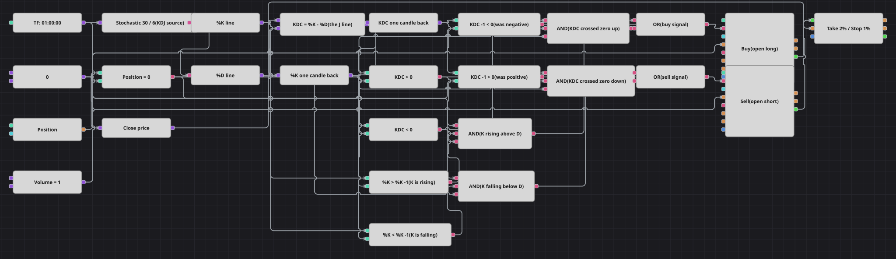

# KDJ エキスパートアドバイザー戦略のダイアグラム
[English](README.md) | [Русский](README_ru.md) | [中文](README_zh.md) | [Español](README_es.md) | [Deutsch](README_de.md) | [Português](README_pt.md)

MetaTrader の KDJ アドバイザーの移植です。J ラインはストキャスティクスの %K と %D の差として組み立てられ、その差が売買の向きを決めます。差がプラスに転じたとき、または差がすでにプラスで %K が上昇を続けているときに買い、売りはその逆です。同梱データに合わせて2点を調整しました。元の4時間足を1時間足にして1か月分のデータでも十分な本数を確保し、pips 建ての損切り・利食いをどの銘柄でも使えるパーセント指定に置き換えています。

## 戦略の概要

- %K を30本、%D を6本としたストキャスティクスが KDJ の代わりを務め、差 K - D が J ラインの役割を果たします。
- エントリーの経路は2つ、差のゼロラインのクロスと、差の符号がすでに示す向きへ %K が動くことです。
- 建玉はノーポジションからのみ作られるため、積み増しもドテンも起きません。決済を担うのは保護ブロックです。

## エントリーとエグジットの条件

- **ロングエントリー**: K - D がプラスで、かつ前の足でマイナスだった（この足がゼロラインの上抜け）か、%K が前の足より高いこと。ポジションはゼロである必要があり、成行で1ロット買います。
- **ショートエントリー**: K - D がマイナスで、かつ前の足でプラスだった（この足がゼロラインの下抜け）か、%K が前の足より低いこと。ポジションはゼロである必要があり、成行で1ロット売ります。
- **エグジット**: 元コードと同じくシグナルによるエグジットは一切ありません。ポジション保護ブロックが利食い2%または損切り1%で成行決済します。これはコードの450 pips と250 pips に相当するパーセント表現です。

## パラメーター

| パラメーター | 既定値 | 説明 |
|---|---|---|
| %K Length (KDJ period) | 30 | %K ラインの期間。元アドバイザーの KDJ 期間にあたります。 |
| %D Smoothing | 6 | %D ラインの平滑化期間。 |
| Take profit, % | 2 | 利食いまでの距離（エントリー価格に対する％）。 |
| Stop loss, % | 1 | 損切りまでの距離（エントリー価格に対する％）。 |
| Volume | 1 | 注文数量（ロット）。 |
| Candles | 01:00:00 | ダイアグラム全体のローソク足の時間軸。元は4時間でした。 |

## ダイアグラムの詳細

- 2つの変換ブロックがストキャスティクスを %K と %D に分け、数式ブロックが一方から他方を引きます。
- 前値ブロックが K - D と %K を1本前の値として保持し、クロスブロックを使わずにゼロラインのクロスと傾きを判定します。
- 4つの論理積ブロックが各方向2通りのエントリー条件を組み立て、ノーポジションのフラグも含めています。論理和が両者をまとめ、片側につき1つのトリガーにします。
- 2つのエントリーブロックは自分の約定をポジション保護ブロックへ渡すので、約定した瞬間に損切りと目標が設定されます。

## 使い方

`.json` ファイルを Designer に読み込み、バックテスターで過去データを使って実行し、実運用の前にパラメーターやブロック自体を自分の銘柄に合わせて調整してください。
