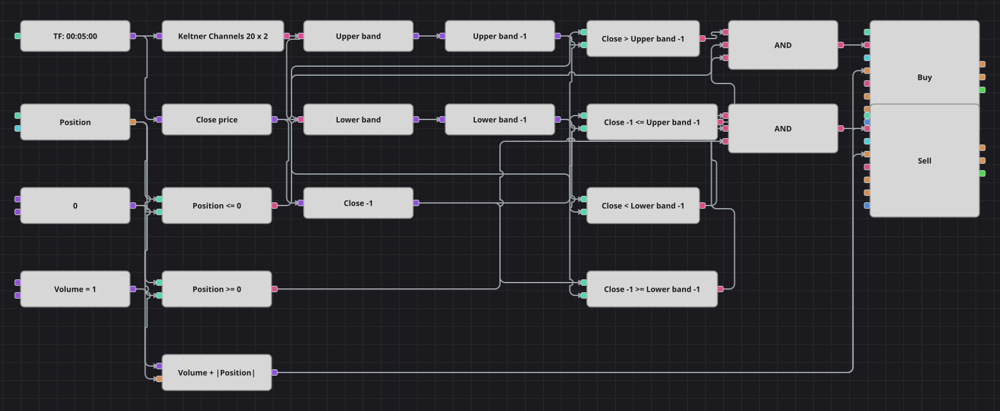

# ケルトナーチャネル・ブレイクアウト戦略のダイアグラム
[English](README.md) | [Русский](README_ru.md) | [中文](README_zh.md) | [Español](README_es.md) | [Deutsch](README_de.md) | [Português](README_pt.md)

ケルトナーチャネルは、指数移動平均の上下に Average True Range の数倍だけ帯を広げたものです。このダイアグラムは、直前の終値がまだ内側にあった帯の外で引けるのを待ち、ブレイクの方向へ建玉ごと反転させます。損切りも利確もなく、反対方向のブレイクだけが建玉を外します。

## 戦略の概要

- KeltnerChannels が1つのブロックでチャネルを作り、2つの変換ブロックがその値から上下の帯を取り出します。
- 前値ブロックが両方の帯と1本前の終値を保持するため、ブレイクは同じ足で動いた帯ではなく、相場がすでに見た水準に対して測られます。
- 各注文の数量は共通数量にポジションの絶対値を足したものなので、1回の注文で建玉が反転します。単なる減量ではありません。
- C# 原典は1分足で期間500・倍率10のチャネルを使いますが、本図はその README に記載された 20 / 2 のチャネルを5分足で用います。こうすることで通常のデータでも実際にブレイクが起こります。

## エントリーとエグジットの条件

- **ロングエントリー**: 終値が1本前のローソク足の上側の帯を上回り、その1本前の終値はまだ帯の上か以下にあり、ポジションが買いではないとき。注文は共通数量に建っている売り分を足して買い、買い建てへ反転します。
- **ショートエントリー**: 終値が1本前のローソク足の下側の帯を下回り、その1本前の終値はまだ帯の下か以上にあり、ポジションが売りではないとき。注文は共通数量に建っている買い分を足して売り、売り建てへ反転します。
- **エグジット**: 専用のエグジットブロックはありません。反対方向のブレイクが建玉を反転させます。損切りも利確もない原典と同じ振る舞いです。

## パラメーター

| パラメーター | 既定値 | 説明 |
|---|---|---|
| Channel period | 20 | ケルトナーチャネルの期間。移動平均と、幅を作る値幅の両方を決めます。 |
| ATR multiplier | 2 | チャネルの帯を中心線から何本分の値幅だけ離すか。 |
| Volume | 1 | 建玉を足す前の注文数量（ロット）。 |
| Candles | 00:05:00 | ダイアグラム全体が用いるローソク足の時間軸。 |

## ダイアグラムの詳細

- ローソク足ブロックが指標と、終値を読み出す変換ブロックにデータを渡します。
- 3つの前値ブロックが上の帯・下の帯・終値を1本ずつずらします。指標は形成後にしか値を出さないため、最初の数本は自動的に飛ばされます。
- 4つの比較ブロックがブレイクの両側を作ります。1つは外へ出た足について、もう1つはまだ内側にあった足についてです。
- ポジションはゼロの定数と比較され両方の論理積に入り、数式ブロックがその絶対値を共通の数量定数に足して反転注文の数量を決めます。

## 使い方

`.json` ファイルを Designer に読み込み、バックテスターで過去データを使って実行し、実運用の前にパラメーターやブロック自体を自分の銘柄に合わせて調整してください。
