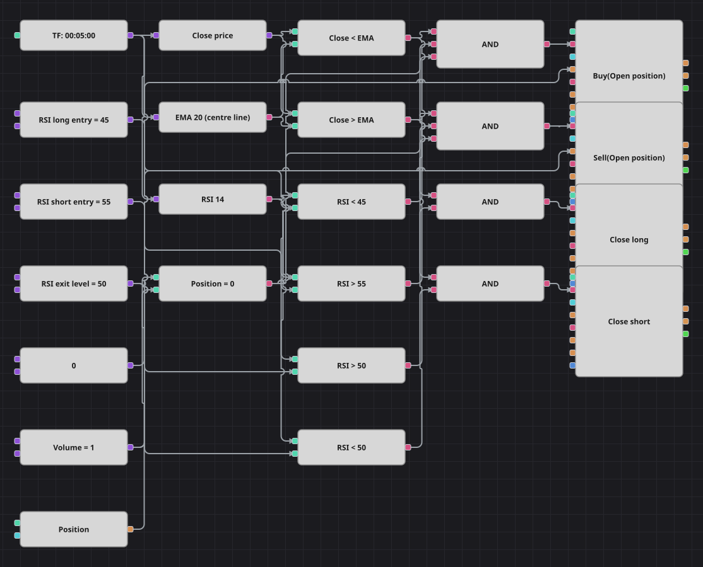

# Keltner RSI 戦略のダイアグラム
[English](README.md) | [Русский](README_ru.md) | [中文](README_zh.md) | [Español](README_es.md) | [Deutsch](README_de.md) | [Português](README_pt.md)

ケルトナーチャネルの中心線を軸に組み立てた平均回帰のダイアグラムです。EMA より下に伸びた価格を RSI の弱さとともに買い、EMA より上に伸びた価格を RSI の強さとともに売り、価格が平均線を戻り抜けて RSI が中央を越えた時点で手仕舞います。元の戦略は ATR によるチャネルの上下バンドを計算しますが一度も参照しないため、このダイアグラムではそれを省き、実際に売買を決める部分だけを残しました。

## 戦略の概要

- 期間20の ExponentialMovingAverage がケルトナーチャネルの中心線であり、ダイアグラム唯一の価格基準です。
- 14本の RSI が第二の判断材料になります。45 を下回れば買い向かう投げ売り、55 を上回れば売り向かう吹き上げと見なします。
- 2つのエントリーはいずれもノーポジションを条件とし、2つのエグジットは決済専用ブロックのため、4つの分岐が同じ建玉を奪い合うことはありません。
- 原典からの簡略化は2点です。使われない ATR バンドを削り、約定後120本のクールダウンはカウンター用ブロックがないため再現していません。そのぶん取引回数は多くなります。

## エントリーとエグジットの条件

- **ロングエントリー**: 終値が EMA より下、RSI がロングのエントリー水準より下、ポジションがゼロのとき。注文は共通の数量を成行で買い、ロングを建てます。
- **ショートエントリー**: 終値が EMA より上、RSI がショートのエントリー水準より上、ポジションがゼロのとき。注文は共通の数量を成行で売り、ショートを建てます。
- **エグジット**: 終値が EMA を上回り RSI が中央を超えるとロングを閉じ、終値が EMA を下回り RSI が中央を割るとショートを閉じます。原典どおり損切りも利食いもありません。コード上で宣言された損切り率は一度も使われていないからです。

## パラメーター

| パラメーター | 既定値 | 説明 |
|---|---|---|
| EMA Length | 20 | チャネルの中心線となる ExponentialMovingAverage の期間。 |
| RSI Length | 14 | RelativeStrengthIndex の平滑化期間。 |
| RSI Long Entry | 45 | ロングのエントリーには RSI がこの水準を下回る必要があります。 |
| RSI Short Entry | 55 | ショートのエントリーには RSI がこの水準を上回る必要があります。 |
| RSI Exit Level | 50 | 決済のために RSI が越えるべき中央の水準。 |
| Volume | 1 | 注文数量（ロット）。 |
| Candles | 00:05:00 | ダイアグラム全体が用いるローソク足の時間軸。 |

## ダイアグラムの詳細

- ローソク足ブロックが EMA、RSI、そして終値を取り出すコンバーターにデータを渡します。
- 2つの比較ブロックが終値と EMA を突き合わせ、別の4つが RSI を3つの水準と比べ、ポジションブロックはゼロ定数と比較されます。
- 2つの論理積が価格条件・RSI 条件・ゼロポジション判定からエントリーを組み立て、建玉を開くモードのポジション変更ブロックを動かします。
- さらに2つの論理積がエグジットを組み立て、決済モードのポジション変更ブロックを動かします。数量の入力は不要で、それぞれ閉じられる側だけに作用します。

## 使い方

`.json` ファイルを Designer に読み込み、バックテスターで過去データを使って実行し、実運用の前にパラメーターやブロック自体を自分の銘柄に合わせて調整してください。
