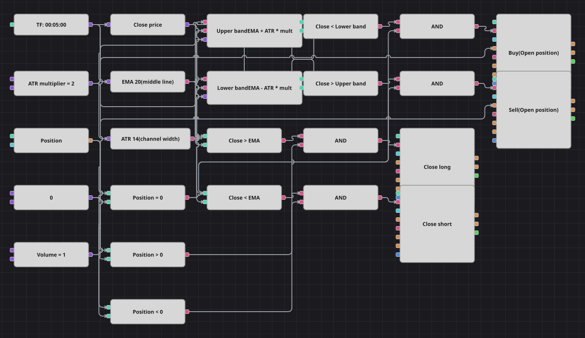

# 肯特纳通道回归策略图
[English](README.md) | [Русский](README_ru.md) | [Español](README_es.md) | [Deutsch](README_de.md) | [Português](README_pt.md) | [日本語](README_ja.md)

肯特纳通道是一条移动平均线加上以波动率决定的包络：宽度来自平均真实波幅，因此上下轨会随行情呼吸，而不是固定距离。本图把通道外的收盘价视为过冲，反向入场，并在中轨了结。

## 策略概览

- 通道是手工搭建的，没有直接使用现成的 KeltnerChannels 指标，因为该方块把均线周期和 ATR 周期绑定为同一个值，而原策略 EMA 用 20、ATR 用 14。
- 两个公式方块逐字构建上下轨：EMA 加减 ATR 乘以倍数；倍数已公开为参数，可以在不改动图形的情况下放宽或收窄通道。
- 中轨就是全部的离场规则：价格一旦回到 EMA 的另一侧就了结，因此目标位随均线移动。
- 原策略使用一分钟K线，并在每笔交易后锁定 500 根K线，实际上也起到持仓作用。随附历史为五分钟数据，故本图使用五分钟K线；Designer 没有可保存状态的K线计数器，锁定无法复现，因此交易更频繁、持仓更短。

## 入场与出场规则

- **做多入场**: 收盘价低于下轨，即低于 EMA 超过 ATR 乘以倍数的距离，且当前空仓。订单按设定数量买入。
- **做空入场**: 收盘价高于上轨，即高于 EMA 超过 ATR 乘以倍数的距离，且当前空仓。订单按设定数量卖出。
- **离场**: 收盘价重新回到 EMA 之上时平掉多头，重新回到 EMA 之下时平掉空头。原策略声明了止损倍数却从未使用，因此本图同样没有止损和止盈。

## 参数

| 参数 | 默认值 | 说明 |
|---|---|---|
| EMA Length | 20 | 构成中轨的指数移动平均线周期。 |
| ATR Length | 14 | 决定通道宽度的平均真实波幅周期。 |
| ATR multiplier | 2 | 上下轨距离中轨多少个 ATR。 |
| Volume | 1 | 下单数量（手）。 |
| Candles | 00:05:00 | 整张图使用的K线周期。 |

## 图表详情

- K线方块向收盘价转换方块和两个指标方块供数；ATR 需要整根K线，因此直接接自K线源。
- 每条轨道是一个带三个输入的公式方块：EMA、ATR 和共享的倍数常量。
- 四个比较方块把收盘价与上下轨及中轨对比，另外三个把持仓与零对比。
- 每个逻辑与把一个价格条件和一个持仓条件合并；入场方块带“开仓”条件并共用数量常量，平仓方块带“平仓”条件。

## 使用方法

将 `.json` 文件导入 Designer，在回测器中用历史数据运行，然后根据自己的交易品种调整参数或方块，确认无误后再用于实盘。
