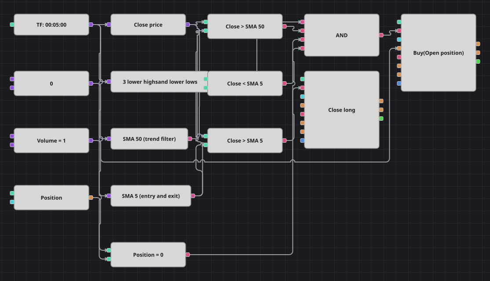

# Diagrama da estratégia Larry Connors 3 Day High/Low
[English](README.md) | [Русский](README_ru.md) | [中文](README_zh.md) | [Español](README_es.md) | [Deutsch](README_de.md) | [日本語](README_ja.md)

O 3 Day High/Low de Larry Connors compra um recuo curto dentro de um mercado em alta. O preço precisa se manter acima de uma SimpleMovingAverage lenta, cair abaixo de uma rápida e formar três candles seguidos cujas máximas e mínimas sejam menores que as do candle anterior. A operação é devolvida no primeiro fechamento acima da média rápida. O original usa barras diárias; este diagrama trabalha em candles de cinco minutos para combinar com o histórico intradiário incluído.

## Visão geral da estratégia

- Um bloco de padrão de candles carrega toda a figura de quatro candles: três consecutivos, cada um com máxima e mínima menores que o anterior.
- Uma SimpleMovingAverage de 50 períodos define que o mercado sobe, de modo que o recuo só é comprado a favor do movimento maior.
- Uma SimpleMovingAverage de 5 períodos é ao mesmo tempo o portão de entrada, pois o preço abaixo dela indica que o recuo continua, e o gatilho de saída.
- A estratégia é somente comprada. O original ainda limita o número de entradas e espera quinze barras entre operações; não há bloco contador, então este diagrama negocia com mais frequência que a fonte.

## Regras de entrada e saída

- **Entrada comprada**: O bloco de padrão informa três máximas e mínimas descendentes, o fechamento está acima da SMA lenta, abaixo da SMA rápida e a posição está zerada. A ordem compra o volume compartilhado a mercado e abre a compra.
- **Entrada vendida**: Não existe lado vendido. As regras de Connors só compram recuos dentro de um mercado em alta, por isso o diagrama não tem entrada de venda.
- **Saída**: O primeiro fechamento acima da SMA rápida encerra a compra. O bloco de encerramento envia uma ordem a mercado do tamanho aberto e, como no código original, não há stop nem alvo.

## Parâmetros

| Parâmetro | Padrão | Descrição |
|---|---|---|
| Slow SMA Length | 50 | Período da SimpleMovingAverage lenta, o filtro de mercado em alta. |
| Fast SMA Length | 5 | Período da SimpleMovingAverage rápida: o preço abaixo abre a operação e o primeiro fechamento acima a encerra. |
| Volume | 1 | Volume da ordem, em lotes. |
| Candles | 00:05:00 | Tempo gráfico dos candles com que todo o diagrama trabalha. |

## Detalhes do diagrama

- O bloco de candles alimenta o indicador de padrão, as duas médias móveis e um conversor que lê o preço de fechamento.
- Dois blocos de comparação confrontam o fechamento com as duas médias e o bloco de posição é comparado a uma constante zero.
- Um E lógico reúne o sinal do padrão, as duas condições de média e a checagem de posição zerada e aciona um bloco de modificação de posição em modo de abertura.
- Um segundo bloco de modificação, em modo de encerramento, dispara quando o fechamento volta acima da média rápida; ele não recebe volume, pois encerra o que estiver aberto.

## Uso

Importe o arquivo `.json` no Designer, execute-o sobre dados históricos no backtester e depois ajuste os parâmetros ou os próprios blocos ao seu instrumento antes de operar ao vivo.
