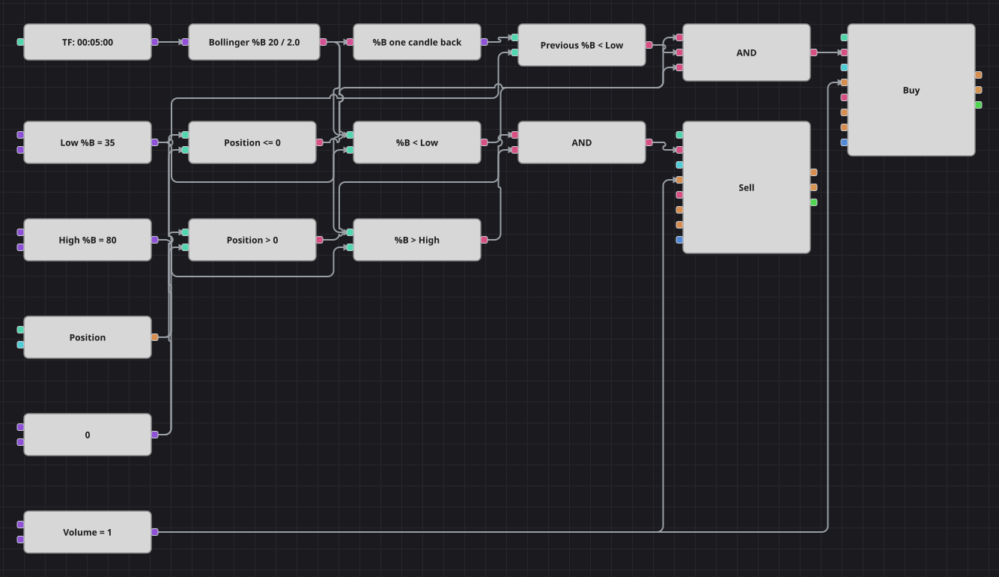

# Диаграмма стратегии Bollinger %B по Ларри Коннорсу
[English](README.md) | [中文](README_zh.md) | [Español](README_es.md) | [Deutsch](README_de.md) | [Português](README_pt.md) | [日本語](README_ja.md)

Диаграмма возврата к среднему только в лонг, построенная на Bollinger %B — положении закрытия внутри полос Боллинджера, выраженном в процентах от их ширины. Идея Ларри Коннорса в том, что одна слабая свеча ничего не доказывает, поэтому схема ждёт, пока %B удержится в нижней части полосы две свечи подряд, и держит позицию, пока %B не вернётся в верхнюю часть.

## Обзор стратегии

- Индикатор BollingerPercentB делает в одном кубике то, что исходная стратегия считает вручную по полосам; его шкала — от 0 до 100, поэтому классические пороги 0.35 и 0.8 записаны как 35 и 80.
- Кубик предыдущего значения хранит показание прошлой свечи — именно он превращает одиночную слабую свечу в условие по двум свечам.
- Стратегия только длинная: она покупает слабость и продаёт тот же лонг обратно, шорт не открывается никогда.
- Позиция участвует в обоих решениях, поэтому вход не наращивается, а выход не срабатывает при пустой позиции.

## Правила входа и выхода

- **Вход в лонг**: %B предыдущей свечи и %B текущей свечи оба ниже нижнего порога, а позиция не в лонге. Заявка покупает один лот.
- **Вход в шорт**: Шорт в диаграмме не открывается. Кубик продажи служит только выходом из открытого лонга.
- **Выход**: %B поднимается выше верхнего порога, а позиция в лонге. Заявка продаёт тот же один лот и возвращает позицию к нулю.

## Параметры

| Параметр | По умолчанию | Описание |
|---|---|---|
| Bollinger Period | 20 | Период полос Боллинджера, по которым считается %B. |
| Bollinger Deviation | 2 | Множитель стандартного отклонения полос Боллинджера. |
| Low %B | 35 | Порог, ниже которого %B считается нижней частью полосы; условие должно выполниться две свечи подряд. |
| High %B | 80 | Порог, выше которого %B считается восстановившимся, что закрывает лонг. |
| Volume | 1 | Объём заявки в лотах. |
| Candles | 00:05:00 | Таймфрейм свечей, на котором работает вся диаграмма. |

## Детали диаграммы

- Кубик свечей питает кубик индикатора, значение которого идёт и в сравнения, и в кубик предыдущего значения.
- Два сравнения с одной и той же нижней константой дают условие по текущей и по прошлой свече, третье сравнивает %B с верхней константой для выхода.
- Ещё два сравнения проверяют позицию против нуля: «не в лонге» для входа и «в лонге» для выхода.
- Два логических И запускают кубики изменения позиции, оба берут объём из одной общей константы.

## Использование

Импортируйте файл `.json` в Designer, прогоните схему на исторических данных в тестере, затем подстройте параметры или сами кубики под свой инструмент, прежде чем торговать вживую.
