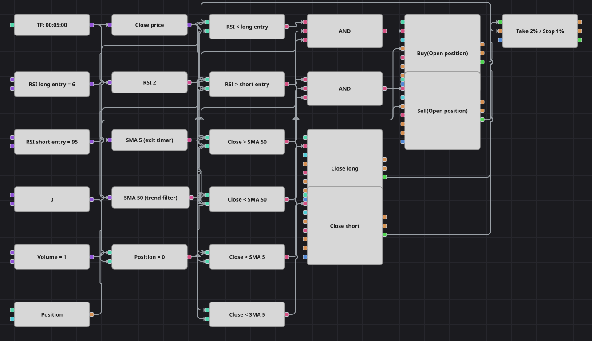

# Diagramm der RSI-2-Strategie von Larry Connors
[English](README.md) | [Русский](README_ru.md) | [中文](README_zh.md) | [Español](README_es.md) | [Português](README_pt.md) | [日本語](README_ja.md)

Larry Connors' RSI-2 kauft die Panik und verkauft die Euphorie, aber nur auf der Seite, die der langsame Durchschnitt erlaubt: Ein RSI mit Periode zwei markiert das Extrem, eine SMA(50) bestimmt die Richtung, eine SMA(5) den Ausstiegszeitpunkt. Das Original handelt Vier-Stunden-Kerzen; dieses Diagramm arbeitet auf Fünf-Minuten-Kerzen und passt damit zur mitgelieferten Intraday-Historie.

## Strategieübersicht

- Ein RSI der Länge zwei reagiert auf eine einzige Kerze, deshalb markiert ein Wert unter 6 oder über 95 einen kurzen Verkaufs- oder Kaufschub und keinen dauerhaften Zustand.
- Die langsame SMA ist der Richtungsfilter: Longs nur oberhalb, Shorts nur unterhalb, damit das Diagramm auf der Seite der größeren Bewegung bleibt.
- Eine Position wird nur aus der Neutralstellung eröffnet, und die schnelle SMA schließt sie, sobald der Kurs wieder über diesen Durchschnitt tritt — Trades leben deshalb meist ein bis zwei Kerzen.
- Der Schutzbaustein ersetzt Stop und Ziel in Pips durch prozentuale Abstände, da sich die Pip-Größe aus dem Kursschritt in einem Diagramm nicht berechnen lässt.

## Ein- und Ausstiegsregeln

- **Long-Einstieg**: Der RSI(2) liegt unter der Long-Einstiegsmarke, der Schlusskurs über der langsamen SMA und die Position ist neutral. Die Order kauft das gemeinsame Volumen zum Markt und eröffnet den Long.
- **Short-Einstieg**: Der RSI(2) liegt über der Short-Einstiegsmarke, der Schlusskurs unter der langsamen SMA und die Position ist neutral. Die Order verkauft das gemeinsame Volumen zum Markt und eröffnet den Short.
- **Ausstieg**: Ein Long wird geschlossen, wenn der Schlusskurs wieder über die schnelle SMA steigt, ein Short, wenn er darunter fällt; der Stop von 1% oder das Ziel von 2% schließen die Position früher, falls der Kurs zuerst dorthin läuft.

## Parameter

| Parameter | Standard | Beschreibung |
|---|---|---|
| RSI Length | 2 | Glättungsperiode des Relative-Stärke-Index; konstruktionsbedingt zwei Kerzen. |
| Fast SMA Length | 5 | Periode der schnellen SMA, die den Ausstieg bestimmt. |
| Slow SMA Length | 50 | Periode der langsamen SMA, die die erlaubte Handelsrichtung festlegt. |
| RSI Long Entry | 6 | RSI-Marke, unterhalb derer ein Long erlaubt ist. |
| RSI Short Entry | 95 | RSI-Marke, oberhalb derer ein Short erlaubt ist. |
| Take Profit, % | 2 | Abstand des Ziels vom Einstiegskurs, in Prozent. |
| Stop Loss, % | 1 | Abstand des Stops vom Einstiegskurs, in Prozent. |
| Volume | 1 | Ordervolumen in Lots. |
| Candles | 00:05:00 | Zeiteinheit der Kerzen, mit der das gesamte Diagramm arbeitet. |

## Diagrammdetails

- Der Kerzenbaustein speist den RSI, beide gleitenden Durchschnitte und einen Konverter, der den Schlusskurs jeder abgeschlossenen Kerze liest.
- Sechs Vergleichsbausteine tragen die Regeln: zwei prüfen den RSI gegen seine Einstiegsmarken, zwei den Schlusskurs gegen die langsame SMA, zwei gegen die schnelle SMA.
- Beide Einstiegs-UNDs nehmen zusätzlich die Prüfung auf neutrale Position auf, und die Einstiegsbausteine sind auf Positionseröffnung gestellt, sodass ein Signal eine laufende Position nie vergrößert.
- Die Ausstiegsbausteine sind auf Positionsschließung gestellt und wirken nur, wenn eine Gegenposition existiert; alle eigenen Trades laufen in den Schutzbaustein, damit Stop und Ziel der tatsächlichen Position folgen.

## Verwendung

Importieren Sie die `.json`-Datei in Designer, testen Sie sie im Backtester mit historischen Daten und passen Sie danach Parameter oder Bausteine an Ihr Instrument an, bevor Sie live handeln.
