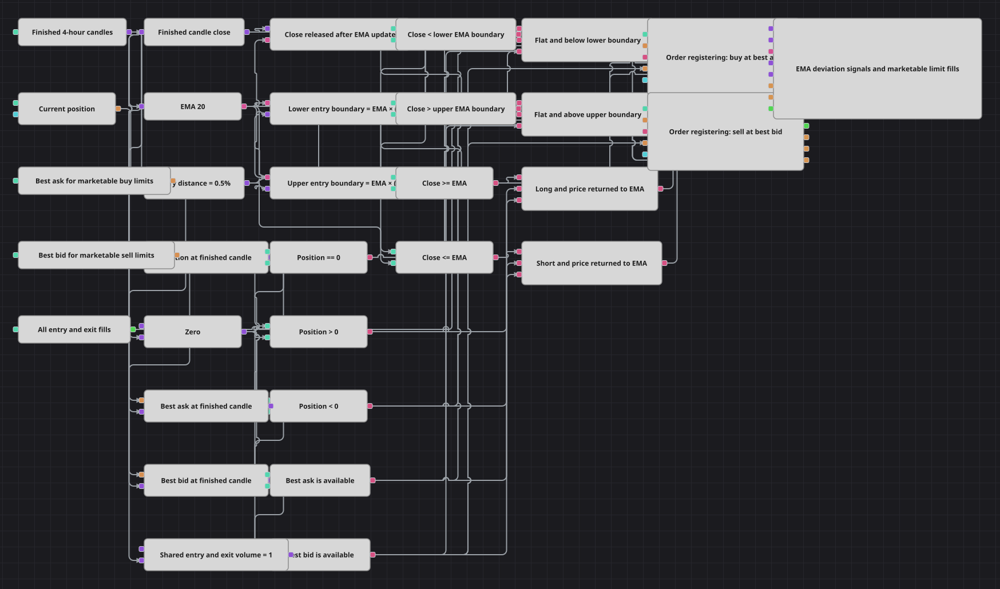

# Last-Price-Rückkehr mit Level1-Limitorders
[English](README.md) | [Русский](README_ru.md) | [中文](README_zh.md) | [Español](README_es.md) | [Português](README_pt.md) | [日本語](README_ja.md)

Das Beispiel zeigt vor allem Order registering und Level1-Ausführung: Die bekannte EMA-Abweichungsrückkehr wird mit marktfähigen Limits umgesetzt. Trotz des historischen Namens stammt jede Entscheidung aus einer fertigen Vierstundenkerze; es gibt keinen Tick-Signalweg.

## Strategieübersicht

- Fertige Vierstundenschlüsse speisen EMA(20) und werden mit Grenzen 0,5% darunter und darüber verglichen.
- Ohne Position fordert ein Schluss unter der unteren Grenze Kauf, über der oberen Grenze Verkauf.
- Long endet bei Rückkehr zu oder über EMA, Short bei Rückkehr zu oder unter EMA.
- Je Kerze wird Best Ask für Käufe und Best Bid für Verkäufe gespeichert; positive Preisgates verhindern Orders ohne Quote.
- Dasselbe Volumen eins gilt für Ein- und Ausstieg, sodass eine eigene Position durch eine Gegenfüllung geschlossen wird.

## Ein- und Ausstiegsregeln

- **Long-Einstieg**: Bei Position == 0 und Close < EMA × (1 − 0,5/100) wird am Best Ask gekauft; das Limit durch den Spread soll wie BuyMarket ausführen.
- **Short-Einstieg**: Bei Position == 0 und Close > EMA × (1 + 0,5/100) wird am Best Bid verkauft; das Limit durch den Spread soll wie SellMarket ausführen.
- **Ausstieg**: Bei Position > 0 und Close >= EMA verkauft der gemeinsame Block eine Einheit am Best Bid; bei Position < 0 und Close <= EMA kauft er am Best Ask.

## Parameter

| Parameter | Standard | Beschreibung |
|---|---|---|
| Candle Time Frame | 04:00:00 | Fertiges Kerzenintervall für EMA und Entscheidungen, wie im C#-Standard. |
| EMA Period | 20 | Anzahl der Schlüsse in ExponentialMovingAverage. |
| Entry Distance, % | 0.5 | Prozentuale EMA-Abweichung für einen Einstieg ohne Position. |
| Shared Entry/Exit Volume | 1 | Gemeinsames Volumen der Ein- und Ausstiegslimits. |

## Diagrammdetails

- C# nutzt Market-Orders. Das Diagramm zeigt bewusst Order registering und nutzt marktfähige Limits: Kauf am Best Ask, Verkauf am Best Bid.
- Passiv wäre Kauf am Best Bid und Verkauf am Best Ask; dann wären Order cancellation oder replacement für liegenbleibende Orders nötig.
- Close und EMA stammen aus derselben Kerze. Eine Variable gibt den Schluss erst nach dem EMA-Update frei und verhindert den Vergleich mit der alten EMA.
- Das gemeinsame Volumen entspricht Strategy.Volume. Eine externe oder anders große Position wird durch eine feste Einheit nicht zwingend glatt.
- Die Idee überschneidet sich mit MA_Deviation; hier sind Level1-Abtastung und marktfähige Limit-Ausführung die eigene Lektion.

## Verwendung

Importieren Sie die `.json`-Datei in Designer, testen Sie sie im Backtester mit historischen Daten und passen Sie danach Parameter oder Bausteine an Ihr Instrument an, bevor Sie live handeln.
