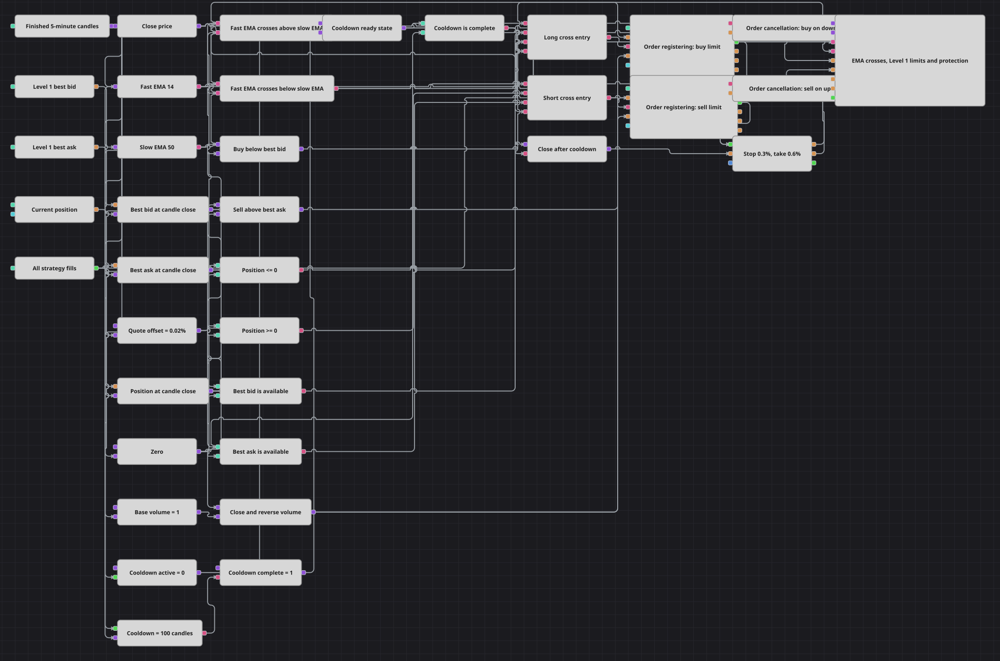

# Лимитные входы по пересечению EMA и Level 1
[English](README.md) | [中文](README_zh.md) | [Español](README_es.md) | [Deutsch](README_de.md) | [Português](README_pt.md) | [日本語](README_ja.md)

Схема сохраняет сигнал EMA(14)/EMA(50) из TwoDLimitsStrategy и наглядно показывает работу заявок. На завершённой пятиминутной свече она фиксирует Level 1, ставит лимит чуть дальше лучшей котировки и снимает неисполненную заявку при обратном пересечении средних.

## Обзор стратегии

- Завершённые пятиминутные свечи поступают в быструю EMA(14) и медленную EMA(50); два блока Crossing отслеживают оба направления.
- BestBidPrice и BestAskPrice приходят асинхронно из Level 1 и фиксируются на каждой свече до расчёта цен.
- Лимит покупки ставится на 0,02% ниже лучшего бида, а продажи — на 0,02% выше лучшего аска, поэтому работу Order cancellation можно увидеть.
- Исполнение запускает кулдаун N values на 100 свечей. До его окончания отключены новые входы и поток цены в Position protection.
- После кулдауна Position protection использует стоп 0,3% и цель 0,6%.

## Правила входа и выхода

- **Вход в лонг**: EMA(14) пересекает EMA(50) снизу вверх, Position нулевая или короткая, лучший бид положителен и кулдаун завершён. Лимитная покупка ставится ниже зафиксированного бида; объём равен abs(Position) плюс базовый объём, поэтому одно исполнение закрывает шорт и открывает лонг.
- **Вход в шорт**: EMA(14) пересекает EMA(50) сверху вниз, Position нулевая или длинная, лучший аск положителен и кулдаун завершён. Лимитная продажа ставится выше зафиксированного аска с тем же правилом нетто-разворота.
- **Выход**: Обратное пересечение EMA снимает последнюю ещё активную встречную лимитную заявку. После исполнения входа и паузы в 100 свечей Position protection закрывает позицию по стопу 0,3% или тейку 0,6%; исполненная встречная лимитка также может развернуть позицию.

## Параметры

| Параметр | По умолчанию | Описание |
|---|---|---|
| Candle Time Frame | 00:05:00 | Интервал завершённых свечей для EMA, фиксации котировок, отсчёта кулдауна и проверки защиты. |
| Fast EMA Length | 14 | Число пятиминутных значений в быстрой экспоненциальной средней. |
| Slow EMA Length | 50 | Число пятиминутных значений в медленной экспоненциальной средней. |
| Quote Offset | 0.02% | Процент смещения от лучшей котировки: ниже бида для покупки и выше аска для продажи. |
| Base Volume | 1 | Размер новой позиции после погашения имеющейся встречной экспозиции. |
| Cooldown, candles | 100 | Число завершённых свечей после каждого исполнения до повторного включения входов и защиты. |
| Stop Loss | 0.3% | Расстояние защитного стопа от цены исполнения в процентах. |
| Take Profit | 0.6% | Расстояние цели прибыли от цены исполнения в процентах. |

## Детали диаграммы

- Исходный C# входит рыночными заявками; схема намеренно использует лимиты от Level 1, чтобы показать жизненный цикл регистрации и отмены.
- Исходные расстояния 200/400 шагов представлены примерно как 0,3%/0,6% для цены BTCUSDT в тестовой истории с сохранением отношения 1:2.
- Код не проверяет стоп и цель первые 100 свечей после исполнения. Гейт потока цены воспроизводит этот порядок, а не изображает защиту постоянно активной.
- Защёлки котировок синхронизируют асинхронный Level 1 со свечным решением EMA. Округление цены отключено, поскольку тестовая бумага может не задавать шаг цены.

## Использование

Импортируйте файл `.json` в Designer, прогоните схему на исторических данных в тестере, затем подстройте параметры или сами кубики под свой инструмент, прежде чем торговать вживую.
