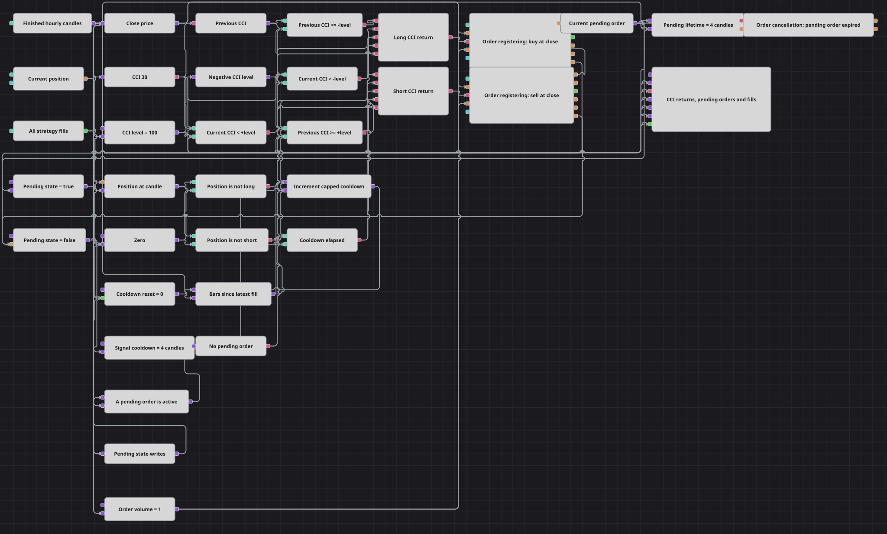

# Схема отложенных заявок на возврате CCI
[English](README.md) | [中文](README_zh.md) | [Español](README_es.md) | [Deutsch](README_de.md) | [Português](README_pt.md) | [日本語](README_ja.md)

Схема торгует возврат CCI из экстремальных зон короткоживущими лимитными заявками. Исполнимая цена берётся из закрытия завершённой свечи, а не из BestBid/BestAsk Level 1, поэтому жизненный цикл воспроизводится и без полей котировок.

## Обзор стратегии

- Часовые свечи поступают в CCI(30). Previous value отличает возврат выше −100 или ниже +100 от продолжающегося пребывания в экстремальной зоне.
- Обе стороны фильтруются направлением Position, кулдауном в четыре свечи после исполнения и общей защёлкой рабочей заявки.
- Order registering выставляет одну лимитную заявку по закрытию без округления цены; одновременно может жить только одна заявка.
- N values взводится объектом зарегистрированной Order и считает свечи. Через четыре свечи Order cancellation снимает неисполненную заявку и освобождает защёлку.

## Правила входа и выхода

- **Вход в лонг**: Предыдущий CCI не выше −100, текущий выше −100, Position не является лонгом, кулдаун завершён и рабочей заявки нет. По закрытию выставляется лимитная покупка.
- **Вход в шорт**: Предыдущий CCI не ниже +100, текущий ниже +100, Position не является шортом, кулдаун завершён и рабочей заявки нет. По закрытию выставляется лимитная продажа.
- **Выход**: Фиксированных стопа и цели нет. Встречный возврат CCI может выставить противоположную заявку и приблизить позицию к нулю. Неисполненная за срок лимитка отменяется без изменения Position.

## Параметры

| Параметр | По умолчанию | Описание |
|---|---|---|
| Candle Time Frame | 01:00:00 | Таймфрейм CCI, кулдауна, цены заявки и отсчёта её срока. |
| CCI Length | 30 | Число значений в CommodityChannelIndex. |
| CCI Level | 100 | Симметричная граница перекупленности и перепроданности как +Level и −Level. |
| Signal Cooldown, candles | 4 | Число завершённых свечей после последнего исполнения до новой заявки. |
| Order Volume | 1 | Объём каждой отложенной лимитной заявки. |
| Pending Lifetime, candles | 4 | Максимальное число завершённых свечей жизни неисполненной заявки. |

## Детали диаграммы

- Папка сохраняет имя позиции галереи, но поле Level 1 не подключено: цена close выбрана явно как воспроизводимая цена отложенной заявки.
- Флаг рабочей заявки включается реальным объектом Order и очищается событием Finished, включая исполнение, отмену и отказ.
- Кулдаун и срок заявки — разные параметры: первый отсчитывается после сделки, второй ограничивает неисполненную заявку.

## Использование

Импортируйте файл `.json` в Designer, прогоните схему на исторических данных в тестере, затем подстройте параметры или сами кубики под свой инструмент, прежде чем торговать вживую.
