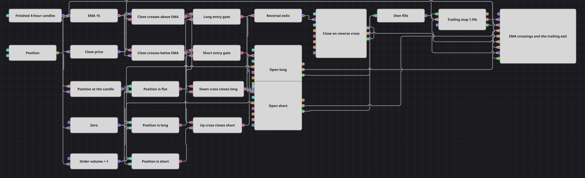

# EMA 交叉配合移动止损的策略图
[English](README.md) | [Русский](README_ru.md) | [Español](README_es.md) | [Deutsch](README_de.md) | [Português](README_pt.md) | [日本語](README_ja.md)

本图中的入场是元件面板里最朴素的做法：四小时K线上的收盘价穿越指数移动平均线。而这个示例真正要讲的，是之后负责把持仓了结的那个模块。持仓保护（Position protection）由入场成交布防，在每根收盘K线上收到一个价格；开启移动止损后，它会跟在顺势的持仓后面拖动止损位，于是出场变成一个只进不退的价位，而不是固定在入场处的一条线。

## 策略概览

- 四小时K线是全图的节拍，并且只发布已走完的K线，因此每一个决策都建立在一根完整的K线上。
- 一个转换模块从每根K线中取出收盘价，而建立在同一序列上的指数移动平均线，就是用来衡量价格的那条基准线。
- 两个交叉模块从相反方向盯住这一对数值：一个把收盘价作为上方输入、把均线作为下方输入，另一个则正好相反。每个模块只在两条线真正互换位置的那根K线上发声。
- 当前持仓由一个变量对齐到K线节拍上——它在输入端保存持仓量，并在K线触发时释放；三个与零的比较把这个被保存的数值转换成空仓、多头和空头三种状态。
- 四个逻辑与（AND）门把两个交叉与这三种状态两两配对：空仓时向上交叉开多，空仓时向下交叉开空，而任一方向的交叉若与已有持仓相反，则把它了结。
- 两个入场模块都带有空仓条件，因此在已有持仓运行时触发的门既不能加仓也不能反手：本图同一时间只持有一个方向的仓位。
- 每一笔自身成交都通过组合（Combination）模块送入持仓保护，正是这一点让它对持仓的认知保持准确——入场成交为它布防，平仓成交为它撤防。
- 它的价格（Price）接口接收的是信号所用的同一个收盘价，因此移动止损位每根收盘K线重算一次；图表面板绘制K线、均线、入场与出场委托、保护性止损以及每一笔成交。

## 入场与出场规则

- **做多入场**: 在一根已收盘的K线上，收盘价向上穿越指数移动平均线，同时保存的持仓量为零。多头门放行，持仓修改（Position modify）按下单数量以市价买入。
- **做空入场**: 在一根已收盘的K线上，收盘价向下穿越指数移动平均线，同时保存的持仓量为零。空头门放行，持仓修改按下单数量以市价卖出。
- **离场**: 有两种方式可以结束一笔交易，通常先发生的是第一种。持仓保护把止损放在距入场价 1.5% 的位置；开启移动止损后，每当一根K线收得更深入盈利，它就把止损在多头后面上移、在空头后面下移；一旦某根收盘价重新穿回该价位，交易立即由市价委托了结。第二条出路是信号本身：与已有持仓方向相反的交叉会触发第三个设为平仓的持仓修改模块，它把现有仓位全部了结，并且不需要自带数量。两条路径都不会反手——反向开仓必须等待下一次交叉，届时本图已经空仓，可以自由接下这笔交易。

## 参数

| 参数 | 默认值 | 说明 |
|---|---|---|
| Candles | 04:00:00 | K线序列的时间周期。一根收盘K线对应一次决策和一次移动止损位的重算。 |
| EMA Length | 15 | 用来衡量收盘价的指数移动平均线所包含的K线根数。周期越长，交叉越少，持仓也能穿过更多噪音而不被打断。 |
| Order Volume | 1 | 下单数量，以手为单位。 |
| Trailing Stop, % | 1.5 | 移动止损距离，以百分比表示。它从持仓开立以来达到的最优价格起算，而不是从入场价起算。 |

## 图表详情

- 移动止损位跟随模块收到的价格，而这里给它的价格是收盘价。因此止损停在K线收盘的位置，而不是影线触及的位置，于是K线内的瞬时插针既不会拖动这个价位，也不会把交易扫出场。
- 只要改一根连线就能得到更细腻的跟踪：把价格接口改由读取最新成交价的 Level 1 模块供给，或者把订单簿接到行情深度（Market depth）接口上，同一个止损就会按每一次报价重新定价，而不是每四小时一次。
- 每一笔自身成交都会进入持仓保护，平仓成交也不例外。平仓成交把它记录的持仓轧回零并撤除止损；没有这一步，该模块就会继续盯着一个已经不存在的持仓，并最终以开出反向仓位的方式去“保护”它。
- 均线只发布已形成的最终值，因此在它还在积累数据的起始若干根K线上，不会产生属于自己的交叉。
- 下单数量是一个对外暴露的单一数值，由两个入场模块共用。平仓模块完全不取数量，因为平仓委托会按当前持有的仓位自行确定规模。

## 使用方法

将 `.json` 文件导入 Designer，在回测器中用历史数据运行，然后根据自己的交易品种调整参数或方块，确认无误后再用于实盘。
