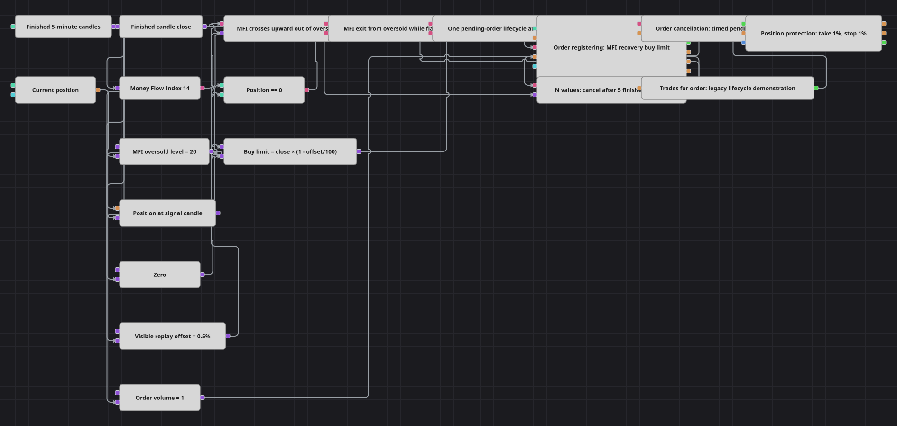

# Entrada límite MFI con cancelación temporizada
[English](README.md) | [Русский](README_ru.md) | [中文](README_zh.md) | [Deutsch](README_de.md) | [Português](README_pt.md) | [日本語](README_ja.md)

El diagrama solo largo muestra el ciclo completo de una orden pendiente. MFI(14) sale de sobreventa, registra compra bajo el cierre, N values cuenta cinco velas, Order cancellation retira el límite y Trades for order conduce ejecuciones a protección 1%/1%.

## Resumen de la estrategia

- El cruce ascendente de MFI por 20 modela la visita recordada a sobreventa.
- Con Position == 0 registra una compra de una unidad en Close × (1 − 0,5/100).
- Una bandera de ciclo único bloquea órdenes nuevas hasta terminar cinco velas, evitando que un timeout viejo cancele una nueva.
- Si ejecuta, Trades for order alimenta la protección; si no, el temporizador cancela exactamente esa orden.

## Reglas de entrada y salida

- **Entrada en largo**: MFI cruza hacia arriba 20 con posición plana y coloca compra 0,5% bajo el cierre terminado.
- **Entrada en corto**: No existe entrada corta, igual que en C#.
- **Salida**: La entrada ejecutada sale en +1% o −1%. La pendiente se cancela tras cinco velas, contando la vela de señal como primera.

## Parámetros

| Parámetro | Por defecto | Descripción |
|---|---|---|
| Candle Time Frame | 00:05:00 | Intervalo terminado para MFI, precio y contador. |
| MFI Period | 14 | Cantidad de velas de MoneyFlowIndex. |
| MFI Oversold Level | 20 | Nivel MFI cuyo cruce ascendente arma la entrada. |
| Replay Entry Offset, % | 0.5 | Distancia bajo cierre; C# usa 0,1% y replay usa 0,5%. |
| Order Volume | 1 | Volumen de la compra pendiente. |
| Cancel After Candles | 5 | Velas terminadas antes de cancelar. |
| Take Profit, % | 1 | Ganancia porcentual desde la ejecución. |
| Stop Loss, % | 1 | Pérdida porcentual desde la ejecución. |

## Detalles del diagrama

- C# usa 0,1%. El emulador ejecuta si el límite cae dentro de Low..High, por lo que casi siempre llena de inmediato; 0,5% hace visible la cancelación replay.
- Trades for order está obsoleto; hoy se usa Trades de Order registering. Se muestra aquí exactamente una vez por su valor histórico.
- La bandera se libera por temporizador, no por ejecución; así un temporizador anterior nunca cancela una orden sustituta.
- El cooldown fuente es 20 velas. Se omite como simplificación, aunque el bloqueo de cinco velas evita entradas solapadas.
- El C# no contiene promediado pese al nombre de carpeta; el diagrama tiene una entrada y no incluye Chart panel.

## Uso

Importe el archivo `.json` en Designer, ejecútelo sobre datos históricos en el probador y después ajuste los parámetros o los propios bloques a su instrumento antes de operar en real.
