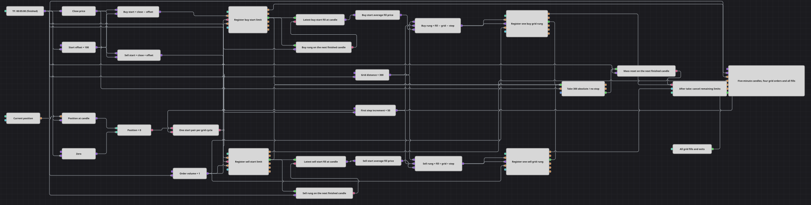

# Diagrama de estrategia de straddle con rejilla limitada
[English](README.md) | [Русский](README_ru.md) | [中文](README_zh.md) | [Deutsch](README_de.md) | [Português](README_pt.md) | [日本語](README_ja.md)

Este diagrama inicia cada ciclo de rejilla con dos órdenes limitadas simétricas alrededor de la última vela de cinco minutos finalizada. La ejecución de una orden inicial programa un nivel adicional en el mismo sentido, la protección con beneficio absoluto cierra la posición resultante y una solicitud diferida de cancelación masiva elimina los límites restantes.

## Resumen de la estrategia

- Cuando la posición es cero, se coloca una compra limitada 100 unidades de precio por debajo del cierre y una venta limitada 100 unidades por encima.
- La ejecución de cualquiera de las órdenes iniciales mantiene activa la orden opuesta y programa un nivel de rejilla del mismo sentido para la siguiente vela finalizada.
- El nivel adicional de compra queda 350 unidades por debajo de su ejecución inicial; el nivel adicional de venta queda 350 unidades por encima.
- Cada ejecución inicial o de rejilla se envía a Position protection con una distancia de beneficio absoluta de 300 y sin pérdida máxima.
- Una salida protectora programa la cancelación masiva para la siguiente vela finalizada. Su confirmación vuelve a habilitar el próximo ciclo de rejilla.

## Reglas de entrada y salida

- **Lado comprador**: Al comenzar un ciclo con posición cero, registrar una compra limitada en `Close - Start Offset`. Tras su ejecución, registrar otra compra en `Average Fill Price - Grid Distance - Step Distance` durante la siguiente vela finalizada.
- **Lado vendedor**: Al comenzar un ciclo con posición cero, registrar una venta limitada en `Close + Start Offset`. Tras su ejecución, registrar otra venta en `Average Fill Price + Grid Distance + Step Distance` durante la siguiente vela finalizada.
- **Órdenes pendientes**: La ejecución inicial no cancela el límite opuesto. Los límites iniciales y de rejilla restantes siguen activos hasta la etapa de cancelación masiva.
- **Salida**: Position protection envía una salida a mercado cuando el cierre de la vela alcanza un objetivo situado a 300 unidades de precio de una ejecución protegida. No se habilita un límite de pérdida.

## Parámetros

| Parámetro | Por defecto | Descripción |
|---|---|---|
| Candles | 00:05:00 | Marco temporal de las velas finalizadas que dirigen el ciclo. |
| Start Offset | 100 | Distancia entre el cierre y cada límite inicial, en unidades de precio. |
| Grid Distance | 300 | Distancia base desde una ejecución inicial hasta su nivel adicional del mismo lado. |
| Step Distance | 50 | Incremento añadido a Grid Distance para el nivel adicional. |
| Take Profit | 300 | Distancia absoluta entre una ejecución protegida y su objetivo de beneficio. |
| Stop Loss | 0 | Distancia absoluta de pérdida; cero desactiva ese límite. |
| Trailing Stop Loss | false | Mantiene desactivado el desplazamiento de la pérdida máxima. |
| Use Market Orders | true | Envía las salidas protectoras como órdenes a mercado. |
| Volume | 1 | Volumen de cada orden limitada inicial y de rejilla. |

## Detalles del diagrama

- La posición se toma en cada vela finalizada y se compara con cero. Un bloque Flag permite un único par inicial simétrico por ciclo de rejilla.
- Cuatro bloques Order registering envían los límites iniciales y de rejilla de compra y venta. No hay bloques de cancelación dirigida entre las dos órdenes iniciales.
- Una ejecución inicial se conserva en un bloque Variable. Un Delay de dos eventos consume la vela que produjo la ejecución y libera la operación guardada en la siguiente vela finalizada, de modo que el nuevo registro queda fuera de la devolución de llamada de ejecución.
- La operación guardada se convierte mediante `Order.AveragePrice`; después, los bloques Formula aplican `Grid Distance + Step Distance`, que suma 350 con los valores predeterminados.
- Position protection trata por separado cada ejecución recibida. Este ejemplo acotado no calcula un objetivo común ponderado por volumen para varias ejecuciones de rejilla.
- Una ejecución protectora arma otro Delay de dos eventos. Su salida solicita Order mass cancellation y solo un resultado satisfactorio restablece el Flag del ciclo.
- El gráfico muestra velas de cinco minutos, los cuatro flujos de órdenes y todas las ejecuciones o salidas de la estrategia.

## Uso

Importe el archivo `.json` en Designer, ejecute el diagrama con datos históricos en el probador y ajuste las distancias y el volumen a la escala de precios y volatilidad del instrumento antes de operar en real.
