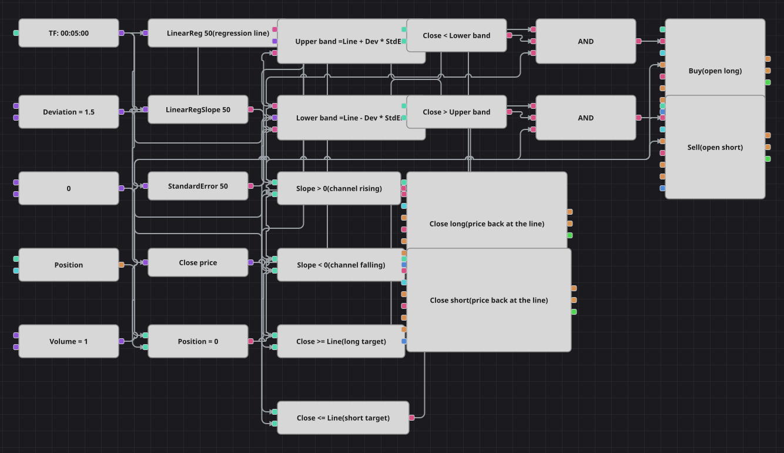

# Diagrama da estratégia de canal de regressão linear
[English](README.md) | [Русский](README_ru.md) | [中文](README_zh.md) | [Español](README_es.md) | [Deutsch](README_de.md) | [日本語](README_ja.md)

Uma reta de mínimos quadrados é ajustada sobre os últimos cinquenta fechamentos e ao seu redor é traçado um canal com largura de alguns erros padrão da regressão. Preço fora do canal é tratado como movimento esticado, e a estratégia o traz de volta à reta enquanto a inclinação do canal estiver a seu favor.

## Visão geral da estratégia

- LinearReg fornece o valor da reta ajustada na barra atual, LinearRegSlope a sua direção e StandardError a dispersão habitual dos fechamentos em torno dela.
- As bandas são a reta mais e menos o multiplicador de desvio vezes o erro padrão, de modo que o canal se alarga e se estreita sozinho junto com o mercado.
- A inclinação funciona como filtro: uma queda só é comprada dentro de um canal ascendente e um pico só é vendido dentro de um canal descendente.
- A reta de regressão é o alvo; não há stop nem realização, exatamente como na estratégia de origem.

## Regras de entrada e saída

- **Entrada comprada**: A inclinação da regressão está acima de zero, o fechamento está abaixo da banda inferior e a posição está zerada. A ordem de compra abre uma posição comprada de um lote.
- **Entrada vendida**: A inclinação da regressão está abaixo de zero, o fechamento está acima da banda superior e a posição está zerada. A ordem de venda abre uma posição vendida de um lote.
- **Saída**: A compra é encerrada assim que o fechamento alcança a reta vindo de baixo, e a venda assim que a alcança vindo de cima. Os dois blocos de saída trabalham em modo de encerramento e nada fazem sem posição.

## Parâmetros

| Parâmetro | Padrão | Descrição |
|---|---|---|
| LinearReg Length | 50 | Número de candles sobre os quais a reta de regressão é ajustada. |
| LinearRegSlope Length | 50 | Número de candles para medir a inclinação; mantenha igual ao comprimento da reta. |
| StandardError Length | 50 | Número de candles para medir o erro padrão; mantenha igual ao comprimento da reta. |
| Channel Deviation | 1.5 | Meia largura do canal, em erros padrão da regressão. |
| Volume | 1 | Volume da ordem, em lotes. |
| Candles | 00:05:00 | Tempo gráfico dos candles com que todo o diagrama trabalha. |

## Detalhes do diagrama

- Um único bloco de candles alimenta três indicadores e um conversor do preço de fechamento, então todos os valores vêm do mesmo candle finalizado.
- Dois blocos de fórmula montam as bandas a partir da reta, do erro padrão e de uma constante de desvio compartilhada que pode ser otimizada.
- Seis blocos de comparação transformam esses números em sinais: dois para a inclinação, dois para as bandas e dois para o retorno à reta.
- Cada entrada é um E lógico de inclinação, banda e posição zerada; as saídas vão direto da comparação para um bloco de encerramento de posição.
- A estratégia original espera vinte barras entre operações e calcula o desvio sobre toda a janela, enquanto o StandardError divide pela janela menos dois, o que deixa o canal cerca de dois por cento mais largo; reduza o desvio para cerca de 1,47 para reproduzir a banda original.

## Uso

Importe o arquivo `.json` no Designer, execute-o sobre dados históricos no backtester e depois ajuste os parâmetros ou os próprios blocos ao seu instrumento antes de operar ao vivo.
