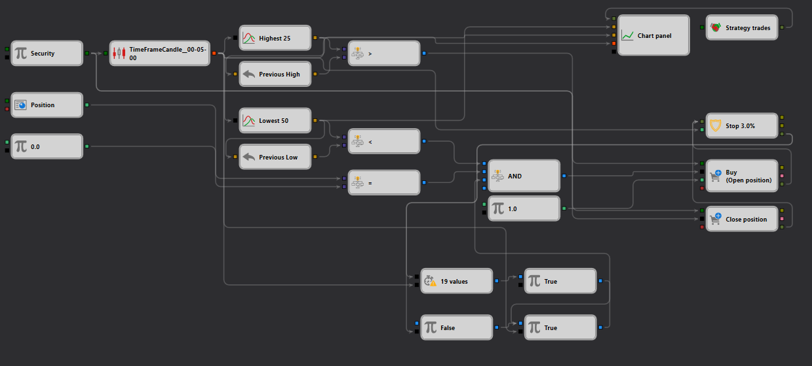

# Low Break with Stop Strategy Example in StockSharp Strategy Designer

## Overview

This example demonstrates a "Low Break with Stop" trading strategy configured within the StockSharp Strategy Designer. It is designed to execute trades based on specific low-price breakout conditions, incorporating stop-loss parameters to manage risk. This strategy leverages real-time market data to identify when a security's price breaks below a predefined low over a certain period and then initiates trades with defined stop conditions.

## Description of the Schema

The schema provided in the JSON file outlines a detailed workflow for trading based on price action relative to historical lows:

1. **Security Node**: This is the primary input node where the target security is defined, serving as the base for data input related to market prices.

2. **TimeFrameCandle Node**: Processes the incoming market data to generate candlesticks, which are crucial for analyzing price movements over specific time intervals.

3. **Lowest Indicator Nodes**: These nodes calculate the lowest price over a given number of periods, identifying potential breakout levels for initiating trades.

4. **Comparison Nodes**: These are used to compare the current price with the historical low, triggering trading signals when the current price falls below the set threshold, indicating a bearish breakout.

5. **Chart Panel Node**: Visualizes the trading data and indicators, providing a graphical representation of the strategy’s operations, which is essential for real-time monitoring and strategy adjustments.

6. **Trade Execution Nodes (Buy/Sell)**: Responsible for executing trades based on the strategy's logic. In this case, a sell order may be executed to capitalize on the expected downward price movement.

7. **Stop Order Node**: Implements stop-loss conditions to manage risk effectively. This ensures that trades are exited at a predefined loss threshold to protect against significant adverse movements.

## Workflow

- The **Security Node** supplies the necessary market data for the strategy.
- This data flows into the **TimeFrameCandle Node**, where it is transformed into usable candlestick formats.
- The **Lowest Indicator Nodes** then analyze these candlesticks to determine historical lows.
- **Comparison Nodes** monitor the current market price in comparison to these lows, activating trades when the price drops below the historical low point.
- The **Trade Execution Nodes** utilize these signals to execute sell orders assuming a continuation of the downward trend.
- Concurrently, **Stop Order Nodes** set stop-loss orders based on predefined criteria to manage potential losses.
- The **Chart Panel Node** displays all transactions and price movements, providing visual feedback on the strategy’s performance.

## Practical Application

This setup is particularly useful for traders focusing on breakout strategies, where recognizing and acting upon significant price movements can lead to profitable opportunities. The strategy is suited for:
- High-volatility markets where price swings can provide substantial trading opportunities.
- Day traders who capitalize on quick price movements and need robust mechanisms to manage risks effectively.

## Conclusion

The "Low Break with Stop" strategy example within the StockSharp Strategy Designer showcases an advanced approach to algorithmic trading by combining real-time data processing with sophisticated risk management techniques. This strategy provides a dynamic framework for exploiting price breakouts while ensuring risk parameters are strictly adhered to, making it an essential tool for traders aiming to maximize their returns through precise and controlled trading methods.