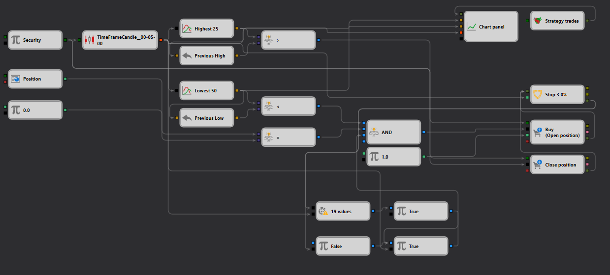

# Exemplo de Estratégia de Rompimento de Mínimas com Stop no StockSharp Strategy Designer
[English](README.md) | [Русский](README_ru.md) | [中文](README_zh.md) | [Español](README_es.md) | [Deutsch](README_de.md) | [日本語](README_ja.md)

## Visão Geral

Este exemplo demonstra uma estratégia de trading de "Rompimento de Mínimas com Stop" configurada no StockSharp Strategy Designer. Ela foi desenvolvida para executar operações com base em condições específicas de rompimento do preço mínimo, incorporando parâmetros de stop-loss para gerenciar o risco. Esta estratégia aproveita dados de mercado em tempo real para identificar quando o preço de um ativo rompe abaixo de uma mínima predefinida durante um período determinado e, em seguida, inicia operações com condições de stop definidas.

## Descrição do Esquema

O esquema fornecido no arquivo JSON descreve um fluxo de trabalho detalhado para negociar com base na ação do preço em relação às mínimas históricas:

1. **Nó de Instrumento**: este é o nó de entrada principal onde o [instrumento-alvo é definido](https://doc.stocksharp.com/topics/designer/strategies/using_visual_designer/elements/data_sources/variable.html), servindo como base para a entrada de dados relacionados aos preços de mercado.

2. **Nó TimeFrameCandle**: processa os dados de mercado recebidos para gerar [velas](https://doc.stocksharp.com/topics/designer/strategies/using_visual_designer/elements/data_sources/candles.html), que são fundamentais para analisar os movimentos de preços em intervalos de tempo específicos.

3. **Nós de Indicador de Mínimas**: esses nós [calculam o preço mais baixo](https://doc.stocksharp.com/topics/designer/strategies/using_visual_designer/elements/common/indicator.html) durante um determinado número de períodos, identificando níveis potenciais de rompimento para iniciar operações.

4. **Nós de Comparação**: são usados para [comparar](https://doc.stocksharp.com/topics/designer/strategies/using_visual_designer/elements/common/comparison.html) o preço atual com a mínima histórica, acionando sinais de trading quando o preço cai abaixo do limite estabelecido, indicando um rompimento de baixa.

5. **Nó do Painel de Gráfico**: visualiza os dados de trading e indicadores, fornecendo uma [representação gráfica](https://doc.stocksharp.com/topics/designer/strategies/using_visual_designer/elements/common/chart.html) das operações da estratégia, essencial para o monitoramento em tempo real e ajustes da estratégia.

6. **Nós de Execução de Operações (Compra/Venda)**: são responsáveis por [executar as operações](https://doc.stocksharp.com/topics/designer/strategies/using_visual_designer/elements/positions/modify.html) com base na lógica da estratégia. Neste caso, uma ordem de venda pode ser executada para aproveitar o movimento esperado de queda do preço.

7. **Nó de Ordem Stop**: implementa condições de [stop-loss](https://doc.stocksharp.com/topics/designer/strategies/using_visual_designer/elements/common/protect_position.html) para gerenciar o risco de forma eficaz. Isso garante que as operações sejam encerradas em um limite de perda predefinido para proteger contra movimentos adversos significativos.

## Fluxo de Trabalho

- O **Nó de Instrumento** fornece os dados de mercado necessários para a estratégia.
- Esses dados fluem para o **Nó TimeFrameCandle**, onde são transformados em formatos de velas utilizáveis.
- Os **Nós de Indicador de Mínimas** analisam essas velas para determinar as mínimas históricas.
- Os **Nós de Comparação** monitoram o preço atual do mercado em comparação com essas mínimas, ativando operações quando o preço cai abaixo do ponto mínimo histórico.
- Os **Nós de Execução de Operações** utilizam esses sinais para executar ordens de venda, assumindo uma continuação da tendência de queda.
- Simultaneamente, os **Nós de Ordem Stop** definem ordens de stop-loss com base em critérios predefinidos para gerenciar perdas potenciais.
- O **Nó do Painel de Gráfico** exibe todas as transações e movimentos de preços, fornecendo feedback visual sobre o desempenho da estratégia.

## Aplicação Prática

Esta configuração é particularmente útil para traders que se concentram em estratégias de rompimento, onde reconhecer e agir sobre movimentos significativos de preços pode levar a oportunidades lucrativas. A estratégia é adequada para:
- mercados de alta volatilidade, onde as oscilações de preços podem oferecer oportunidades substanciais de trading;
- day traders que capitalizam movimentos rápidos de preços e precisam de mecanismos robustos para gerenciar riscos de forma eficaz.

## Conclusão

O exemplo da estratégia "Rompimento de Mínimas com Stop" no StockSharp Strategy Designer demonstra uma abordagem avançada ao trading algorítmico, combinando processamento de dados em tempo real com sofisticadas técnicas de gerenciamento de risco. Esta estratégia fornece um framework dinâmico para explorar rompimentos de preços, garantindo ao mesmo tempo que os parâmetros de risco sejam rigorosamente respeitados, tornando-a uma ferramenta essencial para traders que buscam maximizar seus retornos por meio de métodos de trading precisos e controlados.
