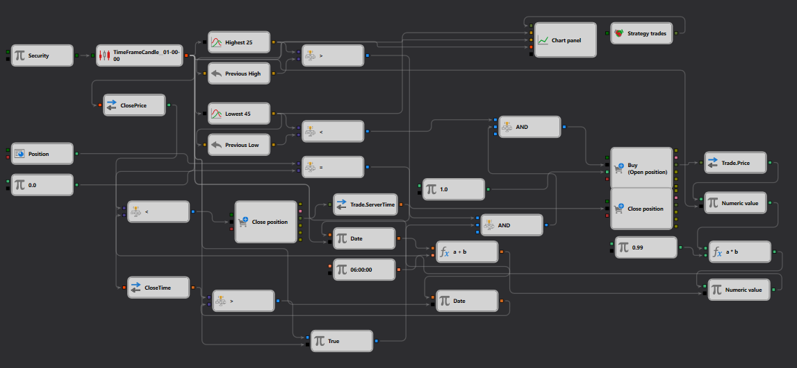

# Low Break with Calculation Strategy Description

## Strategy Overview

The "Low Break with Calculation" strategy utilizes a combination of high and low price indicators to identify potential breakout points in a market. This strategy aims to execute trades when the price breaks below a calculated low over a specified period, suggesting a potential downtrend.

## Strategy Details

### Components

- **Candle Formation**: Uses a one-hour timeframe for [candle](https://doc.stocksharp.com/topics/designer/strategies/using_visual_designer/elements/data_sources/candles.html) generation, capturing significant market movements.
- **High and Low Indicators**: 
  - **Highest 25**: Tracks the [highest price](https://doc.stocksharp.com/topics/designer/strategies/using_visual_designer/elements/converters/converter.html) over the last 25 periods.
  - **Lowest 45**: Monitors the [lowest price](https://doc.stocksharp.com/topics/designer/strategies/using_visual_designer/elements/converters/converter.html) over the last 45 periods.
- **Calculation Logic**: Determines trade execution points by [comparing](https://doc.stocksharp.com/topics/designer/strategies/using_visual_designer/elements/common/comparison.html) current prices with the calculated high and low levels from the indicators.

### Trade Execution

- **Entry Signal**: A [buy](https://doc.stocksharp.com/topics/designer/strategies/using_visual_designer/elements/trading/register_order.html) order is initiated when the current price crosses [below]() the lowest point calculated by the "Lowest 45" indicator.
- **Exit Signal**: A [sell](https://doc.stocksharp.com/topics/designer/strategies/using_visual_designer/elements/trading/register_order.html) order is triggered when subsequent price action does not support the continuation of the downtrend, defined by specific calculation parameters.

### Visualization

- **Chart Display**: Both the "Highest 25" and "Lowest 45" indicator values are plotted on the [chart](https://doc.stocksharp.com/topics/designer/strategies/using_visual_designer/elements/common/chart.html) alongside the price candles, providing a visual representation of potential breakout points.

## Implementation Details

- **Platform**: Implemented on the StockSharp platform, utilizing its capabilities for real-time data processing and indicator computation.
- **Indicator Usage**: Employs both high and low indicators to establish a range within which the strategy looks for breakout points.

## Conclusion

The "Low Break with Calculation" strategy is designed for traders looking for opportunities based on price breakouts from established highs or lows. This strategy combines technical indicators with sophisticated calculation logic to identify and act on potential market movements.
