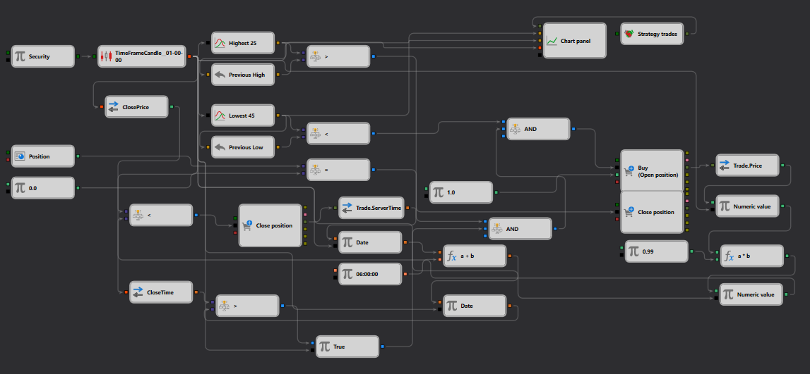

# 低点突破计算策略说明
[English](README.md) | [Русский](README_ru.md) | [Español](README_es.md) | [Deutsch](README_de.md) | [Português](README_pt.md) | [日本語](README_ja.md)

## 策略概述

"低点突破计算"策略综合运用高价和低价指标，识别市场中潜在的突破点。该策略的目标是在价格跌破指定周期内计算所得低点时执行交易，从而把握潜在的下跌趋势。

## 策略详情

### 组件

- **蜡烛图形成**：采用一小时时间框架进行[蜡烛图](https://doc.stocksharp.com/topics/designer/strategies/using_visual_designer/elements/data_sources/candles.html)生成，捕捉重要的市场走势。
- **高低价指标**：
  - **Highest 25**：追踪过去 25 个周期的[最高价格](https://doc.stocksharp.com/topics/designer/strategies/using_visual_designer/elements/converters/converter.html)。
  - **Lowest 45**：监测过去 45 个周期的[最低价格](https://doc.stocksharp.com/topics/designer/strategies/using_visual_designer/elements/converters/converter.html)。
- **计算逻辑**：通过将当前价格与指标计算出的高低水平进行[比较](https://doc.stocksharp.com/topics/designer/strategies/using_visual_designer/elements/common/comparison.html)，确定交易执行点。

### 交易执行

- **入场信号**：当当前价格向下穿越"Lowest 45"指标计算所得最低点时，触发[买入](https://doc.stocksharp.com/topics/designer/strategies/using_visual_designer/elements/positions/modify.html)订单。
- **出场信号**：当后续价格走势不支持下跌趋势的延续时（由特定计算参数定义），触发[卖出](https://doc.stocksharp.com/topics/designer/strategies/using_visual_designer/elements/positions/modify.html)订单。

### 可视化

- **图表显示**："Highest 25"和"Lowest 45"指标值与价格蜡烛图一同绘制在[图表](https://doc.stocksharp.com/topics/designer/strategies/using_visual_designer/elements/common/chart.html)上，直观呈现潜在的突破点。

## 实现细节

- **平台**：在 StockSharp 平台上实现，利用其实时数据处理和指标计算能力。
- **指标应用**：同时使用高价和低价指标，建立策略寻找突破点的价格区间。

## 结论

"低点突破计算"策略适合寻求基于既有高点或低点价格突破机会的交易者。该策略将技术指标与精密的计算逻辑相结合，识别并把握潜在的市场走势。
