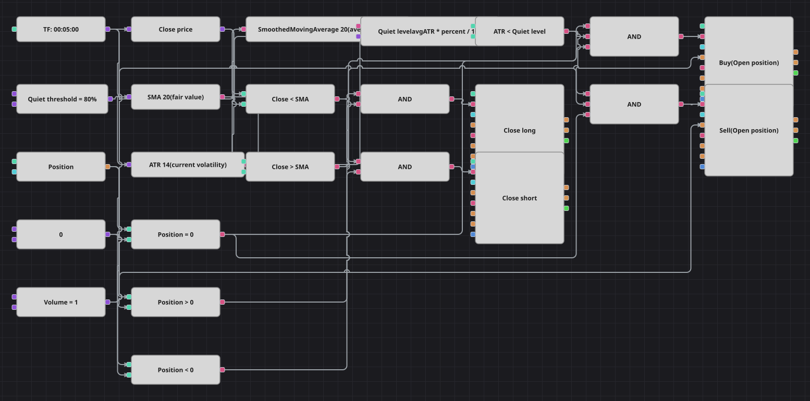

# Diagrama da estratégia de reversão em baixa volatilidade
[English](README.md) | [Русский](README_ru.md) | [中文](README_zh.md) | [Español](README_es.md) | [Deutsch](README_de.md) | [日本語](README_ja.md)

A reversão à média funciona quando o mercado anda de lado e machuca quando há tendência, por isso este diagrama só opera enquanto o mercado está calmo. A calma é definida sem nenhum número absoluto: o Average True Range atual é comparado com a sua própria média suavizada, e só se abre posição quando ele fica abaixo de uma fração dessa média.

## Visão geral da estratégia

- A volatilidade é medida em relação a si mesma: um AverageTrueRange alimenta uma SmoothedMovingAverage, e a razão entre os dois é todo o filtro de regime, de modo que o diagrama se transfere para qualquer ativo sem recalibração.
- A suavização reproduz exatamente a média recursiva do código original, pois a SmoothedMovingAverage usa a mesma fórmula: a média vezes o comprimento menos um, mais o novo valor, dividido pelo comprimento.
- O valor justo é uma SimpleMovingAverage comum: um fechamento abaixo dela é comprado e um acima é vendido, mas apenas no regime calmo e apenas com a posição zerada.
- O original trabalha em candles de um minuto e bloqueia toda a estratégia por 500 barras após cada negócio, inclusive as saídas. O histórico incluído é de cinco minutos, então o diagrama usa candles de cinco minutos; a trava não é reproduzida porque o Designer não tem contador de barras com estado, e por isso ele negocia com mais frequência que o original.

## Regras de entrada e saída

- **Entrada comprada**: O Average True Range está abaixo do nível de calma, o fechamento fica abaixo da média móvel e a posição está zerada. A ordem compra o volume configurado.
- **Entrada vendida**: O Average True Range está abaixo do nível de calma, o fechamento fica acima da média móvel e a posição está zerada. A ordem vende o volume configurado.
- **Saída**: A compra é encerrada quando o fechamento volta acima da média móvel e a venda quando volta abaixo. As saídas ignoram de propósito o filtro de volatilidade, de modo que a operação é devolvida mesmo que o mercado já tenha acordado. Não há stop nem alvo, como na estratégia original.

## Parâmetros

| Parâmetro | Padrão | Descrição |
|---|---|---|
| SMA Length | 20 | Período da média móvel que serve de valor justo. |
| ATR Length | 14 | Período do Average True Range, a volatilidade atual. |
| ATR averaging length | 20 | Período com que o Average True Range é suavizado para obter a sua própria média. |
| Quiet threshold, % | 80 | Fração da volatilidade média, em porcentagem, abaixo da qual o mercado é considerado calmo. |
| Volume | 1 | Volume da ordem, em lotes. |
| Candles | 00:05:00 | Tempo gráfico dos candles com que todo o diagrama trabalha. |

## Detalhes do diagrama

- O bloco de candles alimenta o conversor do preço de fechamento, a média móvel e o Average True Range; o range então segue para um segundo bloco de indicador que o suaviza.
- Um bloco de fórmula transforma o range suavizado e a porcentagem exposta no nível de calma, e um bloco de comparação coloca o range bruto contra ele.
- Dois blocos de comparação decidem de que lado da média está o fechamento e são reaproveitados: a condição que abre uma compra também encerra uma venda.
- Cada E de entrada une três condições — preço, volatilidade e posição zerada — enquanto os E de saída unem apenas preço e posição, o que faz as saídas funcionarem em qualquer regime.

## Uso

Importe o arquivo `.json` no Designer, execute-o sobre dados históricos no backtester e depois ajuste os parâmetros ou os próprios blocos ao seu instrumento antes de operar ao vivo.
