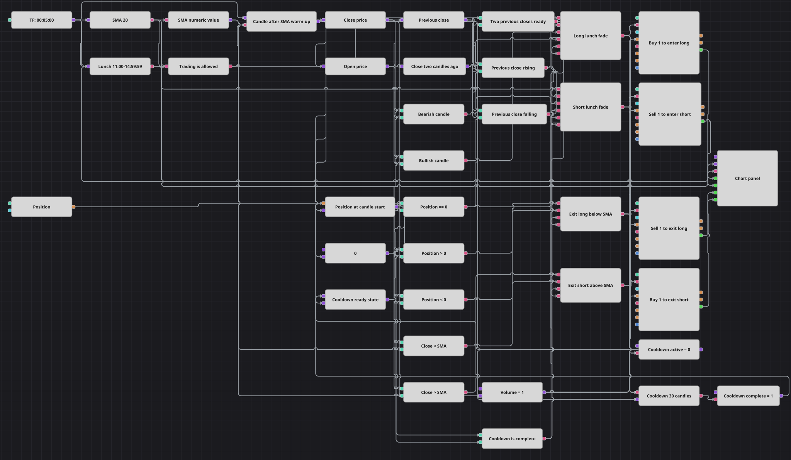

# 午间反转策略图
[English](README.md) | [Русский](README_ru.md) | [Español](README_es.md) | [Deutsch](README_de.md) | [Português](README_pt.md) | [日本語](README_ja.md)

该图表在已完成的五分钟 K 线上，于 11:00:00–14:59:59 午间窗口内对短期走势进行反向交易。它只在空仓时入场，依据收盘价与已形成的 20 周期 SMA 的关系出场，并在每次订单信号后阻止所有入场和出场路径处理接下来的 30 根已完成 K 线。

## 策略概览

- 只有已完成的五分钟 K 线进入决策链。SMA 在 20 个周期预热后才输出数值，两个 Previous value 模块提供紧邻当前 K 线的前两个收盘价。
- Working time 模块读取每根 K 线的开盘时间，并在 11:00:00 至 14:59:59（含边界）允许入场。该时间窗口不限制出场。
- 前两个收盘价上升且当前 K 线为阴线时，在空仓状态下做空；前两个收盘价下降且当前 K 线为阳线时，在空仓状态下做多。
- 多头在收盘价低于 SMA 时退出，空头在收盘价高于 SMA 时退出。四条独立路径分别为两个入场和两个出场提交固定数量的市价单。
- 每个入场或出场信号都会启动冷却，在接下来的 30 根已完成 K 线内阻止两类操作。图中没有仓位保护模块；图表显示 K 线、SMA 以及四条订单路径的成交。

## 入场与出场规则

- **做多入场**: 在午间窗口内，当 `Close[-1] < Close[-2]`、当前 K 线为阳线（`Close > Open`）、仓位快照为零且冷却已结束时，图表提交数量为 1 的市价买单。
- **做空入场**: 在午间窗口内，当 `Close[-1] > Close[-2]`、当前 K 线为阴线（`Close < Open`）、仓位快照为零且冷却已结束时，图表提交数量为 1 的市价卖单。
- **离场**: 冷却结束后，多头在 `Close < SMA` 时提交市价卖单，空头在 `Close > SMA` 时提交市价买单。这些价位判断在午间窗口内外都会运行。图中未连接止损、止盈或其他保护。

## 参数

| 参数 | 默认值 | 说明 |
|---|---|---|
| Candles | 00:05:00 | 五分钟周期；指标、历史、冷却和决策只由已完成 K 线驱动。 |
| SMA Period | 20 | 两项出场价位判断所使用的 SimpleMovingAverage 周期。 |
| Cooldown Bars | 30 | 入场和出场信号被阻止的后续已完成 K 线数量。 |
| Lunch Begin | 11:00:00 | 午间入场开始生效的 K 线开盘时间边界，包含该时刻。 |
| Lunch End | 14:59:59 | 午间入场保持生效的 K 线开盘时间上限，包含该时刻。 |
| Volume | 1 | 提供给四个采用 NoCondition 的市价单模块的固定数量。 |

## 图表详情

- [K 线](https://doc.stocksharp.com/zh/topics/designer/strategies/using_visual_designer/elements/data_sources/candles.html)模块只输出已完成的五分钟 K 线。仅输出已形成数值的[指标](https://doc.stocksharp.com/zh/topics/designer/strategies/using_visual_designer/elements/common/indicator.html)模块计算 SimpleMovingAverage 20，[公式](https://doc.stocksharp.com/zh/topics/designer/strategies/using_visual_designer/elements/common/formula.html)模块提供其数值。[允许交易](https://doc.stocksharp.com/zh/topics/designer/strategies/using_visual_designer/elements/time/trade_allow.html)门控把已保存的 K 线释放到决策链。
- [转换器](https://doc.stocksharp.com/zh/topics/designer/strategies/using_visual_designer/elements/converters/converter.html)模块提取 Close 和 Open 价格。两个[前值](https://doc.stocksharp.com/zh/topics/designer/strategies/using_visual_designer/elements/common/prev_value.html)模块采用位移 1 和 2；历史就绪门控会等待两个先前收盘价都可用后才允许决策。
- [工作时间](https://doc.stocksharp.com/zh/topics/designer/strategies/using_visual_designer/elements/time/working_time.html)模块直接接收 K 线流，并把开盘时间元数据与午间窗口的包含式边界比较。其结果只参与两个入场条件。
- 当前[仓位](https://doc.stocksharp.com/zh/topics/designer/strategies/using_visual_designer/elements/positions/current.html)由[变量](https://doc.stocksharp.com/zh/topics/designer/strategies/using_visual_designer/elements/data_sources/variable.html)模块持续保存，并在每根决策 K 线上释放一次。[比较](https://doc.stocksharp.com/zh/topics/designer/strategies/using_visual_designer/elements/common/comparison.html)与[逻辑条件](https://doc.stocksharp.com/zh/topics/designer/strategies/using_visual_designer/elements/common/logical_condition.html)模块组合时段、先前方向、当前 K 线方向、仓位、历史就绪状态、SMA 价位和冷却状态。
- [延迟信号](https://doc.stocksharp.com/zh/topics/designer/strategies/using_visual_designer/elements/common/delay_value.html)模块对之后 30 根已完成 K 线计数。就绪状态变量在计数期间抑制四个操作条件，并在再下一根 K 线上重新启用它们。
- 四个[修改仓位](https://doc.stocksharp.com/zh/topics/designer/strategies/using_visual_designer/elements/positions/modify.html)模块使用 `NoCondition` 和共享的 Volume 1 提交市价单：买入开多、卖出开空、卖出平多和买入平空。图中没有保护元素。
- [图表面板](https://doc.stocksharp.com/zh/topics/designer/strategies/using_visual_designer/elements/common/chart.html)接收已完成 K 线、已形成的 SMA 流以及四个订单模块各自的 MyTrade 输出。

## 使用方法

将 `.json` 文件导入 Designer，在回测器中用历史数据运行，然后根据自己的交易品种调整参数或方块，确认无误后再用于实盘。
