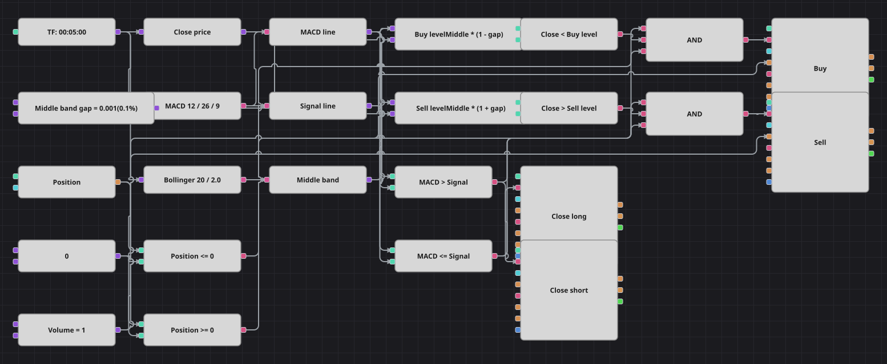

# Diagrama da estratégia MACD com a banda média de Bollinger
[English](README.md) | [Русский](README_ru.md) | [中文](README_zh.md) | [Español](README_es.md) | [Deutsch](README_de.md) | [日本語](README_ja.md)

Dois indicadores muito comuns dividem o trabalho: o MACD decide de que lado do mercado ficar e a banda média de Bollinger diz quando o preço se afastou o bastante do valor justo para assumir esse lado barato. As bandas externas ficam de fora de propósito — a estratégia original compra recuos abaixo da linha média, não rompimentos do canal.

## Visão geral da estratégia

- O único filtro de tendência é a linha MACD frente à sua linha de sinal: acima, só compras; igual ou abaixo, só vendas.
- O preço de entrada precisa estar a um décimo de ponto percentual da banda média, do lado oposto à tendência: em alta compram-se as quedas, em baixa vendem-se os repiques.
- A margem é dada como fração do valor da banda, e não em pontos fixos, então o mesmo diagrama serve para qualquer ativo.
- As saídas não esperam pelo preço: assim que as duas linhas do MACD trocam de lugar, a posição é encerrada.

## Regras de entrada e saída

- **Entrada comprada**: A linha MACD está acima da linha de sinal, o candle fecha abaixo da banda média menos a margem e a posição não está comprada. A ordem compra um lote: abre uma compra a partir do zero ou cobre uma venda.
- **Entrada vendida**: A linha MACD está igual ou abaixo da linha de sinal, o candle fecha acima da banda média mais a margem e a posição não está vendida. A ordem vende um lote: abre uma venda a partir do zero ou encerra uma compra.
- **Saída**: A compra é encerrada assim que a linha MACD cai até a de sinal ou abaixo dela, e a venda assim que sobe acima; os dois blocos ficam em modo de fechamento e só agem quando existe posição.

## Parâmetros

| Parâmetro | Padrão | Descrição |
|---|---|---|
| MACD fast period | 12 | Comprimento da média rápida dentro do MACD. |
| MACD slow period | 26 | Comprimento da média lenta dentro do MACD. |
| MACD signal period | 9 | Comprimento da linha de sinal do MACD. |
| Bollinger period | 20 | Período de suavização das BollingerBands; apenas a linha média é lida. |
| Bollinger width | 2.0 | Multiplicador de desvio padrão das BollingerBands; não afeta as regras, pois as bandas externas não são usadas. |
| Middle band gap | 0.001 | Distância que o preço de entrada deve alcançar em relação à banda média, como fração do valor dela. |
| Volume | 1 | Volume da ordem, em lotes. |
| Candles | 00:05:00 | Tempo gráfico dos candles com que todo o diagrama trabalha. |

## Detalhes do diagrama

- Um bloco de candles alimenta o MACD, as BollingerBands e um conversor do fechamento; outros três conversores extraem a linha MACD, a de sinal e a banda média dos valores dos indicadores.
- Uma única constante de margem e dois blocos de fórmula transformam a banda média em um nível de compra e um de venda, de modo que um parâmetro exposto move os dois limiares ao mesmo tempo.
- Cada entrada é um E lógico de três sinais: a comparação do MACD, a da banda e a posição comparada com uma constante zero.
- Os dois blocos de saída ficam pendurados diretamente nas comparações do MACD e operam em modo de fechamento; os quatro blocos de ordem tiram o tamanho da mesma constante de volume.
- Simplificações deliberadas: o original também assina um AverageTrueRange que nunca usa, então nenhum bloco de ATR é desenhado, e bloqueia entradas por 100 barras após cada operação, algo que nenhum bloco expressa — este diagrama entra de novo assim que as condições voltam.

## Uso

Importe o arquivo `.json` no Designer, execute-o sobre dados históricos no backtester e depois ajuste os parâmetros ou os próprios blocos ao seu instrumento antes de operar ao vivo.
