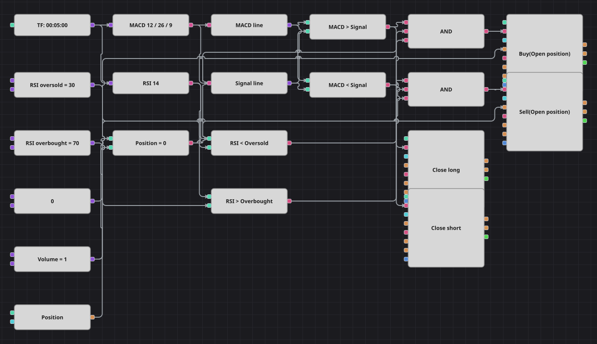

# Диаграмма стратегии MACD + RSI
[English](README.md) | [中文](README_zh.md) | [Español](README_es.md) | [Deutsch](README_de.md) | [Português](README_pt.md) | [日本語](README_ja.md)

MACD задаёт направление, RSI выбирает момент. Пока линия MACD выше сигнальной, схема ждёт, когда индекс относительной силы уйдёт в зону перепроданности, и покупает этот откат; зеркальное правило продаёт перекупленный RSI, пока MACD ниже сигнальной. Позиция отдаётся, как только линии MACD меняются местами.

## Обзор стратегии

- Тренд проверяется по уровню, а не по пересечению: важно, с какой стороны от сигнальной линии сейчас находится MACD, поэтому фильтр держится всё время, пока тренд жив.
- Вход внутри этого тренда намеренно контртрендовый — RSI должен быть растянут против него, так что схема покупает откаты, а не догоняет пробои.
- Выход использует ту же пару линий: лонг закрывается, когда MACD уходит ниже сигнальной, шорт — когда поднимается выше.
- Стоп-лосса и тейк-профита в диаграмме нет, ровно как в оригинальной стратегии, где единственный выход — разворот MACD.

## Правила входа и выхода

- **Вход в лонг**: Линия MACD выше сигнальной, RSI ниже уровня перепроданности, позиции нет. Заявка покупает один лот по рынку.
- **Вход в шорт**: Линия MACD ниже сигнальной, RSI выше уровня перекупленности, позиции нет. Заявка продаёт один лот по рынку.
- **Выход**: Лонг закрывается на первой свече, где MACD опускается ниже сигнальной, шорт — на первой свече, где MACD поднимается выше неё; оба закрывающих кубика берут объём из открытой позиции.

## Параметры

| Параметр | По умолчанию | Описание |
|---|---|---|
| MACD Fast Length | 12 | Период быстрой EMA внутри MACD. |
| MACD Slow Length | 26 | Период медленной EMA внутри MACD. |
| MACD Signal Length | 9 | Период EMA, которая сглаживает MACD в сигнальную линию. |
| RSI Length | 14 | Период усреднения индекса относительной силы. |
| RSI Oversold | 30 | Уровень, ниже которого RSI считается перепроданным и разрешён лонг. |
| RSI Overbought | 70 | Уровень, выше которого RSI считается перекупленным и разрешён шорт. |
| Volume | 1 | Объём заявки в лотах. |
| Candles | 00:05:00 | Таймфрейм свечей, на котором работает вся диаграмма. |

## Детали диаграммы

- Один кубик индикатора содержит MACD с сигнальной линией; два конвертера достают из него значения Macd и Signal, а второй кубик индикатора считает индекс относительной силы по тем же свечам.
- Два сравнения ставят линию MACD против сигнальной, ещё два — RSI против пороговых констант, и одно сравнивает позицию с нулём.
- Каждое логическое И объединяет условие по тренду, условие по RSI и проверку нулевой позиции, после чего запускает кубик изменения позиции, открывающий сделку только из нуля.
- Сравнения по тренду переиспользуются как триггеры выхода, поэтому двум кубикам закрытия не нужна отдельная логика. Паузы в 150 баров между сделками из оригинала среди кубиков нет, и она опущена — перезаходы происходят чаще, чем в коде.

## Использование

Импортируйте файл `.json` в Designer, прогоните схему на исторических данных в тестере, затем подстройте параметры или сами кубики под свой инструмент, прежде чем торговать вживую.
