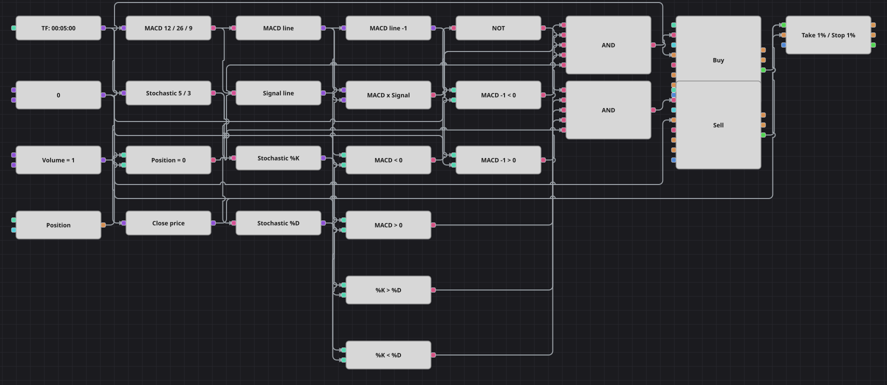

# Diagrama de la estrategia MACD + Stochastic con cruce en su lado del cero
[English](README.md) | [Русский](README_ru.md) | [中文](README_zh.md) | [Deutsch](README_de.md) | [Português](README_pt.md) | [日本語](README_ja.md)

Un cruce del MACD significa cosas distintas según dónde ocurra. Este diagrama acepta el cruce alcista solo mientras la línea MACD sigue por debajo de cero, que es donde nace un nuevo impulso, y el bajista solo mientras sigue por encima. Las líneas del Stochastic confirman la dirección, la posición debe estar plana antes de operar y un stop y un objetivo porcentuales sacan del mercado.

## Resumen de la estrategia

- El disparador es el cruce de la línea MACD con su señal; el filtro de signo revisa el valor actual y el de la vela anterior, de modo que una barra que salta a la vez sobre el cero y sobre la señal no se confunde con un cruce nuevo.
- El Stochastic Oscillator es la segunda opinión: un largo quiere %K por encima de %D y un corto lo quiere por debajo.
- Solo se entra desde posición plana: el diagrama nunca aumenta una operación ni se da la vuelta con una señal; el stop y el objetivo son la única salida.
- El original es un port de un experto de MetaTrader y mide stop y objetivo en pips, con tres sesiones de negociación y un trailing de varios pasos. El diagrama convierte las distancias en porcentaje del precio de entrada y omite las ventanas de sesión, porque la ventana por defecto cubre el día entero.
- Dos simplificaciones más: la confirmación del Stochastic está cableada de forma permanente, mientras que en el código es un interruptor apagado por defecto, y se comparan las dos líneas tal como están ahora, sin revisar además cómo estaban cuatro barras antes. El original trabaja con velas de cuatro horas; el diagrama se reduce a cinco minutos para el histórico de muestra incluido.

## Reglas de entrada y salida

- **Entrada en largo**: La línea MACD cruza al alza su señal, el valor actual y el anterior del MACD están por debajo de cero, %K está sobre %D y la posición está plana. La orden compra un lote a mercado.
- **Entrada en corto**: La línea MACD cruza a la baja su señal, el valor actual y el anterior del MACD están por encima de cero, %K está bajo %D y la posición está plana. La orden vende un lote a mercado.
- **Salida**: El bloque de protección cierra la operación a un porcentaje fijo del precio de entrada, por objetivo o por stop. No hay salida por el cruce contrario del MACD, igual que en el original.

## Parámetros

| Parámetro | Por defecto | Descripción |
|---|---|---|
| MACD fast length | 12 | Periodo de la EMA rápida dentro del MACD. |
| MACD slow length | 26 | Periodo de la EMA lenta dentro del MACD. |
| MACD signal length | 9 | Periodo de la EMA que suaviza el MACD hasta la línea de señal. |
| Stochastic %K length | 5 | Periodo de cálculo de la línea %K del Stochastic. |
| Stochastic %D length | 3 | Periodo de suavizado de la línea %D, la media móvil de %K. |
| Volume | 1 | Volumen de la orden, en lotes. |
| Take profit, % | 1 | Distancia del objetivo, en porcentaje del precio de entrada; sustituye a los 100 pips del original. |
| Stop loss, % | 1 | Distancia del stop, en porcentaje del precio de entrada; sustituye a los 100 pips del original. |
| Candles | 00:05:00 | Marco temporal de las velas con el que trabaja todo el diagrama. |

## Detalles del diagrama

- El bloque de velas alimenta el MACD y el Stochastic Oscillator; cuatro conversores extraen los valores Macd, Signal, %K y %D de los dos valores de indicador.
- Un bloque de cruce convierte el par del MACD en el disparador alcista y un bloque NO lo invierte en el bajista, mientras un bloque de valor anterior guarda la línea MACD de la vela previa para la comprobación de signo.
- Siete bloques de comparación forman los filtros: cuatro para las dos pruebas del cero, dos para las líneas del Stochastic y uno para la posición frente a cero.
- Cada Y lógica une cinco condiciones y dispara un bloque de modificación de posición que envía una orden a mercado por la constante de volumen compartida; ambos bloques de orden pasan su operación al bloque de protección, que además lee el cierre de la vela como precio actual.

## Uso

Importe el archivo `.json` en Designer, ejecútelo sobre datos históricos en el probador y después ajuste los parámetros o los propios bloques a su instrumento antes de operar en real.
