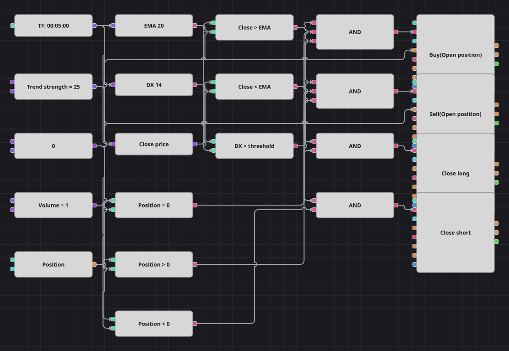

# Diagrama da estratégia MA + ADX
[English](README.md) | [Русский](README_ru.md) | [中文](README_zh.md) | [Español](README_es.md) | [Deutsch](README_de.md) | [日本語](README_ja.md)

Um diagrama de tendência com filtro de força. A ExponentialMovingAverage indica de que lado do mercado ficar, o índice direcional DX decide se o movimento merece posição, e a posição é abandonada assim que o fechamento volta para o outro lado da média.

## Visão geral da estratégia

- O fechamento do candle é comparado com uma ExponentialMovingAverage: acima da média significa compra, abaixo significa venda.
- O bloco DirectionalIndex entrega o valor DX, a mesma fórmula que a estratégia original calcula manualmente a partir de +DM e -DM; a entrada só é permitida enquanto o DX estiver acima do limiar.
- As entradas ocorrem apenas com posição zerada e cada saída encerra exatamente o que está aberto, de modo que nunca há aumento de posição.
- A saída ignora a força da tendência: assim que o fechamento fica do outro lado da média, a posição é encerrada independentemente do DX.

## Regras de entrada e saída

- **Entrada comprada**: O fechamento está acima da EMA, o DX está acima do limiar de força de tendência e a posição está zerada. A ordem compra o volume base e abre uma posição comprada.
- **Entrada vendida**: O fechamento está abaixo da EMA, o DX está acima do limiar de força de tendência e a posição está zerada. A ordem vende o volume base e abre uma posição vendida.
- **Saída**: A compra é encerrada assim que um candle fecha abaixo da EMA, e a venda assim que fecha acima; os blocos de encerramento tiram o volume da posição aberta. A estratégia original não tem stop nem take, e sua pausa de cem candles após cada operação não foi transposta, por isso este diagrama negocia com mais frequência que o código-fonte.

## Parâmetros

| Parâmetro | Padrão | Descrição |
|---|---|---|
| EMA Length | 20 | Período da média exponencial que define a direção. |
| DX Length | 14 | Período do índice direcional que mede a força da tendência. |
| Trend Strength | 25 | Valor de DX acima do qual uma nova posição é permitida. |
| Volume | 1 | Volume da ordem, em lotes. |
| Candles | 00:05:00 | Tempo gráfico dos candles com que todo o diagrama trabalha. |

## Detalhes do diagrama

- O bloco de candles alimenta os dois indicadores e um conversor que extrai o preço de fechamento.
- Dois blocos de comparação posicionam o fechamento em relação à EMA e são reaproveitados: o mesmo sinal abre um lado e encerra o outro.
- O bloco de posição alimenta três comparações com zero: a posição zerada protege as entradas, comprado e vendido protegem as duas saídas.
- Os blocos de entrada usam a condição de abertura e tiram o volume de uma constante compartilhada; os de saída usam a condição de encerramento e calculam o volume sozinhos.

## Uso

Importe o arquivo `.json` no Designer, execute-o sobre dados históricos no backtester e depois ajuste os parâmetros ou os próprios blocos ao seu instrumento antes de operar ao vivo.
