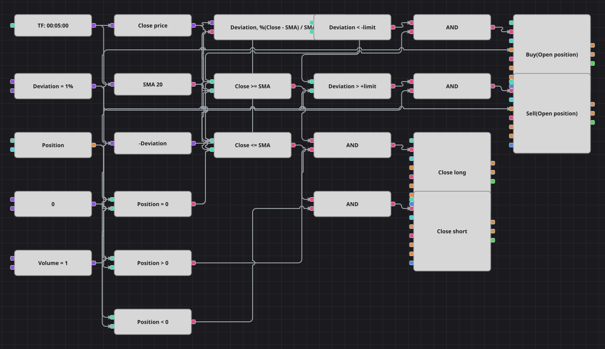

# 均线偏离策略图
[English](README.md) | [Русский](README_ru.md) | [Español](README_es.md) | [Deutsch](README_de.md) | [Português](README_pt.md) | [日本語](README_ja.md)

简单移动平均被视为合理价格，全部信号就是收盘价与它的距离（以百分比衡量）。价格偏离均线过远时，图形反向开仓；价格重新触及均线时立即平仓。

## 策略概览

- 偏离度用一个公式方块直接计算：(Close - SMA) / SMA * 100。
- 一个阈值同时服务多空两侧：偏离度分别与该数值的正负两个形式比较，做多与做空完全对称。
- 只有在空仓时才入场，两个入场方块还带有“开仓”条件，因此绝不会摊平加仓。
- 原策略使用1分钟K线、2%阈值以及每次交易后500根K线的冷却期。随附的历史数据是5分钟的，所以本图使用5分钟K线和1%阈值（约为该序列的两倍标准差）；冷却期未移植，因为 Designer 没有锁定计数器，因此本图的交易频率高于原策略。

## 入场与出场规则

- **做多入场**: 偏离度低于负阈值，即收盘价比移动平均低出设定的百分比，且当前空仓。订单按设定数量买入。
- **做空入场**: 偏离度高于正阈值，即收盘价比移动平均高出设定的百分比，且当前空仓。订单按设定数量卖出。
- **离场**: 当收盘价回到移动平均或其上方时平掉多头；当收盘价回到移动平均或其下方时平掉空头。与原策略一样，没有止损也没有止盈。

## 参数

| 参数 | 默认值 | 说明 |
|---|---|---|
| SMA Length | 20 | 简单移动平均的平滑周期。 |
| Deviation, % | 1 | 触发开仓所需的与均线的距离（百分比）。 |
| Volume | 1 | 下单数量（手）。 |
| Candles | 00:05:00 | 整张图使用的K线周期。 |

## 图表详情

- K线方块同时驱动取收盘价的转换方块和持有移动平均的指标方块。
- 一个公式方块把两者变成百分比偏离度；另一个很小的公式把阈值常量取负，使一个暴露的参数覆盖多空两侧。
- 两个比较方块把偏离度与阈值对比，另外两个把收盘价与均线对比用于离场。
- 持仓方块与零比较三次，得到空仓、多头、空头三个标志，由逻辑与方块与价格条件合并。
- 入场进入带“开仓”条件的修改持仓方块并共享数量常量；离场进入带“平仓”条件的方块，后者不需要数量。

## 使用方法

将 `.json` 文件导入 Designer，在回测器中用历史数据运行，然后根据自己的交易品种调整参数或方块，确认无误后再用于实盘。
