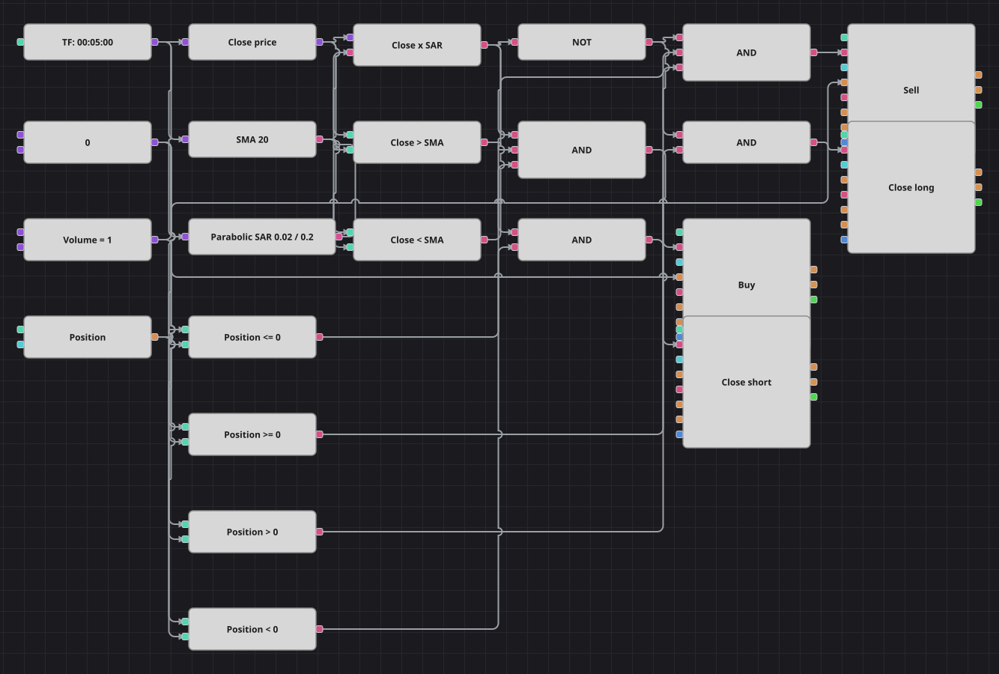

# Diagrama de la estrategia MA + Parabolic SAR
[English](README.md) | [Русский](README_ru.md) | [中文](README_zh.md) | [Deutsch](README_de.md) | [Português](README_pt.md) | [日本語](README_ja.md)

Una media móvil simple indica de qué lado del mercado conviene estar y un Parabolic SAR indica cuándo: el diagrama espera a que el cierre cruce la línea del SAR en la dirección que la media ya señala. El cruce contrario de esa misma línea devuelve la posición, de modo que la estrategia o va montada en una tendencia o espera la siguiente.

## Resumen de la estrategia

- SimpleMovingAverage actúa como filtro de dirección: solo se compra mientras el cierre está por encima y solo se vende mientras está por debajo.
- ParabolicSar aporta el momento y un único bloque de cruce convierte el paso del precio por esa línea en un solo impulso: verdadero para el cruce al alza, falso para el cruce a la baja.
- Las entradas están protegidas por la posición actual y las salidas usan bloques de cierre, que actúan solo si hay una posición del signo adecuado.
- Dos diferencias con el original en C#: allí el SAR se sustituye por una EMA rápida y los ajustes declarados del SAR nunca se leen, mientras que el diagrama usa un ParabolicSar real; además, la pausa de 20 barras entre entradas no se reproduce.

## Reglas de entrada y salida

- **Entrada en largo**: El cierre cruza al alza la línea del ParabolicSar estando por encima de la SMA y la posición no es larga. El bloque de modificación compra a mercado el volumen compartido.
- **Entrada en corto**: El cierre cruza a la baja la línea del ParabolicSar estando por debajo de la SMA y la posición no es corta. El bloque de modificación vende a mercado el volumen compartido.
- **Salida**: El largo se cierra en el primer cruce a la baja de la línea del SAR y el corto en el primer cruce al alza, sin consultar la media móvil; no hay stop ni objetivo, igual que en la estrategia original.

## Parámetros

| Parámetro | Por defecto | Descripción |
|---|---|---|
| SMA Length | 20 | Periodo de la media móvil simple que decide la dirección de la tendencia. |
| SAR Acceleration | 0.02 | Factor de aceleración inicial del Parabolic SAR. |
| SAR Max acceleration | 0.2 | Techo hasta el que crece el factor de aceleración del Parabolic SAR. |
| Volume | 1 | Volumen de la orden, en lotes. |
| Candles | 00:05:00 | Marco temporal de las velas con el que trabaja todo el diagrama. |

## Detalles del diagrama

- El bloque de velas alimenta ambos indicadores y un conversor que extrae el precio de cierre.
- El bloque de cruce compara el cierre con la línea del SAR y un NO lógico convierte su salida en el cruce a la baja que usan la entrada corta y la salida larga.
- Los bloques de comparación contrastan el cierre con la SMA y la posición con una constante cero, y cuatro Y lógicas los combinan en las señales de entrada y salida.
- Dos bloques de modificación abren posiciones con la constante de volumen compartida y otros dos las cierran con la condición de cierre de posición.

## Uso

Importe el archivo `.json` en Designer, ejecútelo sobre datos históricos en el probador y después ajuste los parámetros o los propios bloques a su instrumento antes de operar en real.
