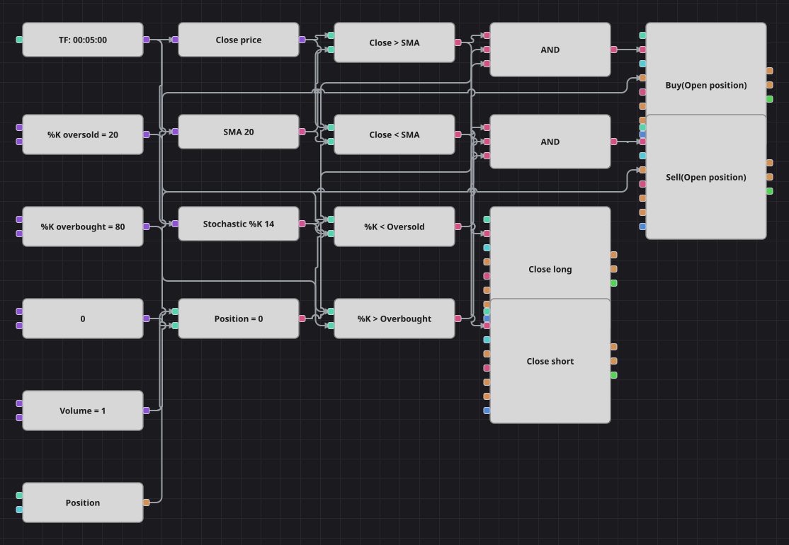

# Диаграмма стратегии отката по SMA и стохастику
[English](README.md) | [中文](README_zh.md) | [Español](README_es.md) | [Deutsch](README_de.md) | [Português](README_pt.md) | [日本語](README_ja.md)

Решение принимают два кубика вместе: SimpleMovingAverage говорит, в какую сторону схеме вообще разрешено торговать, а StochasticK ждёт движения против этой стороны, прежде чем отправить заявку. Позиция отдаётся, как только цена закрывается по другую сторону той же средней.

## Обзор стратегии

- Направление задаёт закрытие относительно SimpleMovingAverage: выше средней рассматриваются только покупки, ниже — только продажи.
- Сам вход контртрендовый: линия %K должна быть в зоне перепроданности для лонга и в зоне перекупленности для шорта, то есть схема покупает откаты внутри роста и продаёт отскоки внутри падения.
- StochasticK — это ровно тот %K, который оригинальная стратегия считала вручную: 100 * (Close - минимум Low) / (максимум High - минимум Low) за последние N свечей.
- Та же скользящая средняя служит линией выхода; стоп-лосса и тейк-профита в диаграмме нет.

## Правила входа и выхода

- **Вход в лонг**: Закрытие выше SimpleMovingAverage, StochasticK ниже уровня перепроданности, позиции нет. Заявка покупает один лот по рынку.
- **Вход в шорт**: Закрытие ниже SimpleMovingAverage, StochasticK выше уровня перекупленности, позиции нет. Заявка продаёт один лот по рынку.
- **Выход**: Лонг закрывается на первой свече, закрывшейся ниже средней, шорт — на первой свече выше неё; оба закрывающих кубика берут объём из открытой позиции.

## Параметры

| Параметр | По умолчанию | Описание |
|---|---|---|
| SMA Length | 20 | Период усреднения SimpleMovingAverage, которая фильтрует тренд и закрывает позицию. |
| %K Length | 14 | Число свечей, по которым считается линия %K. |
| %K Oversold | 20 | Уровень, ниже которого %K считается перепроданным и разрешён лонг. |
| %K Overbought | 80 | Уровень, выше которого %K считается перекупленным и разрешён шорт. |
| Volume | 1 | Объём заявки в лотах. |
| Candles | 00:05:00 | Таймфрейм свечей, на котором работает вся диаграмма. |

## Детали диаграммы

- Кубик свечей питает три ветки: конвертер с ценой закрытия, SimpleMovingAverage и индикатор StochasticK.
- Два сравнения ставят закрытие против средней, ещё два — %K против пороговых констант, и одно сравнивает позицию с нулём.
- Каждое логическое И объединяет условие по тренду, условие по стохастику и проверку нулевой позиции, после чего запускает кубик изменения позиции, открывающий сделку только из нуля.
- Сравнения по тренду переиспользуются на выходе: тот же сигнал, что разрешает шорт, закрывает лонг, — за счёт этого схема остаётся компактной. Счётчика баров, который в оригинале останавливал торговлю на 100 свечей после каждой сделки, среди кубиков нет, и он опущен.

## Использование

Импортируйте файл `.json` в Designer, прогоните схему на исторических данных в тестере, затем подстройте параметры или сами кубики под свой инструмент, прежде чем торговать вживую.
