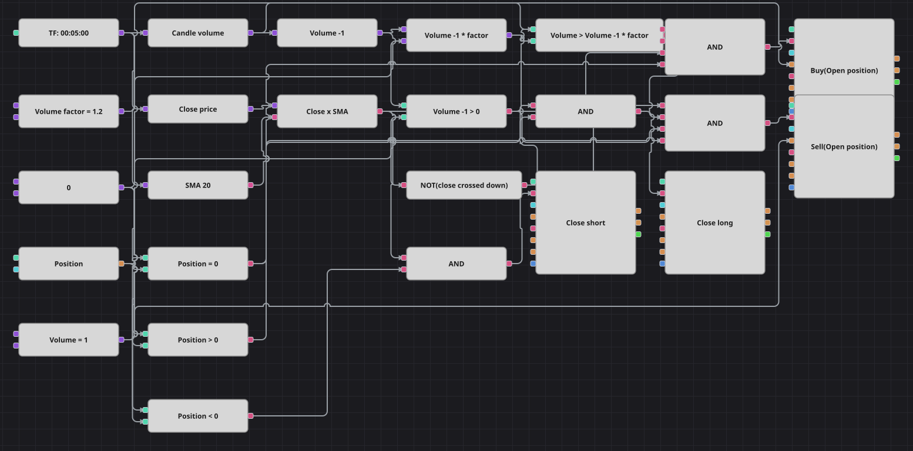

# Diagrama de cruzamento de média móvel com confirmação de volume
[English](README.md) | [Русский](README_ru.md) | [中文](README_zh.md) | [Español](README_es.md) | [Deutsch](README_de.md) | [日本語](README_ja.md)

Um cruzamento de média móvel sozinho reage a qualquer tremor do preço. Este diagrama aceita o cruzamento apenas quando ele vem junto com um salto real de atividade: o candle que cruza a SimpleMovingAverage precisa negociar mais que o anterior por um fator definido. O cruzamento contrário devolve a posição, e ali o volume não é exigido.

## Visão geral da estratégia

- Uma SimpleMovingAverage do candle é a linha que o fechamento precisa cruzar, e um único bloco de cruzamento transforma as duas séries em um evento de subida ou descida.
- O filtro de volume compara o candle com o seu próprio antecessor, e não com uma média: um bloco de valor anterior guarda o volume do candle passado, uma fórmula o multiplica pelo fator e uma comparação confronta o candle novo com o resultado.
- A entrada só ocorre a partir da posição zerada e com a confirmação de volume; a saída depende apenas do cruzamento inverso, exatamente como no original em C#.
- O original congela a negociação por 150 barras após cada ordem; aqui não existe bloco contador de barras, então essa pausa foi omitida e o diagrama negocia com mais frequência.

## Regras de entrada e saída

- **Entrada comprada**: O fechamento cruza a média móvel para cima, o volume desse candle supera o volume do anterior multiplicado pelo fator, o volume anterior é maior que zero e a posição está zerada. O bloco de modificação compra a mercado o volume compartilhado.
- **Entrada vendida**: O fechamento cruza a média móvel para baixo com a mesma confirmação de volume e com a posição zerada. O bloco de modificação vende a mercado o volume compartilhado.
- **Saída**: A compra é encerrada pelo primeiro cruzamento de baixa e a venda pelo primeiro cruzamento de alta, sem qualquer condição de volume; os dois blocos de encerramento operam em modo de fechamento e só agem quando há algo a encerrar. Nem a estratégia de origem nem este diagrama têm stop loss ou take profit.

## Parâmetros

| Parâmetro | Padrão | Descrição |
|---|---|---|
| SMA Length | 20 | Período da média móvel simples que o fechamento precisa cruzar. |
| Volume factor | 1.2 | Quantas vezes o volume do candle anterior o candle atual deve superar para a entrada ser aceita. |
| Volume | 1 | Volume da ordem, em lotes. |
| Candles | 00:05:00 | Tempo gráfico dos candles com que todo o diagrama trabalha. |

## Detalhes do diagrama

- O bloco de candles alimenta um conversor do volume total, um do preço de fechamento e a média móvel.
- A cadeia de volume é valor anterior, fórmula e comparação; uma segunda comparação com zero impede que o primeiro candle passe pelo filtro de graça.
- Um bloco de cruzamento mais um NÃO lógico cobrem as duas direções: a saída própria é o cruzamento de alta, a negada é o de baixa.
- Dois E lógicos montam as entradas com cruzamento, volume e posição zerada, e outros dois montam as saídas com o cruzamento oposto e o sinal da posição.

## Uso

Importe o arquivo `.json` no Designer, execute-o sobre dados históricos no backtester e depois ajuste os parâmetros ou os próprios blocos ao seu instrumento antes de operar ao vivo.
