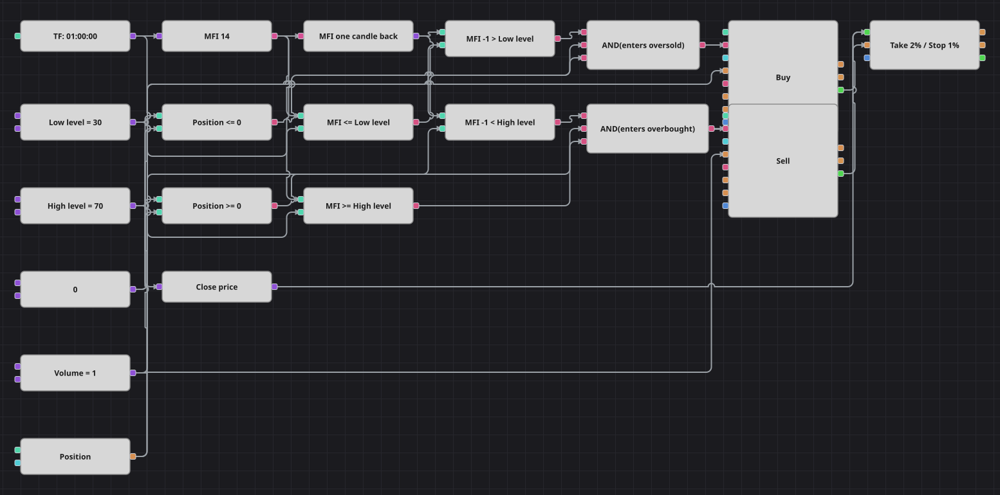

# MFI Level Cross Strategy Diagram
[Русский](README_ru.md) | [中文](README_zh.md) | [Español](README_es.md) | [Deutsch](README_de.md) | [Português](README_pt.md) | [日本語](README_ja.md)

The Money Flow Index weighs every price move by the volume behind it, so it says how much money is actually pushing the market. This diagram fades the extremes: it buys on the candle where MFI steps down through the low level into the oversold zone and sells on the candle where it steps up through the high level into the overbought zone. A percent take profit and stop loss finish every trade.

## Strategy Overview

- Money Flow Index with a length of 14 is calculated on finished hourly candles, which the tester builds from the packaged five-minute history.
- The two levels, 30 and 70, are read as crossings rather than as zones: only the candle that enters a zone produces a signal, not the candles that stay inside it.
- The original strategy has a Trend switch that can mirror both signals; the diagram keeps the default Direct mode, so a step into the oversold zone buys and a step into the overbought zone sells.
- The current position takes part in both decisions, so the schema never piles a second order onto a position it already holds.

## Entry and Exit Rules

- **Long entry**: The previous MFI value was above the low level and the current one is at or below it, and the position is not long. The order buys one lot, which opens a long from flat or closes an existing short.
- **Short entry**: The previous MFI value was below the high level and the current one is at or above it, and the position is not short. The order sells one lot, which opens a short from flat or closes an existing long.
- **Exit**: The protection block closes the trade at a take profit of 2 percent or a stop loss of 1 percent from the entry price; before that, the opposite level crossing flattens the position, because every order uses the same volume.

## Parameters

| Parameter | Default | Description |
|---|---|---|
| MFI Length | 14 | Averaging length of the Money Flow Index. |
| Low Level | 30 | Level the index has to step down through to arm a long entry. |
| High Level | 70 | Level the index has to step up through to arm a short entry. |
| Take profit, % | 2 | Take profit distance from the entry price, in percent. |
| Stop loss, % | 1 | Stop loss distance from the entry price, in percent. |
| Volume | 1 | Order volume, in lots. |
| Candles | 01:00:00 | Candle time frame the whole diagram works on. |

## Diagram Details

- The candle block feeds the indicator block holding the Money Flow Index, and a previous-value block keeps the reading from one candle back.
- Four comparison blocks build the two crossings: previous above the level plus current at or below it for the long side, previous below plus current at or above it for the short side.
- Two more comparison blocks test the position against a zero constant, and each logical AND joins one crossing with its position guard.
- Both modify blocks send market orders with the volume of one shared constant, and their own trades feed the protection block that carries the take profit and the stop loss.

## Usage

Import the `.json` file into Designer, run it in the backtester on historical data, then adjust the parameters or the blocks themselves to fit your instrument before trading it live.
