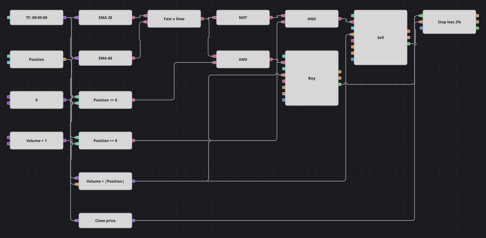

# Diagrama da estratégia de cruzamento de médias móveis
[English](README.md) | [Русский](README_ru.md) | [中文](README_zh.md) | [Español](README_es.md) | [Deutsch](README_de.md) | [日本語](README_ja.md)

O diagrama de tendência mais antigo que existe: uma média móvel exponencial rápida contra uma lenta, com a posição invertida a cada cruzamento. Um bloco de proteção acrescenta o que o cruzamento sozinho não dá — um stop percentual que fecha a posição quando o movimento vai contra ela.

## Visão geral da estratégia

- Duas médias móveis exponenciais, uma rápida e uma lenta, são calculadas sobre candles finalizados de um único instrumento.
- O bloco de cruzamento dispara apenas no candle em que a média rápida realmente cruza a lenta, e a direção do cruzamento separa compra de venda.
- O bloco de proteção da posição acompanha o fechamento de cada candle finalizado e encerra a posição assim que o preço se afasta um percentual definido do preço de entrada.

## Regras de entrada e saída

- **Entrada comprada**: A EMA rápida cruza acima da lenta e a posição ainda não está comprada. A ordem compra Volume mais o valor absoluto da posição atual: abre uma compra a partir do zero ou vira uma venda diretamente em compra.
- **Entrada vendida**: A EMA rápida cruza abaixo da lenta e a posição ainda não está vendida. A ordem vende Volume mais o valor absoluto da posição atual: abre uma venda a partir do zero ou vira uma compra diretamente em venda.
- **Saída**: Ou o cruzamento contrário inverte a posição com uma única ordem, ou o stop de proteção a encerra quando o fechamento do candle fica pior que o preço médio de entrada no percentual indicado.

## Parâmetros

| Parâmetro | Padrão | Descrição |
|---|---|---|
| Fast EMA length | 20 | Período da média móvel exponencial rápida. |
| Slow EMA length | 80 | Período da média móvel exponencial lenta. |
| Stop loss, % | 2 | Distância do stop de proteção em relação ao preço de entrada, em percentual. |
| Volume | 1 | Volume base da ordem, em lotes; na inversão soma-se a posição aberta. |
| Candles | 00:05:00 | Tempo gráfico dos candles com que todo o diagrama trabalha. |

## Detalhes do diagrama

- O bloco de candles alimenta os dois blocos de indicador, e suas saídas se encontram no bloco de cruzamento.
- A saída do cruzamento é o sinal de compra, um NÃO lógico dela é o sinal de venda, e cada um se junta por um E lógico à comparação da posição com zero.
- Um bloco de fórmula calcula Volume mais a posição em valor absoluto e alimenta a entrada de volume dos dois blocos de modificação, de modo que uma ordem a mercado inverte a posição.
- Os dois blocos de modificação de posição enviam seus próprios negócios ao bloco de proteção, e um conversor leva o preço de fechamento de cada candle finalizado até sua entrada de preço, então o stop é verificado nos fechamentos.

## Uso

Importe o arquivo `.json` no Designer, execute-o sobre dados históricos no backtester e depois ajuste os parâmetros ou os próprios blocos ao seu instrumento antes de operar ao vivo.
