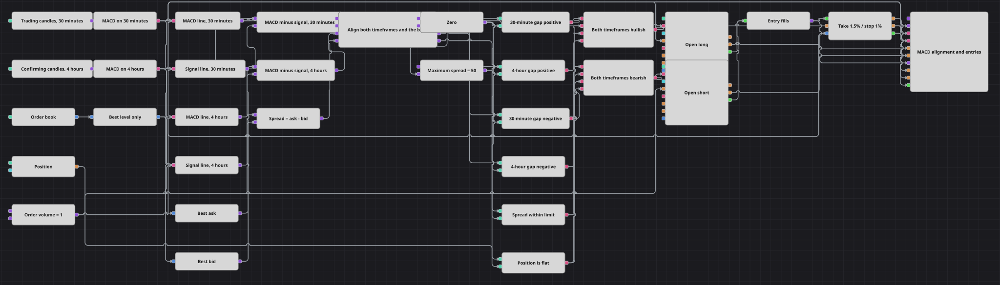

# MACD 時間軸一致戦略のダイアグラム
[English](README.md) | [Русский](README_ru.md) | [中文](README_zh.md) | [Español](README_es.md) | [Deutsch](README_de.md) | [Português](README_pt.md)

MACD が 1 本だけなら、それは一つの見方にすぎません。しかし異なる時間軸の 2 本が同じ方向を示したとき、それはシグナルになります。このダイアグラムは、30 分足と 4 時間足のそれぞれで MACD がシグナル線からどれだけ離れているかを測り、両方の値が同じ方向を向き、かつ板のスプレッドが取引できる程度に狭いときにだけポジションを建てます。

## 戦略の概要

- 2 つのローソク足ブロックが、同じ銘柄を 2 つの時間軸で処理します。取引用が 30 分足、確認用が 4 時間足です。
- それぞれの系列は専用の MACD に入り、2 つのコンバーターが各インジケーターから MACD 線とシグナル線を取り出します。
- 数式ブロックが MACD 線からシグナル線を引き、各時間軸を 1 つの数値にまとめます。プラスなら短期側が先行し、マイナスなら遅れていることを意味します。
- 板情報 (Market depth) は最良気配だけに絞り込まれ、2 つのコンバーターが最良売気配と最良買気配を読み取ります。3 つ目の数式がそれらをスプレッドに変換します。
- 同期 (Sync) は 3 つの数値をすべて保持し、4 時間足のタイミングでまとめて送り出します。比較を公正なものにしているのは、まさにこの仕組みです。板は 1 本のバーの間に数百回も更新されるため、これがなければ 3 つの値が同じ瞬間のものになることはありません。
- 同期の後、2 つの差はゼロと、スプレッドは上限と比較され、論理条件がこの 3 つの答えとノーポジションであることを 1 つにまとめます。
- 買いも売りも固定数量の成行注文で、ノーポジションの状態からのみ出されます。
- そこから取引を引き継ぐのはポジション保護 (Position protection) です。エントリーの約定を監視し、板から現在値を読み取り、パーセントで指定されたテイクプロフィットまたはストップロスで決済します。

## エントリーとエグジットの条件

- **ロングエントリー**: 4 時間足のタイミングで 2 つの差がともにプラス — つまり取引時間軸でも確認時間軸でも MACD がシグナル線の上にある — で、スプレッドが上限内に収まり、ポジションがノーポジションのとき。ポジション変更 (Position modify) が注文数量を成行で買います。
- **ショートエントリー**: 同じタイミングで 2 つの差がともにマイナスになり、スプレッドとノーポジションの条件も同じく満たされたとき。ポジション変更が注文数量を成行で売ります。
- **エグジット**: ダイアグラムに決済シグナルはありません。ポジションが建った時点でポジション保護がそれを引き受け、エントリー価格から 1.5% の利益、または 1% の損失で決済します。ポジションを保有している間は反対方向の値が無視されるため、途中でドテンすることはありません。

## パラメーター

| パラメーター | 既定値 | 説明 |
|---|---|---|
| Trading Candles | 00:30:00 | 取引用 MACD が計算に使う時間軸。 |
| Confirming Candles | 04:00:00 | 確認用 MACD の時間軸であり、同期がすべての値を送り出すタイミング。 |
| Maximum Spread | 50 | エントリーを許容するスプレッドの上限（価格単位）。 |
| Order Volume | 1 | 注文数量（ロット）。 |
| Take Profit, % | 1.5 | テイクプロフィットまでの距離（エントリー価格に対する %）。 |
| Stop Loss, % | 1 | ストップロスまでの距離（エントリー価格に対する %）。 |

## ダイアグラムの詳細

- どちらの MACD ブロックも、確定した最終値だけを出力するように設定されています。そのため未完成のローソク足が判断を動かすことはありません。
- 確認用の MACD は取引用より意図的に短い設定です。1 か月分のヒストリーでは 4 時間足の本数が少なく、標準の 12/26/9 ではその大半をウォームアップに費やしてしまいます。
- 同期は保持する各ラインに名前を付けており、すべてのラインは入口と出口の両方が接続されています。送り込まれたまま取り出されない値があると、ブロックは待ち続け、戦略は起動しません。
- スプレッドは値が届いたその場ではなく、同期の後で比較されます。板を起点としたフィルターがローソク足を起点とした条件の中に収まるのは、これがあるからです。
- ポジション保護にはローソク足の価格ではなく板情報が入力されます。そのため決済価格は現在の最良気配を基準に算出されます。

## 使い方

`.json` ファイルを Designer に読み込み、バックテスターで過去データを使って実行し、実運用の前にパラメーターやブロック自体を自分の銘柄に合わせて調整してください。
