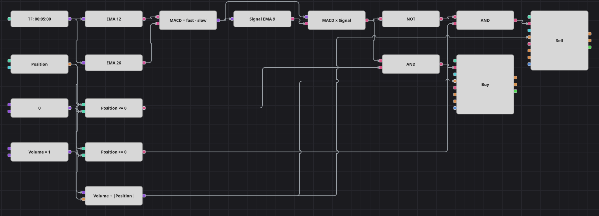

# MACD 趋势策略图
[English](README.md) | [Русский](README_ru.md) | [Español](README_es.md) | [Deutsch](README_de.md) | [Português](README_pt.md) | [日本語](README_ja.md)

该图用 MACD 跟随趋势：快慢两条指数移动平均线之差再平滑一次得到信号线，两线每次交叉都会把持仓反向。下单数量把当前持仓一并算入，因此一笔订单即可平掉旧方向并开出相反方向。

## 策略概览

- MACD 在图上由基本部件搭成：EMA(12) 减 EMA(26) 得到 MACD 线，再对它取 EMA(9) 得到信号线，这样三个周期都能作为方案参数。
- 交叉方块比较两条线，只在真正发生上穿或下穿的那根K线上输出信号。
- 首个信号之后策略始终持仓；没有单独的离场方块，反向交叉即完成反手。

## 入场与出场规则

- **做多入场**: MACD 线上穿信号线，且持仓尚未做多。订单买入 Volume 加上当前持仓的绝对值：空仓时开多，持空时直接反手做多。
- **做空入场**: MACD 线下穿信号线，且持仓尚未做空。订单卖出 Volume 加上当前持仓的绝对值：空仓时开空，持多时直接反手做空。
- **离场**: 没有专门的离场方块，也没有保护性止损：只有反向交叉才会离场，并用一笔订单完成反手。

## 参数

| 参数 | 默认值 | 说明 |
|---|---|---|
| Fast EMA length | 12 | MACD 中快速指数移动平均线的周期。 |
| Slow EMA length | 26 | MACD 中慢速指数移动平均线的周期。 |
| Signal EMA length | 9 | 在 MACD 线上构建的信号线的平滑周期。 |
| Volume | 1 | 基础下单数量（手）；反手时会加上当前持仓。 |
| Candles | 00:05:00 | 整张图使用的K线周期。 |

## 图表详情

- K线方块同时驱动两条均线，公式方块用快线减慢线得到 MACD 线。
- MACD 线继续进入第三个指标方块 EMA(9)，即信号线，两条线在交叉方块中汇合。
- 交叉输出是做多信号，对它取逻辑非即为做空信号，各自再与持仓和零的比较做逻辑与。
- 第二个公式方块计算 Volume 加持仓绝对值，送入两个修改持仓方块的数量输入，这正是一笔市价单完成反手的方式。

## 使用方法

将 `.json` 文件导入 Designer，在回测器中用历史数据运行，然后根据自己的交易品种调整参数或方块，确认无误后再用于实盘。
