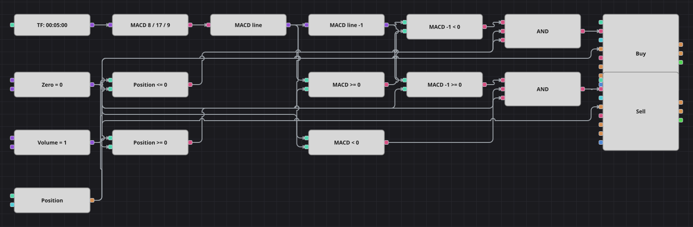

# Diagrama de la estrategia de cruce de la línea cero del MACD
[English](README.md) | [Русский](README_ru.md) | [中文](README_zh.md) | [Deutsch](README_de.md) | [Português](README_pt.md) | [日本語](README_ja.md)

El MACD es la distancia entre una media móvil exponencial rápida y una lenta, de modo que el signo de la línea MACD ya indica por sí solo cuál de las dos está por encima. Este diagrama ignora la línea de señal y opera justo en el instante en que la línea MACD cambia de signo: de negativo a cero o positivo compra, de cero o positivo a negativo vende.

## Resumen de la estrategia

- El MACD se calcula con un periodo rápido de 8, uno lento de 17 y uno de señal de 9; solo la línea MACD participa en las decisiones, la de señal se calcula pero nunca se lee.
- Un bloque de valor anterior guarda la línea MACD de la vela precedente, así el cambio de signo se reconoce como un cruce real y no como un estado que simplemente dura.
- La posición actual se suma a cada condición, de modo que una señal en el sentido ya mantenido se descarta en lugar de aumentar la posición.

## Reglas de entrada y salida

- **Entrada en largo**: La línea MACD estaba por debajo de cero en la vela anterior y está en cero o por encima en la actual, y la posición no es larga. La orden compra el volumen fijo: abre un largo desde plano o cierra un corto existente.
- **Entrada en corto**: La línea MACD estaba en cero o por encima en la vela anterior y está por debajo en la actual, y la posición no es corta. La orden vende el volumen fijo: abre un corto desde plano o cierra un largo existente.
- **Salida**: No hay bloque de salida propio ni stop de protección: todas las órdenes usan el mismo volumen, así que el cruce contrario de cero devuelve la posición a plano en vez de invertirla, y la siguiente posición solo se abre en el cruce siguiente.

## Parámetros

| Parámetro | Por defecto | Descripción |
|---|---|---|
| Fast EMA length | 8 | Periodo de la media móvil exponencial rápida dentro del MACD. |
| Slow EMA length | 17 | Periodo de la media móvil exponencial lenta dentro del MACD. |
| Signal EMA length | 9 | Periodo de suavizado de la línea de señal del MACD; no influye en las decisiones. |
| Volume | 1 | Volumen de la orden, en lotes; se usa igual para abrir y para cerrar. |
| Candles | 00:05:00 | Marco temporal de las velas con el que trabaja todo el diagrama. |

## Detalles del diagrama

- El bloque de velas alimenta el bloque de indicador MACD y un conversor extrae la línea MACD del valor del indicador complejo.
- Un bloque de valor anterior desplaza esa línea una vela hacia atrás y cuatro bloques de comparación contrastan el valor anterior y el actual con una constante cero compartida.
- Esa misma constante cero se compara con el bloque de posición, lo que da los dos filtros Posición <= 0 y Posición >= 0.
- Cada Y lógica une tres condiciones —valor anterior, valor actual y posición— y dispara un bloque de modificación de posición que envía una orden a mercado con la constante de volumen compartida.

## Uso

Importe el archivo `.json` en Designer, ejecútelo sobre datos históricos en el probador y después ajuste los parámetros o los propios bloques a su instrumento antes de operar en real.
