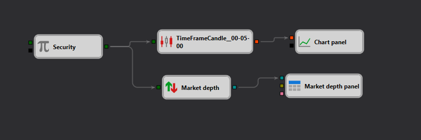

# Market Depth Handling Example in StockSharp Strategy Designer

## Overview

This example illustrates a setup within the StockSharp Strategy Designer that focuses on handling market depth data. Market depth data, often referred to as "the order book," includes information about buy and sell orders at different price levels for a security. It's crucial for strategies that need to analyze supply and demand dynamics at various price levels in real-time.

## Schema Description

The schema comprises several interconnected components designed to fetch, process, and display market depth information:

1. **Security Node**: This node likely represents the security (e.g., a stock, future, or other financial instrument) for which the market depth will be retrieved. This is a fundamental element as it defines which market or instrument's depth is being analyzed.

2. **TimeFrameCandle Node**: This component is configured to handle candle data for the security, aggregated over a specified timeframe (5 minutes in your example). This might be used to correlate changes in market depth with price movements over time.

3. **Market Depth Nodes**: These are designed to capture and possibly react to real-time changes in market depth. It includes settings to process incoming market depth data, providing insights into current buy and sell orders.

4. **Chart Panel Node**: This element suggests that the market depth and possibly other data (like candlestick charts) are being visualized on a chart. This can help traders or algorithms visualize the market situation better and make informed decisions.

5. **Market Depth Panel Node**: Specifically focused on displaying the market depth data in a structured format, potentially offering features like highlighting the best bid and ask prices, visualizing the depth of market data, and more.

## Workflow
- The **Security Node** outputs data which is likely used as input for both the **TimeFrameCandle Node** and the **Market Depth Node**.
- The **TimeFrameCandle Node** processes this data to generate candlesticks for the specified timeframe, which could be used for trend analysis or other technical analysis purposes.
- The **Market Depth Node** processes the real-time market depth for the specified security. It could be used to trigger trading decisions based on specific conditions, such as a large imbalance in the buy vs. sell orders at certain price levels.
- Visualization occurs through the **Chart Panel Node** and **Market Depth Panel Node**, ensuring that the data is not only processed for trading logic but also made accessible for human traders or for review.

## Practical Application
This setup could be used in a variety of trading strategies, including:
- **High-Frequency Trading (HFT)**, where slight changes in order book dynamics can indicate potential profitable trades.
- **Arbitrage Strategies**, which may involve comparing order books across multiple exchanges to exploit price discrepancies.
- **Market Making Strategies**, where understanding both sides of the order book is crucial for setting appropriate buy and sell orders.

## Conclusion
The schema provided in the JSON file demonstrates a comprehensive approach to handling market depth data within the StockSharp Strategy Designer. By integrating real-time data processing with sophisticated visualization tools, this setup aids traders and algorithms in making rapid, data-driven decisions based on the state of the order book. This example serves as a robust foundation for developing more complex trading strategies that require deep insights into market dynamics.