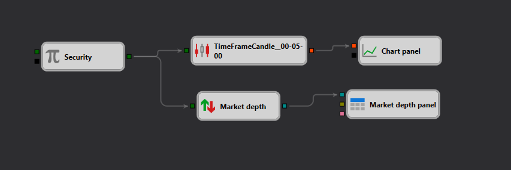

# StockSharp Strategy Designer における板情報処理の例
[English](README.md) | [Русский](README_ru.md) | [中文](README_zh.md) | [Español](README_es.md) | [Deutsch](README_de.md) | [Português](README_pt.md)

## 概要

この例は、StockSharp Strategy Designer における板情報（マーケットデプス）データの処理に焦点を当てた設定を示しています。板情報（「注文板」とも呼ばれる）には、証券の各価格水準における買い注文・売り注文の情報が含まれます。リアルタイムで各価格水準の需給動態を分析する必要がある戦略にとって不可欠なデータです。

## スキーマの説明

このスキーマは、板情報を取得・処理・表示するために設計された複数の相互連結コンポーネントで構成されています。

1. **証券ノード**: 板情報を取得する対象の[証券](https://doc.stocksharp.com/topics/designer/strategies/using_visual_designer/elements/data_sources/variable.html)（株式、先物、その他の金融商品）を表します。どの市場または商品を分析するかを定義する基本的な要素です。

2. **TimeFrameCandle ノード**: 指定した時間枠（例では5分）で集計した証券の[ローソク足データ](https://doc.stocksharp.com/topics/designer/strategies/using_visual_designer/elements/data_sources/candles.html)を処理します。板情報の変化と価格変動を時系列で関連付けるために使用できます。

3. **板情報ノード**: [板情報](https://doc.stocksharp.com/topics/designer/strategies/using_visual_designer/elements/market_depths/order_book.html)のリアルタイムな変化を捕捉し、必要に応じて反応するよう設計されています。現在の買い注文・売り注文の情報を提供する板データの処理設定が含まれます。

4. **チャートパネルノード**: ローソク足データを[チャート](https://doc.stocksharp.com/topics/designer/strategies/using_visual_designer/elements/common/chart.html)上に可視化します。トレーダーやアルゴリズムが市場状況をより明確に把握し、適切な判断を下すのに役立ちます。

5. **板情報パネルノード**: 板情報データを[専用パネル](https://doc.stocksharp.com/topics/designer/strategies/using_visual_designer/elements/market_depths/order_book_panel.html)に表示することに特化しており、最良気配値のハイライト表示や板の深さの可視化などの機能を提供します。

## ワークフロー

- **証券ノード**が出力するデータは、**TimeFrameCandle ノード**と**板情報ノード**の両方への入力として使用されます。
- **TimeFrameCandle ノード**がこのデータを処理して指定した時間枠のローソク足を生成し、トレンド分析やその他のテクニカル分析に活用できます。
- **板情報ノード**が指定した証券のリアルタイム板情報を処理します。特定の価格水準における買い・売り注文の大きな不均衡など、特定の条件に基づいて取引判断をトリガーするために使用できます。
- **チャートパネルノード**と**板情報パネルノード**を通じて可視化が行われ、データが取引ロジックに利用されるだけでなく、人間のトレーダーや確認作業のためにも活用できるようになります。

## 実際の応用

この設定は、以下を含むさまざまな取引戦略に使用できます。
- **高頻度取引（HFT）**: 注文板のわずかな動態変化が潜在的な収益取引を示す場合。
- **アービトラージ戦略**: 複数の取引所の注文板を比較して価格差を活用する戦略。
- **マーケットメイキング戦略**: 適切な買い・売り注文を設定するために注文板の両サイドを深く理解することが重要。

## 結論

JSON ファイルで提供されるスキーマは、StockSharp Strategy Designer 内での板情報データ処理への包括的なアプローチを示しています。リアルタイムデータ処理と高度な可視化ツールを統合することで、この設定はトレーダーとアルゴリズムが注文板の状態に基づいて迅速かつデータ主導の意思決定を行うことを支援します。この例は、市場動態への深い洞察を必要とする複雑な取引戦略を開発するための堅牢な基盤となります。
