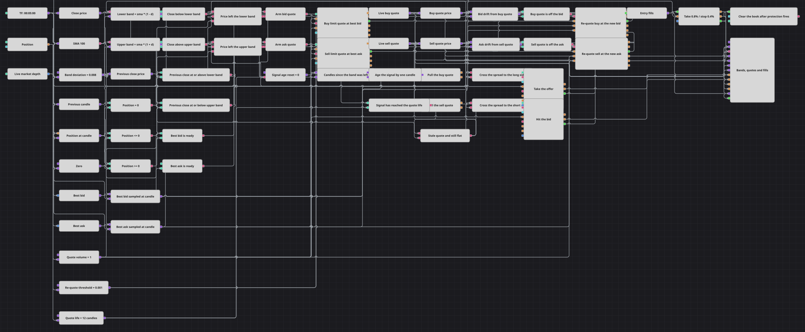

# 做市报价管理策略图
[English](README.md) | [Русский](README_ru.md) | [Español](README_es.md) | [Deutsch](README_de.md) | [Português](README_pt.md) | [日本語](README_ja.md)

该图把均值回归信号变成完整的报价生命周期。价格离开慢速均线带后，图表在盘口本侧挂出限价单，随最优价进行改单，撤销过期或已失去依据的订单，并且只在被动等待超时后才跨越点差成交。

## 策略概览

- 已完成的五分钟K线进入周期为100的简单移动平均线（SimpleMovingAverage）；两条公式在均线上下0.8%处形成通道。
- 市场深度（Market depth）提供BestBid和BestAsk，变量按K线时钟采样，避免高频盘口更新与K线信号错位。
- 当前收盘价必须位于通道外，而前一根收盘价仍在通道内；Position比较还会阻止沿已有持仓方向继续加仓。
- 订单注册（Order registering）按采样后的BestBid挂买单，或按BestAsk挂卖单，两者共用Quote Volume。
- 组合（Combination）保存当前订单引用；订单替换（Order replacing）把替换后的订单送回同一流，并在相对偏移超过阈值时跟随最优价。
- 订单撤销（Order cancellation）在反向通道被突破时撤掉对侧报价，并在12根K线后撤掉过期报价；若仍为空仓且价格仍在通道外，则Modify position按市价开仓。
- 持仓保护（Position protection）在盈利0.8%或亏损0.4%时平仓；保护成交随后触发批量撤单（Mass order cancellation）。

## 入场与出场规则

- **做多入场**: 当前收盘价跌破下轨，前一收盘价仍在下轨之上或等于下轨，Position不是多头，并且已有可用BestBid时，图表按该价格挂买入限价单。偏移超过0.001时进行替换。信号持续12根K线、仍为空仓且价格仍低于下轨时，撤单并发送OpenPosition市价买入。
- **做空入场**: 当前收盘价升破上轨，前一收盘价仍在上轨之下或等于上轨，Position不是空头，并且已有可用BestAsk时，图表按该价格挂卖出限价单并通过替换跟随市场。信号持续12根K线、仍为空仓且价格仍高于上轨时，撤单并发送OpenPosition市价卖出。
- **离场**: 注册、替换或市价备用入口产生的所有成交都送入Position protection。K线收盘价驱动0.8%的止盈和0.4%的止损；保护单成交后，Mass order cancellation撤销仍然活动的报价。

## 参数

| 参数 | 默认值 | 说明 |
|---|---|---|
| Candle Time Frame | 00:05:00 | 用于均线、通道信号、盘口采样、报价计时和保护检查的K线周期。 |
| SMA Length | 100 | 通道中心SimpleMovingAverage的长度。 |
| Band Deviation | 0.008 | 通道相对半宽；0.008表示均线上下各0.8%。 |
| Quote Volume | 1 | 限价报价、替换和市价备用入口使用的数量。 |
| Re-quote Threshold | 0.001 | 当前报价与最优价之间触发替换的相对距离。 |
| Quote Life, candles | 12 | 被动报价被视为过期前允许经过的已完成K线数。 |
| Take Profit, % | 0.8 | 相对入场成交价的有利距离，单位为百分比。 |
| Stop Loss, % | 0.4 | 相对入场成交价的不利距离，单位为百分比。 |

## 图表详情

- 前值（Previous value）先保存上一根K线，再提取其收盘价，因此设置只在价格刚离开通道时触发一次。
- BestBid、BestAsk和Position由变量锁存，并由已完成K线释放，所以比较和订单都带有当前K线时间。
- 每个注册或替换后的订单都进入Combination<Order>总线；价格转换、替换、撤销和图表始终使用最新订单。
- 年龄计数器在价格首次离开任一通道时归零，每根K线加一，并限制在寿命值加一；与12相等只产生一次过期事件。
- 限价注册和替换保留传入价格。市价备用入口限定为OpenPosition，保护与批量撤单在退出后清理状态。

## 使用方法

将 `.json` 文件导入 Designer，在回测器中用历史数据运行，然后根据自己的交易品种调整参数或方块，确认无误后再用于实盘。
