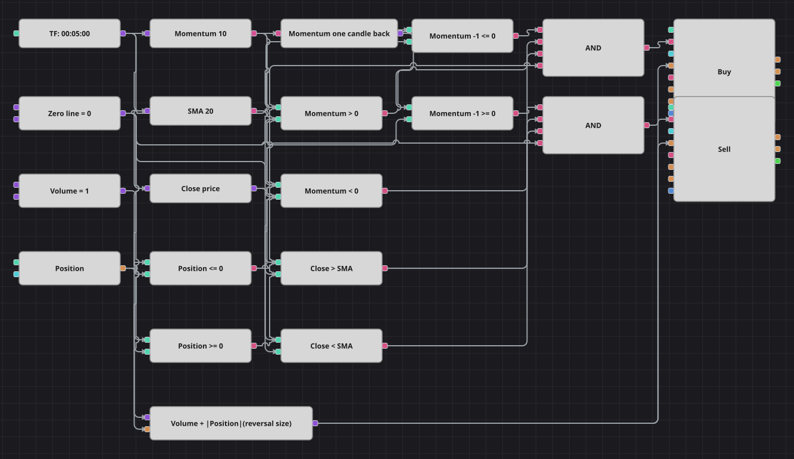

# Momentum ゼロクロスと SMA フィルターのダイアグラム
[English](README.md) | [Русский](README_ru.md) | [中文](README_zh.md) | [Español](README_es.md) | [Deutsch](README_de.md) | [Português](README_pt.md)

ここでは2つの考え方が重ねられています。Momentum は現在の終値と10本前の終値の差で、その区間に相場が価格をどちらへ押したかを示し、差の符号が変わる瞬間が引き金になります。単純移動平均は審判役です。終値が同意している方向のクロスだけを採用します。

## 戦略の概要

- ゼロラインのクロスは2つの比較で書き下されています。現在値とゼロ、1本前の値とゼロで、これは原典のコードが記述している条件そのままです。
- 移動平均のフィルターが2方向を分けます。上抜けは終値が平均より上のときだけ買い、下抜けは終値が平均より下のときだけ売ります。
- フォルダー名に反して、ここでの指標は Momentum、すなわちポイント単位の絶対的な価格差であり、率で測る変化率ではありません。
- すべてのシグナルはドテンです。注文数量は共通の数量に現在の建玉の絶対値を足したもので、1回の約定で旧ポジションを閉じ新ポジションを建てます。
- 原典は約定後30本のあいだ取引を凍結しますが、バーを数えるブロックがないためこの休止は再現せず、条件を満たすクロスすべてに反応します。

## エントリーとエグジットの条件

- **ロングエントリー**: 前の足で Momentum がゼロ以下、現在はゼロより上、終値が SMA より上で、ポジションが買いではないとき。注文はドテン数量を成行で買います。
- **ショートエントリー**: 前の足で Momentum がゼロ以上、現在はゼロより下、終値が SMA より下で、ポジションが売りではないとき。注文はドテン数量を成行で売ります。
- **エグジット**: 原典と同じく、専用のエグジットブロックも保護ストップもありません。反対方向のクロスが1本の注文でドテンするまで建玉を保有します。

## パラメーター

| パラメーター | 既定値 | 説明 |
|---|---|---|
| Momentum Length | 10 | Momentum が遡るローソク足の本数。値は現在の終値からその本数前の終値を引いたものです。 |
| SMA Length | 20 | クロスの方向を絞り込む単純移動平均の期間。 |
| Volume | 1 | 基本の注文数量（ロット）。ドテン注文はこれに建玉の絶対値を加えます。 |
| Candles | 00:05:00 | ダイアグラム全体が用いるローソク足の時間軸。 |

## ダイアグラムの詳細

- ローソク足ブロックは3つの分岐に値を渡します。Momentum 指標、単純移動平均、そして終値を取り出す変換ブロックです。
- 前値ブロックが1本前の Momentum を保持し、4つの比較ブロックが現在値と前値を共通のゼロ定数の両側に振り分けます。
- さらに2つの比較ブロックが終値と移動平均を突き合わせ、2つが同じゼロ定数とポジションを比べます。
- それぞれの論理積が、前の足のゼロに対する位置、現在の位置、移動平均フィルター、ポジション判定を束ね、数量を「共通数量＋建玉の絶対値」の数式ブロックから受け取るポジション変更ブロックを起動します。

## 使い方

`.json` ファイルを Designer に読み込み、バックテスターで過去データを使って実行し、実運用の前にパラメーターやブロック自体を自分の銘柄に合わせて調整してください。
