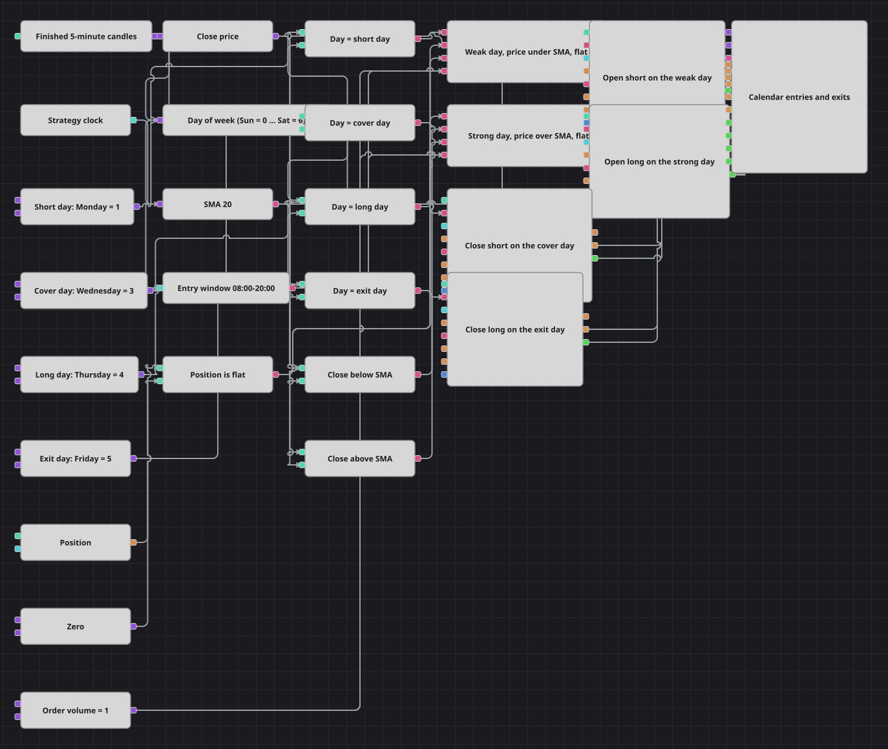

# Diagramm der Strategie Monday Weakness
[English](README.md) | [Русский](README_ru.md) | [中文](README_zh.md) | [Español](README_es.md) | [Português](README_pt.md) | [日本語](README_ja.md)

Dieses Diagramm handelt einen festen Wochenkalender. Jede Seite der Woche hat ihren eigenen Tag: Am Short-Tag wird verkauft, wenn der Schlusskurs unter der SMA 20 liegt, und am Cover-Tag wird dieser Short zurückgekauft; am Long-Tag wird gekauft, wenn der Schlusskurs über der SMA 20 liegt, und am Exit-Tag wird dieser Long wieder verkauft. Der Wochentag wird direkt an der Kerze als Zahl abgelesen, sodass die vier Kalenderregeln vier gewöhnliche Vergleiche sind, und ein uhrgesteuertes Einstiegsfenster hält die Wochenentscheidung im aktiven Teil des Tages.

## Strategieübersicht

- Fünf-Minuten-Kerzen werden ausschließlich als abgeschlossene Kerzen geliefert. Zwei Converter lesen dieselbe Kerze: einer nimmt den Schlusskurs, der andere den Wochentag der Eröffnungszeit, der als Zahl eintrifft, bei der Sonntag 0 und Samstag 6 ist.
- Vier Variable-Blöcke halten die vier Kalendertage – Short, Cover, Long und Exit – und vier auf Equal gesetzte Comparison-Blöcke machen aus der Tageszahl vier Signale. Auf einer einzelnen Kerze kann genau eines davon wahr sein, und genau das verhindert, dass die vier Zweige jemals miteinander konkurrieren.
- Die SMA 20 läuft über dieselben Kerzen und veröffentlicht nichts, solange sie nicht ausgebildet ist; die ersten zwanzig Kerzen eines Laufs erzeugen daher überhaupt kein Signal. Zwei Comparison-Blöcke lesen sie aus: einer ist wahr, solange der Schlusskurs unter dem Durchschnitt liegt, der andere, solange er darüber liegt.
- Ein Position-Block, eine Variable mit dem Wert null und ein auf Equal gesetzter Comparison-Block ergeben die Prüfung auf eine flache Position. Beide Einstiegszweige verlangen sie, sodass eine Woche, die bereits im Markt ist, keine zweite Position obendrauf aufbauen kann.
- Current time speist Working time, das zwischen 08:00:00 und 20:00:00 wahr ist. Beide Einstiegszweige verlangen ebenfalls dieses Fenster, sodass eine Wochenposition nie auf einer dünnen Nachtkerze eröffnet wird. Die beiden Ausstiege stehen bewusst außerhalb des Fensters – was offen ist, muss an seinem Kalendertag geschlossen werden, zu welcher Stunde das Signal auch auftritt.
- Zwei Logical condition-Blöcke mit AND sammeln die Einstiege. Der Short-Zweig braucht den Short-Tag, einen Schlusskurs unter der SMA 20, eine flache Position und ein offenes Fenster; der Long-Zweig braucht den Long-Tag, einen Schlusskurs über der SMA 20 und dieselben beiden Filter. Jeder steuert einen Modify position-Block mit der Bedingung Open position an, sodass ein wiederholtes Signal innerhalb desselben Tages keine zweite Order senden kann.
- Die beiden Ausstiege sind Modify position-Blöcke mit der Bedingung Close position und einer ausdrücklich gesetzten Richtung. Der Block des Cover-Tages ist ein Kauf und kann daher nur einen Short schließen; der Block des Exit-Tages ist ein Verkauf und kann daher nur einen Long schließen. Keiner der beiden hat einen Volumeneingang, denn Close position bemisst die Order an der offenen Position selbst.
- Das Chart panel zeichnet die Kerzenreihe, die SMA 20, die Orders aller vier Aktionen und die daraus entstehenden Ausführungen, sodass sich der Wochenrhythmus – Einstieg früh in der Woche, Cover in der Wochenmitte, Einstieg spät in der Woche, Ausstieg am Ende – direkt aus dem Bild ablesen lässt.

## Ein- und Ausstiegsregeln

- **Long-Einstieg**: Am Long-Tag wird innerhalb des Einstiegsfensters, bei flacher Position und einem Schlusskurs über der SMA 20, ein Market-Kauf über Order volume durch Modify position mit der Bedingung Open position gesendet.
- **Short-Einstieg**: Am Short-Tag wird innerhalb des Einstiegsfensters, bei flacher Position und einem Schlusskurs unter der SMA 20, ein Market-Verkauf über Order volume durch Modify position mit der Bedingung Open position gesendet.
- **Ausstieg**: Die Ausstiege richten sich nach dem Kalender, nicht nach dem Kurs. Am Cover-Tag stellt ein Kauf über Modify position mit der Bedingung Close position einen offenen Short glatt; am Exit-Tag stellt ein Verkauf über Modify position mit derselben Bedingung einen offenen Long glatt. Es gibt keinen Stop, kein Ziel und keine Trailing-Regel, sodass eine Position gehalten wird, bis ihr eigener Exit-Tag kommt. Die beiden Ausstiegssignale wiederholen sich auf jeder Kerze ihres Tages, und nichts zählt oder unterdrückt diese Wiederholung: Die erste Kerze schließt die Position, danach hat Close position nichts mehr, womit es arbeiten könnte, und weist das Signal stillschweigend ab. Dasselbe gilt für die Einstiege – es gibt weder einen Zähler pro Tag noch eine Wartezeit zwischen den Trades; es sind die Bedingung Open position zusammen mit der Prüfung auf eine flache Position, die einen Kalendertag auf eine einzige Order begrenzen.

## Parameter

| Parameter | Standard | Beschreibung |
|---|---|---|
| Candles | 00:05:00 | Zeitrahmen der Kerzenreihe. Es werden nur abgeschlossene Kerzen geliefert; Wochentag, Durchschnitt und jedes Signal werden aus fertigen Kerzen gelesen. |
| MA Period | 20 | Periode des einfachen gleitenden Durchschnitts, der beide Einstiege filtert. Der Durchschnitt veröffentlicht erst dann Werte, wenn er ausgebildet ist, sodass während der ersten Kerzen eines Laufs kein Einstieg möglich ist. |
| Session From | 08:00:00 | Beginn des Tagesfensters, in dem Einstiege erlaubt sind, abgelesen von der Uhr der Strategie. Die Ausstiege ignorieren dieses Fenster. |
| Session Until | 20:00:00 | Ende dieses Fensters. Erweitern Sie das Paar, damit die Kalenderregel zu jeder Stunde wirken kann; verengen Sie es, um die Einstiege auf wenige Stunden des Tages zu konzentrieren. |
| Short day | 1 | Tageszahl, die einen Short eröffnet, wenn der Schlusskurs unter dem Durchschnitt liegt. Die Tage sind von Sonntag als 0 bis Samstag als 6 nummeriert. |
| Cover day | 3 | Tageszahl, an der ein offener Short zurückgekauft wird. Sie schließt nur einen Short; an diesem Tag bleibt ein Long unangetastet. |
| Long day | 4 | Tageszahl, die einen Long eröffnet, wenn der Schlusskurs über dem Durchschnitt liegt. Nummeriert auf derselben Skala mit Sonntag als 0. |
| Exit day | 5 | Tageszahl, an der ein offener Long verkauft wird. Sie schließt nur einen Long; an diesem Tag bleibt ein Short unangetastet. |
| Order volume | 1 | Feste Stückzahl, die von beiden Open position-Aktionen verwendet wird. Die beiden Close position-Aktionen benötigen kein Volumen, da sie ihre Order an der jeweils offenen Position bemessen. |

## Diagrammdetails

- Der [Candles](https://doc.stocksharp.com/en/topics/designer/strategies/using_visual_designer/elements/data_sources/candles.html)-Block ist auf ausschließlich abgeschlossene Kerzen eingestellt, was in zweifacher Hinsicht zählt: Der Wochentag stammt aus einer Kerze, die sich nicht mehr ändert, und jede Order, die das Diagramm sendet, trägt den Schlusszeitpunkt einer fertigen Kerze statt der Eröffnungszeit einer noch entstehenden.
- Kalender und Kurs stammen beide aus einem [Converter](https://doc.stocksharp.com/en/topics/designer/strategies/using_visual_designer/elements/converters/converter.html)-Paar über dieser Reihe. Den Wochentag an der Kerze statt an einer separaten Uhr abzulesen hält den Kalendertest exakt im selben Takt wie den Trendtest, sodass beide immer dieselbe Kerze beschreiben, wenn die [Logical condition](https://doc.stocksharp.com/en/topics/designer/strategies/using_visual_designer/elements/common/logical_condition.html)-Blöcke mit AND sie zusammenführen.
- Die vier Tageszahlen sind gewöhnliche [Variables](https://doc.stocksharp.com/en/topics/designer/strategies/using_visual_designer/elements/data_sources/variable.html), die mit [Comparison](https://doc.stocksharp.com/en/topics/designer/strategies/using_visual_designer/elements/common/comparison.html)-Blöcken verglichen werden; deshalb lässt sich der gesamte Wochenplan über die Parameterliste umstellen: Setzt man den Short-Tag auf eine andere Zahl, handelt das Schema stattdessen diesen Tag, ohne dass eine Verbindung angefasst wird.
- [Current time](https://doc.stocksharp.com/en/topics/designer/strategies/using_visual_designer/elements/time/current_time.html) und [Working time](https://doc.stocksharp.com/en/topics/designer/strategies/using_visual_designer/elements/time/working_time.html) liefern den Tageszeitfilter als einfachen Pegel: wahr im gesamten Fenster, falsch außerhalb. Er ist nur in die beiden Einstiegszweige verdrahtet, und die [Position](https://doc.stocksharp.com/en/topics/designer/strategies/using_visual_designer/elements/positions/current.html)-Momentaufnahme daneben liefert die Prüfung auf eine flache Position auf dieselbe Weise.
- Vier [Modify position](https://doc.stocksharp.com/en/topics/designer/strategies/using_visual_designer/elements/positions/modify.html)-Blöcke erledigen den gesamten Handel: zwei mit Open position und festem Volumen, zwei mit Close position und angegebener Richtung. Erst die festgelegte Richtung der schließenden Blöcke macht die Kalenderausstiege exakt – ein Kauf am Cover-Tag verweigert schlicht einen Long, und ein Verkauf am Exit-Tag verweigert schlicht einen Short. Alles, was sie ausgeben, wird zusammen mit den Kerzen und der SMA 20 auf dem [Chart panel](https://doc.stocksharp.com/en/topics/designer/strategies/using_visual_designer/elements/common/chart.html) gezeichnet.

## Verwendung

Importieren Sie die `.json`-Datei in Designer, testen Sie sie im Backtester mit historischen Daten und passen Sie danach Parameter oder Bausteine an Ihr Instrument an, bevor Sie live handeln.
