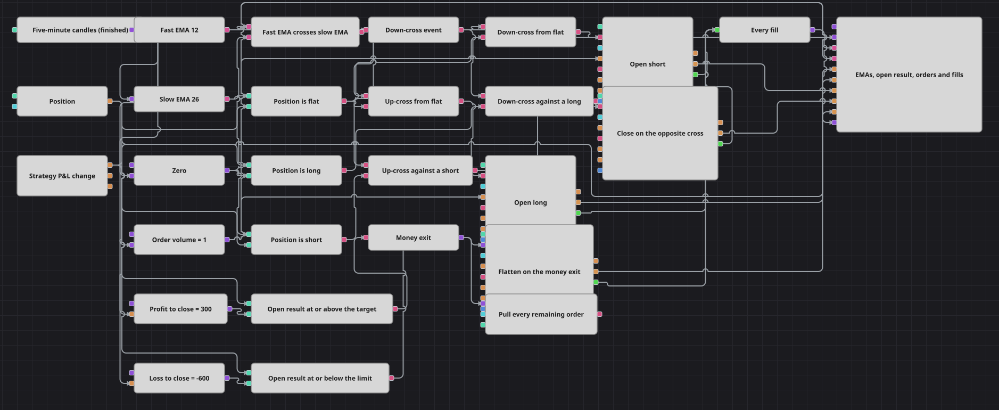

# Money Target Flatten Strategy Diagram
[Русский](README_ru.md) | [中文](README_zh.md) | [Español](README_es.md) | [Deutsch](README_de.md) | [Português](README_pt.md) | [日本語](README_ja.md)

A money target does not look at price at all: it closes the position when the money in it reaches a figure. This diagram puts that rule on top of a plain two-average engine. The crossing decides when to be in the market; the profit target and the loss limit decide when enough is enough, and the moment either is reached the position is flattened and every order still working is pulled behind it.

## Strategy Overview

- Finished five-minute candles feed a fast and a slow exponential moving average, and a crossing block turns the pair into one event: true when the fast line rises through the slow one, false when it falls through it.
- A logical NOT gives the down-cross a signal of its own, so each direction is a gate in its own right.
- The position block compared with zero says whether the diagram is flat, long or short, and every gate is a logical AND of one crossing and one position state.
- Both entries are market orders of a fixed volume and carry the open-position condition, so a crossing that arrives while a position is already running cannot add to it.
- The P&L block emits the open result of the running position on a beat of its own, several times an hour rather than once a bar.
- Two comparisons hold that number against the profit target and against the loss limit, and each threshold is a variable triggered by the same P&L value, so a comparison always sees both of its operands from the same moment.
- A combination joins the two answers into a single exit line, which does two things at once: position modify closes the position at market, and mass order cancellation sweeps whatever is still working.
- A crossing that goes against an open position closes it too, so the diagram never sits in a trade the averages have turned against.

## Entry and Exit Rules

- **Long entry**: The fast average crosses above the slow one on a finished candle while the position is flat: position modify buys the order volume at market.
- **Short entry**: The fast average crosses below the slow one on a finished candle while the position is flat: position modify sells the order volume at market.
- **Exit**: Two independent ways out. The money exit fires as soon as the open result of the position reaches the profit target or falls to the loss limit: the combination passes the signal on, the position is closed at market and every remaining order is pulled. A crossing against the open position closes it as well. Whichever comes first, the diagram goes flat and waits, and the next crossing that finds it flat opens the next position, long or short.

## Parameters

| Parameter | Default | Description |
|---|---|---|
| Candles | 00:05:00 | Time frame of the candle series both averages are built on. |
| Fast EMA Length | 12 | Length of the fast exponential moving average. |
| Slow EMA Length | 26 | Length of the slow exponential moving average. |
| Volume | 1 | Order size, in lots, sent by each entry. |
| Profit To Close | 300 | Open result, in money, at which the position is closed as a win. |
| Loss To Close | -600 | Open result, in money, at which the position is closed as a loss; it is written as a negative number because it is compared with the result directly. |

## Diagram Details

- The thresholds are compared with the unrealized result, the money in the position that is running, so they behave as a money take-profit and a money stop-loss on each position in turn. The same two comparisons wired to the realized output turn the pair into a one-way switch instead: once the account reaches the figure, the run is over.
- The money exit is not tied to the candle beat. It acts on the P&L update, so a target can be taken in the middle of a bar rather than at the next close.
- Every order the diagram sends is a market order, so on packaged history the sweep finds nothing to pull. It is wired because a money exit that leaves working orders behind is only half an exit, and it starts to matter the moment a resting order joins the diagram.
- Both closing blocks carry the close-position condition and therefore need neither a side nor a volume: the block reads the open position and sends the opposite order for exactly that size.
- The five-minute beat is what makes the money layer visible. On a much longer candle this pair of averages crosses only a handful of times a month, positions are few, and the thresholds are sized for the swing a five-minute series produces.

## Usage

Import the `.json` file into Designer, run it in the backtester on historical data, then adjust the parameters or the blocks themselves to fit your instrument before trading it live.
