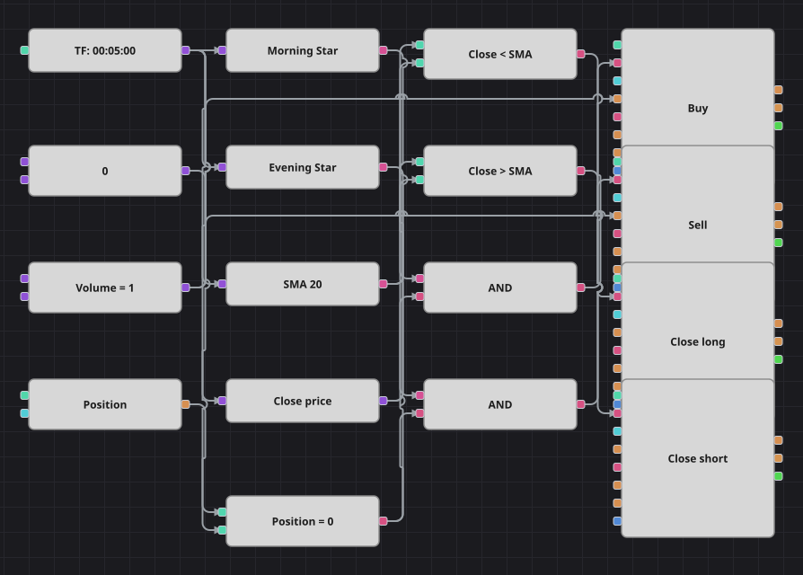

# Диаграмма стратегии разворота «Утренняя звезда»
[English](README.md) | [中文](README_zh.md) | [Español](README_es.md) | [Deutsch](README_de.md) | [Português](README_pt.md) | [日本語](README_ja.md)

«Утренняя звезда» — классическое трёхсвечное дно: широкая падающая свеча, маленькая нерешительная свеча и широкая растущая свеча, отыгрывающая больше половины первой. Зеркальная фигура, «Вечерняя звезда», отмечает вершину. Схема распознаёт обе фигуры кубиками свечных паттернов, открывает позицию только при её отсутствии и отдаёт сделку, как только цена закрывается не с той стороны простой скользящей средней.

## Обзор стратегии

- Два кубика индикатора свечных паттернов держат собственные трёхсвечные выражения: у первой свечи есть тело и она направлена против будущего входа, тело средней меньше половины первого, а третья свеча закрывается за серединой первой.
- Простая скользящая средняя по цене закрытия — единственный ориентир выхода; стоп-лосса и тейк-профита в схеме нет, ровно как и в исходной стратегии.
- Кубик позиции сравнивается с нулём, поэтому по паттерну действуют только из флэта и никогда не доливаются в открытую сделку.
- Исходная стратегия дополнительно замораживает все сигналы на несколько сотен баров после каждой сделки; отдельного кубика-счётчика баров нет, поэтому пауза опущена, о чём здесь и сказано.

## Правила входа и выхода

- **Вход в лонг**: Кубик «Утренней звезды» сообщает о фигуре на только что завершённой свече, позиция равна нулю. Заявка покупает один лот и открывает лонг.
- **Вход в шорт**: Кубик «Вечерней звезды» сообщает о фигуре на только что завершённой свече, позиция равна нулю. Заявка продаёт один лот и открывает шорт.
- **Выход**: Лонг закрывает кубик изменения позиции в режиме закрытия, как только свеча закроется ниже скользящей средней; шорт закрывается так же, когда свеча закроется выше неё. Защитного стопа нет, потому что его нет и в исходной стратегии.

## Параметры

| Параметр | По умолчанию | Описание |
|---|---|---|
| SMA Length | 20 | Период простой скользящей средней, по которой закрываются сделки. |
| Volume | 1 | Объём заявки в лотах. |
| Candles | 00:05:00 | Таймфрейм свечей для всей диаграммы; оригинал работает на минутных свечах и здесь переведён на пятиминутную историю, поставляемую с галереей. |

## Детали диаграммы

- Кубик свечей питает четыре ветки: два кубика паттернов, скользящую среднюю и конвертер цены закрытия.
- В каждом кубике паттерна лежит выражение из трёх условий, поэтому фигура распознаётся без цепочки формул.
- Два кубика сравнения ставят цену закрытия по одну или другую сторону средней и напрямую запускают закрывающие кубики.
- Каждое логическое И объединяет паттерн с проверкой позиции и запускает вход; обе входные заявки берут объём из общей константы, а закрывающие кубики считают его по открытой позиции.

## Использование

Импортируйте файл `.json` в Designer, прогоните схему на исторических данных в тестере, затем подстройте параметры или сами кубики под свой инструмент, прежде чем торговать вживую.
