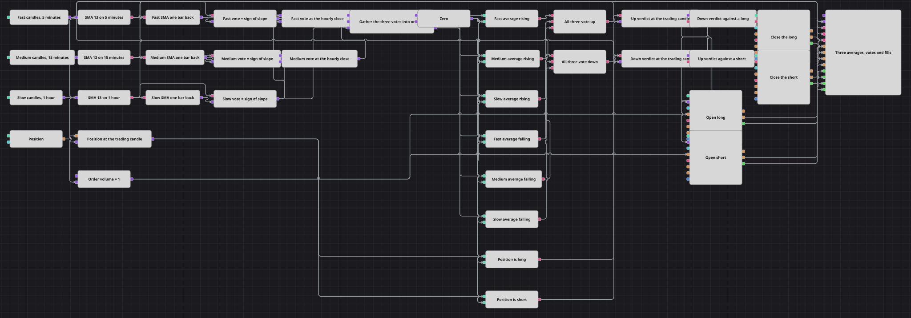

# Схема стратегии голосования SMA на нескольких таймфреймах
[English](README.md) | [中文](README_zh.md) | [Español](README_es.md) | [Deutsch](README_de.md) | [Português](README_pt.md) | [日本語](README_ja.md)

Одна развернувшаяся вверх скользящая средняя говорит немного; три средние, развернувшиеся вверх одновременно на трёх разных таймфреймах, — уже тренд, которым стоит торговать. Каждый таймфрейм отдаёт голос: плюс один, минус один или ноль; Sync собирает три голоса в один набор, и позиция открывается только при единогласии.

## Обзор стратегии

- Три кубика свечей читают один и тот же инструмент на пяти минутах, пятнадцати минутах и часе, и каждый из них пропускает только завершённые свечи.
- Каждая серия питает свою простую скользящую среднюю, а кубик Previous value хранит значение той же средней на один бар назад.
- Формула превращает эту пару в голос: плюс один, когда средняя выше прежнего значения, минус один — когда ниже, ноль — когда она не сдвинулась.
- Пятиминутный и пятнадцатиминутный голоса удерживаются в переменных и выпускаются часовым голосом, поэтому все три линии приходят в Sync относящимися к одному и тому же моменту.
- Sync держит по линии на каждый голос и выпускает все три вместе; без него часовое значение приходило бы на час позже пятиминутного и сравнить три голоса было бы невозможно.
- После Sync каждый голос сравнивается с нулём, и два логических условия задают единственный вопрос, который важен схеме: смотрят ли все три в одну сторону.
- Вердикт защёлкивается на следующей завершённой пятиминутной свече — такте, которым датируется каждая заявка, — и Position modify открывает позицию по рынку из нулевой позиции.
- Позиция, считанная на том же пятиминутном такте, сравнивается с нулём: противоположный вердикт при открытой позиции закрывает её по рынку, а новая сторона берётся на следующей свече.

## Правила входа и выхода

- **Вход в лонг**: На часовом такте все три голоса равны плюс одному: пятиминутная, пятнадцатиминутная и часовая средние — каждая выше своего значения на один бар назад. Вердикт переносится на следующую завершённую пятиминутную свечу, где Position modify покупает объём заявки по рынку — и только из нулевой позиции.
- **Вход в шорт**: На том же такте все три голоса равны минус одному: каждая средняя ниже своего значения на один бар назад. На следующей завершённой пятиминутной свече Position modify продаёт объём заявки по рынку, снова только из нулевой позиции.
- **Выход**: Ни тейк-профита, ни стоп-лосса, ни таймера здесь нет. Позиция живёт, пока три таймфрейма не выстроятся в обратную сторону: противоположный вердикт вместе со сравнением позиции закрывает её по рынку на торговой свече, а вход в новую сторону следует на очередной свече, когда позиция снова нулевая. Разноголосица ничего не меняет и позицию не трогает.

## Параметры

| Параметр | По умолчанию | Описание |
|---|---|---|
| Fast Candles | 00:05:00 | Таймфрейм самого быстрого голоса и такт, на котором отрабатываются вердикты и датируются заявки. |
| Medium Candles | 00:15:00 | Таймфрейм среднего голоса. |
| Slow Candles | 01:00:00 | Таймфрейм самого медленного голоса и такт, на котором три голоса собираются и подсчитываются. |
| Fast SMA Length | 13 | Период усреднения пятиминутной средней. |
| Medium SMA Length | 13 | Период усреднения пятнадцатиминутной средней. |
| Slow SMA Length | 13 | Период усреднения часовой средней. |
| Order Volume | 1 | Размер заявки в лотах, используемый для входов в обе стороны; выход закрывает весь объём, который держит позиция. |

## Детали диаграммы

- Все три средние выдают только сформированные, окончательные значения, поэтому ещё строящаяся свеча не может сдвинуть голос.
- Сведение каждого таймфрейма к знаку наклона и делает три голоса сопоставимыми: часовая средняя и пятиминутная живут в разных масштабах, а плюс один и минус один — нет.
- Два более быстрых голоса попадают в Sync через переменную, которую выпускает часовой голос. Это сделано намеренно: линии, приходящие поодиночке, оставили бы Sync с набором, который никогда не соберётся, и всё, что стоит после него, больше никогда бы не сработало.
- Sync помечает выпускаемый набор тем моментом, к которому этот набор относится, а к закрытию часа такая метка уже отстаёт от часов. По пути к заявке её никто не читает — вердикт защёлкивается второй раз на завершённой пятиминутной свече, которая несёт сделку.
- Оба входа поставлены в зависимость от открытой позиции, поэтому вердикт, повторяющийся на каждой пятиминутной свече, не может нарастить заявки: пока позиция жива, повтор просто отклоняется.

## Использование

Импортируйте файл `.json` в Designer, прогоните схему на исторических данных в тестере, затем подстройте параметры или сами кубики под свой инструмент, прежде чем торговать вживую.
