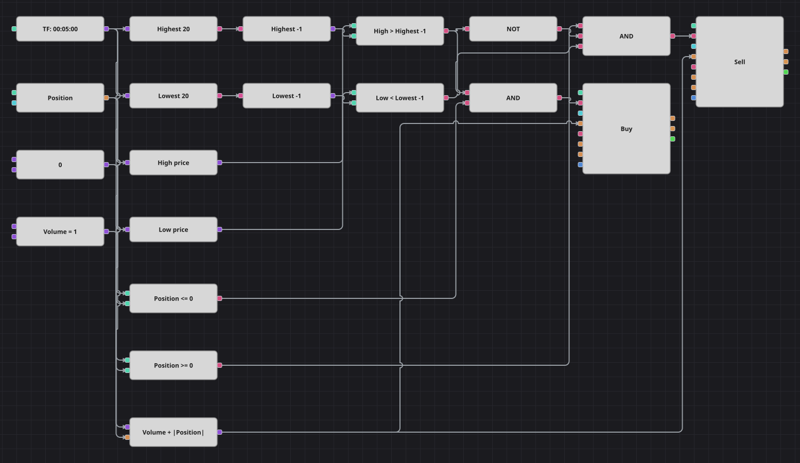

# N-Day Breakout Strategy Diagram
[Русский](README_ru.md) | [中文](README_zh.md) | [Español](README_es.md) | [Deutsch](README_de.md) | [Português](README_pt.md) | [日本語](README_ja.md)

The turtle-trader classic reduced to its core: two indicators, Highest and Lowest, hold the extremes of the last N bars, and a candle that pushes past either of them is taken as the start of a move. The diagram is always in the market and reverses on the opposite breakout.

## Strategy Overview

- Highest reads the high of every finished candle and Lowest reads the low, so the pair forms the breakout channel of the lookback period.
- Both readings are shifted one candle back, because the current value already includes the candle being tested — without the shift the high could at best equal the channel and never exceed it.
- The current position gates every entry, and the order volume adds the absolute position so a single market order reverses the side.

## Entry and Exit Rules

- **Long entry**: The candle high rises above the Highest value of the previous candle and the position is not long. The order buys the base volume plus the absolute position, turning a short into a long or opening a long from flat.
- **Short entry**: The candle low falls below the Lowest value of the previous candle, the long breakout did not fire on the same candle, and the position is not short. The order sells the base volume plus the absolute position.
- **Exit**: No stop, no target, no dedicated exit: the position lives until the opposite breakout reverses it, which is what the original code does as well.

## Parameters

| Parameter | Default | Description |
|---|---|---|
| Lookback period | 20 | Number of bars the breakout channel is built over; the same length is used for Highest and Lowest. |
| Volume | 1 | Base order volume, in lots; the absolute position is added when reversing. |
| Candles | 00:05:00 | Candle time frame the whole diagram works on. |

## Diagram Details

- The candle block feeds both indicators and, through two converters, the high and the low of the current candle.
- Two previous-value blocks delay the Highest and Lowest readings by one candle, which is the whole trick of this strategy.
- Comparison blocks produce the two breakout flags, and two more compare the position against zero; a logical NOT gives the long breakout priority over the short one, exactly as the else-if branch of the original does.
- A formula block computes the reversal volume as base volume plus the absolute position and feeds both position modify blocks.
- The original declares a moving average and a stop-loss percentage that its own code never uses, and defaults to a 1500-bar channel on one-minute candles; the diagram leaves the dead parameters out and uses a 20-bar channel on five-minute candles, as the strategy's README and optimization range suggest.

## Usage

Import the `.json` file into Designer, run it in the backtester on historical data, then adjust the parameters or the blocks themselves to fit your instrument before trading it live.
