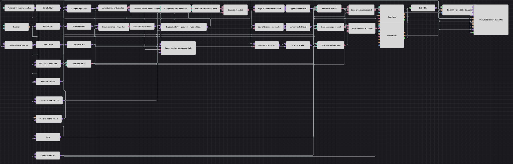

# Narrow Range Limit Bracket Strategy Diagram
[Русский](README_ru.md) | [中文](README_zh.md) | [Español](README_es.md) | [Deutsch](README_de.md) | [Português](README_pt.md) | [日本語](README_ja.md)

A market that stops moving is a market getting ready to move. This diagram measures the height of every candle, finds the moment the height collapses to the smallest it has been for several candles, and brackets that candle with two levels: its high above and its low below. Whichever level the price closes beyond first decides the direction of the trade.

## Strategy Overview

- Finished 15-minute candles feed three converters that read the high, the low and the close of each candle.
- A formula subtracts the low from the high, so every candle is reduced to a single number: its range.
- The Lowest indicator runs over that number, not over the price, and reports the smallest range of the last six candles; a formula multiplies it by the squeeze factor to get the width a candle must fit into to count as narrow.
- A second branch rebuilds the same measurement one candle back: Previous value hands out the candle before, two converters and a formula give its range, and another Previous value takes the reading the Lowest indicator had at that time.
- A logical condition puts three answers together: this candle is narrow, the candle before it was not, and the position is flat. That is the squeeze.
- On the squeeze the high and the low of that candle are captured into two variables, which keep holding those two prices candle after candle: the bracket. A third variable arms it.
- From the next candle on, two comparisons watch the close against the two levels, and a logical condition releases a market entry when the close is beyond one of them, the bracket is armed and the position is flat.
- Two chart panels draw the result: price with the bracket levels, the orders and the fills on one, and the candle range against its squeeze limit on the other.

## Entry and Exit Rules

- **Long entry**: The close of a candle is above the upper bracket level, the bracket is armed and the position is flat. Position modify buys the order volume at market.
- **Short entry**: The close of a candle is below the lower bracket level, under the same armed and flat-position conditions. Position modify sells the order volume at market.
- **Exit**: The diagram has no exit signal of its own. The two entries are merged by Combination into one stream of fills, which feeds Position protection: it takes the position over and closes it 550 price units in profit or 550 price units in loss, measured from the fill price. The same stream of fills disarms the bracket, so a level that has already been traded cannot be traded again.

## Parameters

| Parameter | Default | Description |
|---|---|---|
| Candles | 00:15:00 | Time frame of the candles the whole diagram works on. |
| Period | 6 | Number of candles the Lowest indicator measures the smallest range over. |
| Squeeze Factor | 1.08 | How much wider than the smallest recent range the current candle may still be and count as narrow. |
| Expansion Factor | 1.05 | How much wider than its own smallest recent range the previous candle had to be for the squeeze to count as fresh. |
| Order Volume | 1 | Order size, in lots. |
| Take Profit | 550 | Take-profit distance from the fill price, in price units. |
| Stop Loss | 550 | Stop-loss distance from the fill price, in price units. |

## Diagram Details

- The squeeze is a comparison of a candle against its own recent history, so it needs no fixed idea of what a narrow candle is: the squeeze factor only says how close to the smallest recent range the current one has to come.
- The expansion factor guards the other side of the same idea. Without it a run of equally quiet candles would keep re-signalling; requiring the previous candle to have been wider than its own limit means the signal marks the moment volatility collapses, not the whole quiet stretch.
- The Lowest indicator is fed a number rather than a candle, which is what lets an ordinary price indicator work as a volatility meter.
- The bracket is armed by the squeeze and disarmed by an entry fill, and its levels stay in place until the next squeeze replaces them. A bracket therefore lives until it is traded or a fresh squeeze appears, rather than expiring on a bar count.
- The squeeze also requires a flat position, so the levels are never rewritten while a trade is running, and the position condition on both entry blocks refuses a second order on top of an open position.

## Usage

Import the `.json` file into Designer, run it in the backtester on historical data, then adjust the parameters or the blocks themselves to fit your instrument before trading it live.
