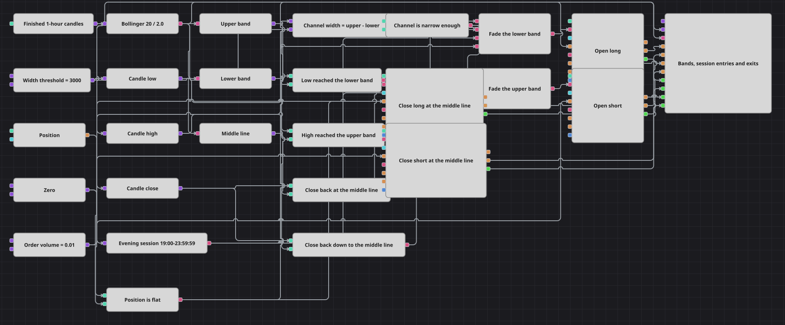

# 夜间时段布林带反向回归策略图
[English](README.md) | [Русский](README_ru.md) | [Español](README_es.md) | [Deutsch](README_de.md) | [Português](README_pt.md) | [日本語](README_ja.md)

通道告诉你价格在哪里不再按常态运行,时钟告诉你什么时候值得据此行动。本图把两者放在已完成的一小时K线上结合起来:它在价格触及布林带轨线时做反向进场,但只在傍晚时段、并且只在通道本身较窄时才进。离场依据是中轨,而这一半并不受时钟约束——傍晚较晚时开出的仓位,只要价格回到中轨就会被平掉,无论那时是几点。

## 策略概览

- 整张图由一条K线序列驱动。只有已完成的一小时K线才会被输出,因此每一次比较、每一道条件和每一笔委托,都是在已收盘的K线上决定的。
- 周期为 20 根K线、偏差为 2.0 的布林带只在形成之后才输出数值。三个转换器(Converter)方块把指标值拆成上轨、下轨和中轨。
- 一个公式(Formula)方块用上轨减去下轨得到通道宽度,一个比较(Comparison)方块把它与宽度阈值相比。这一个结果就是两个进场方向共用的“平静行情”条件。
- 工作时间(Working time)方块读取每根K线携带的时间戳——也就是它的开盘时间——并在 19:00:00 至 23:59:59 之间给出 true。只有两个进场条件会用到它。
- 只有当同一根K线上的四个结果同时成立时,才接受多头进场:最低价触及下轨、通道宽度在阈值之内、K线开盘时间落在时段之内,并且当前为空仓。
- 空头进场是镜像条件:最高价触及上轨,同样要满足宽度、时段和空仓这三项条件。
- 两个方向的进场都是由持仓修改(Position modify)方块在“开仓(Open position)”条件下发出的市价委托,因此在已有持仓时到来的信号会被委托方块本身拒绝,而不需要额外加一个比较方块。
- 离场把收盘价与中轨比较,两个方向都以“仅减仓(Reduce only)”委托发出。图表面板绘制K线、三条轨线,以及全部四个委托方块的委托与成交。

## 入场与出场规则

- **做多入场**: 在傍晚窗口之内,若一根已完成K线的最低价触及或跌破下轨,同时通道宽度不大于阈值且当前为空仓,持仓修改(Position modify)方块便在“开仓(Open position)”条件下,以市价买入 Order Volume 指定的数量。
- **做空入场**: 在同一窗口之内,若一根已完成K线的最高价触及或升破上轨,同时通道宽度不大于阈值且当前为空仓,持仓修改方块便在“开仓”条件下,以市价卖出 Order Volume 指定的数量。
- **离场**: 中轨是两个方向共同的目标。任何一根已完成K线收在中轨或其上方时,发出一笔“仅减仓(Reduce only)”卖出委托;收在中轨或其下方时,发出一笔仅减仓买入委托。仅减仓方块若收到与当前持仓同向的委托,会自行拒绝该委托,因此持有空头时卖出这条路径不会动作,持有多头时买入这条路径同样不会动作。两个离场都不受时段和通道宽度的限制——它们在每一根已完成K线上、全天候运行。策略没有止损,也没有止盈:回到中轨是退出一笔交易的唯一方式。

## 参数

| 参数 | 默认值 | 说明 |
|---|---|---|
| Candles | 01:00:00 | 整张图所运行的那一条K线序列的周期;只有已完成的K线才会从中输出。 |
| Bollinger Period | 20 | 计算轨线均值所使用的K线数量。 |
| Bollinger Deviation | 2.0 | 标准差倍数,决定上下两条轨线距离中轨有多远。 |
| Width Threshold | 3000 | 仍被视为足够平静、可以进场的最大通道宽度,以标的的价格单位表示。 |
| Session From | 19:00:00 | 允许进场的时间窗口起点,与K线的开盘时间比对。 |
| Session Until | 23:59:59 | 该窗口的终点;在此刻或之前开盘的K线仍算作落在窗口之内。 |
| Order Volume | 0.01 | 两个进场和两个离场所发出的委托数量。 |

## 图表详情

- 进场读取的是K线的极值,而不是它的收盘价。一根在盘中刺穿轨线、随后收回通道内的K线仍然算作触及,正是这一点使它成为对价格偏离的反向操作,而不是对收盘价突破的跟随。
- 宽度条件以标的的价格单位衡量,而不是按百分比。对于报价只有个位数的标的,几乎每根K线都能通过,这道条件形同虚设;对于报价以万计的标的,它才会成为预期中的选择性过滤。阈值被开放为参数,正是为了与具体标的相匹配。
- 尽管仅减仓自己就会判定方向,两个离场仍各自带有一个方向:正是这个方向让每条路径拒绝不匹配的持仓。这也是图中离场一侧没有出现多空判别比较的原因——这项检查由两个委托方块完成。
- 一个数量(Volume)变量为全部四个委托方块提供委托量。在离场时,仅减仓会把委托量削减到持仓实际持有的数量,因此即使进场只有部分成交,也会被恰好平掉,而不会反手。
- 时段是按每根K线求值的,而不是取自一个自由运行的时钟,因此它与轨线和宽度的结果在同一拍上变化,进场条件的四个输入始终描述同一根K线。

## 使用方法

将 `.json` 文件导入 Designer，在回测器中用历史数据运行，然后根据自己的交易品种调整参数或方块，确认无误后再用于实盘。
