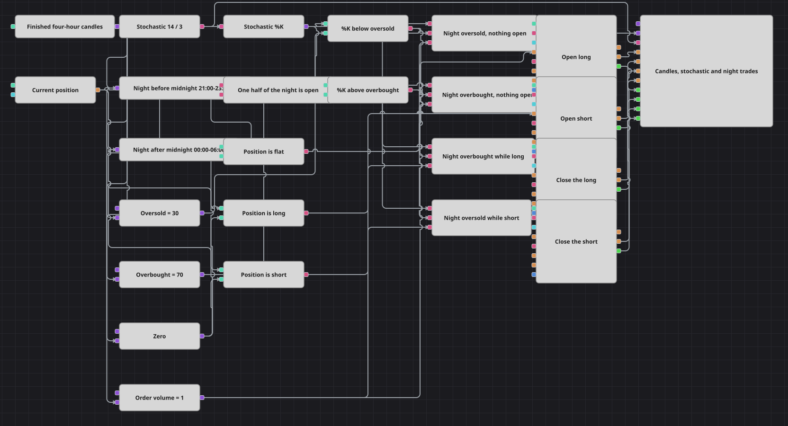

# Diagrama de la estrategia Night Session Stochastic
[English](README.md) | [Русский](README_ru.md) | [中文](README_zh.md) | [Deutsch](README_de.md) | [Português](README_pt.md) | [日本語](README_ja.md)

Un oscilador estocástico sobre velas de cuatro horas al que solo se le permite actuar de noche. Lo interesante es el reloj, no el oscilador: una sesión nocturna empieza por la tarde y termina a la mañana siguiente, de modo que su inicio es una hora del día posterior a su fin, y un único bloque Working time no puede describir un intervalo así. Por eso el diagrama construye la noche a partir de dos mitades —una antes de medianoche y otra después— y las une en una única respuesta antes de que nada más pueda mirarla.

## Resumen de la estrategia

- Las velas de cuatro horas terminadas mueven todo el diagrama, así que cada decisión se toma sobre una barra cerrada y nada reacciona a una barra que aún se está formando.
- Un oscilador Stochastic con un %K de 14 barras y un %D de 3 barras se calcula sobre esas velas, y un Converter extrae la línea %K de su valor; %D solo se dibuja, nunca se opera con él.
- Dos bloques Working time leen el momento de apertura de cada vela: uno cubre de 21:00 a 23:59:59 y el otro de 00:00 a 06:00. Ninguno de ellos por separado es la noche.
- Un Logical condition configurado como Exclusive or une las dos mitades en una única señal de noche. Las mitades no pueden solaparse, así que solo una de ellas puede estar abierta a la vez, y el bloque responde una vez por vela con las dos mitades ya disponibles.
- Dos bloques Comparison sitúan %K frente a los niveles de sobreventa y sobrecompra; otros dos sitúan la posición frente a cero, lo que le dice al diagrama si está plano, largo o corto.
- Cuatro puertas And de Logical condition combinan esos tres hechos —noche, oscilador, posición— en dos entradas y dos salidas, de modo que ninguna puerta puede dispararse si el reloj no está de acuerdo.
- Las entradas son bloques Position modify que trabajan con la condición Open position: una orden a mercado por Order Volume solo sale mientras la posición es exactamente cero, que es lo que impide que una señal se convierta en un chorro de órdenes.
- El panel de gráfico dibuja las velas, el oscilador y todas las órdenes y ejecuciones que produce el diagrama, de modo que las ventanas nocturnas se leen directamente en la imagen.

## Reglas de entrada y salida

- **Entrada en largo**: Mientras la noche está abierta, la posición está plana y %K se encuentra por debajo del nivel de sobreventa, se dispara la puerta larga y Position modify compra Order Volume a mercado. La condición Open position de ese bloque hace que una repetición de la misma lectura no cambie nada hasta que la posición vuelva a cerrarse.
- **Entrada en corto**: La imagen especular: con la noche abierta, la posición plana y %K por encima del nivel de sobrecompra se dispara la puerta corta, y Position modify vende Order Volume a mercado bajo la misma condición Open position.
- **Salida**: No hay take-profit, ni stop-loss, ni cierre por tiempo. Un largo se cierra por el extremo opuesto —%K por encima del nivel de sobrecompra mientras la posición es larga— y un corto por %K por debajo del nivel de sobreventa mientras la posición es corta, ambos a través de un bloque Position modify configurado como Close position, que toma por sí mismo la cantidad abierta. Las salidas también están dentro de la ventana nocturna, así que una posición abierta de noche se arrastra durante el día y se libera la noche siguiente. Cerrar y dar la vuelta son dos sucesos distintos: el extremo que cierra un largo solo lo deja plano, y es una lectura posterior del mismo tipo la que abre el corto.

## Parámetros

| Parámetro | Por defecto | Descripción |
|---|---|---|
| Candles | 04:00:00 | Marco temporal de cuatro horas, construido a partir de las velas más pequeñas disponibles en los datos. Solo se procesan velas terminadas, y cada una se fecha por su momento de apertura, que es lo que decide la sesión a la que pertenece. |
| %K Length | 14 | Periodo de la línea %K: cuántas velas usa el oscilador para medir el cierre. |
| %D Length | 3 | Longitud de suavizado de la línea %D. Se dibuja en el panel y no forma parte de ninguna condición. |
| Evening Half From | 21:00:00 | Inicio de la mitad de la noche que queda antes de medianoche. Mantén separadas las dos mitades: deben encontrarse en la medianoche, no solaparse. |
| Evening Half Until | 23:59:59 | Fin de la mitad vespertina. Un segundo antes de medianoche la cierra sin dejar que toque la mitad que viene después. |
| Morning Half From | 00:00:00 | Inicio de la mitad de la noche que queda después de medianoche, que es la propia medianoche. |
| Morning Half Until | 06:00:00 | Fin de la mitad matutina y, con ella, fin de la noche. Después de esta hora ninguna puerta del diagrama puede dispararse hasta que la mitad vespertina vuelva a abrirse. |
| Oversold Level | 30 | Nivel por debajo del cual %K se considera sobrevendido: abre un largo cuando la posición está plana y cierra un corto cuando hay uno abierto. |
| Overbought Level | 70 | Nivel por encima del cual %K se considera sobrecomprado: abre un corto cuando la posición está plana y cierra un largo cuando hay uno abierto. |
| Order Volume | 1 | Cantidad que envían ambas entradas. Las salidas la ignoran y cierran lo que haya abierto. |

## Detalles del diagrama

- El bloque [Candles](https://doc.stocksharp.com/en/topics/designer/strategies/using_visual_designer/elements/data_sources/candles.html) se suscribe a una serie de cuatro horas con la opción de solo velas formadas activada y marca cada valor que envía con el momento de apertura de la vela. Esa marca es la que leen los bloques de reloj, así que una vela pertenece a la sesión en la que cae su hora de apertura, pase lo que pase durante las cuatro horas siguientes.
- [Indicator](https://doc.stocksharp.com/en/topics/designer/strategies/using_visual_designer/elements/common/indicator.html) contiene el oscilador Stochastic y solo transmite valores una vez que está formado, de modo que las primeras barras del histórico preparan el cálculo sin generar señales. Un [Converter](https://doc.stocksharp.com/en/topics/designer/strategies/using_visual_designer/elements/converters/converter.html) lee el campo %K del valor del oscilador y entrega un número simple a las comparaciones.
- Los dos bloques [Working time](https://doc.stocksharp.com/en/topics/designer/strategies/using_visual_designer/elements/time/working_time.html) son la clave del diagrama. Cada uno es verdadero mientras la hora del día se sitúa entre sus dos límites, lo que significa que un bloque nunca puede describir una ventana que cruza la medianoche: su inicio sería posterior a su fin y la comprobación jamás se cumpliría. Partir la noche en la medianoche da dos ventanas corrientes, y el [Logical condition](https://doc.stocksharp.com/en/topics/designer/strategies/using_visual_designer/elements/common/logical_condition.html) que está por encima de ellos vuelve a componer la noche.
- [Position](https://doc.stocksharp.com/en/topics/designer/strategies/using_visual_designer/elements/positions/current.html) se compara con una [Variable](https://doc.stocksharp.com/en/topics/designer/strategies/using_visual_designer/elements/data_sources/variable.html) igual a cero mediante tres bloques [Comparison](https://doc.stocksharp.com/en/topics/designer/strategies/using_visual_designer/elements/common/comparison.html) a la vez —igual, mayor, menor— y esas tres respuestas son las que separan las dos puertas de entrada de las dos puertas de salida. Los niveles de sobreventa y sobrecompra y el volumen de la orden también son Variables, de modo que cada número sobre el que discute el diagrama es un parámetro y no un valor enterrado dentro de un bloque.
- Cuatro bloques [Position modify](https://doc.stocksharp.com/en/topics/designer/strategies/using_visual_designer/elements/positions/modify.html) actúan sobre las puertas. Las dos entradas llevan la condición Open position y toman su cantidad de la Variable de volumen; las dos salidas llevan la condición Close position y no necesitan cantidad, porque una orden de cierre se dimensiona a partir de la posición que deshace. Sus órdenes y ejecuciones van al [Chart panel](https://doc.stocksharp.com/en/topics/designer/strategies/using_visual_designer/elements/common/chart.html) junto con las velas y el oscilador.

## Uso

Importe el archivo `.json` en Designer, ejecútelo sobre datos históricos en el probador y después ajuste los parámetros o los propios bloques a su instrumento antes de operar en real.
