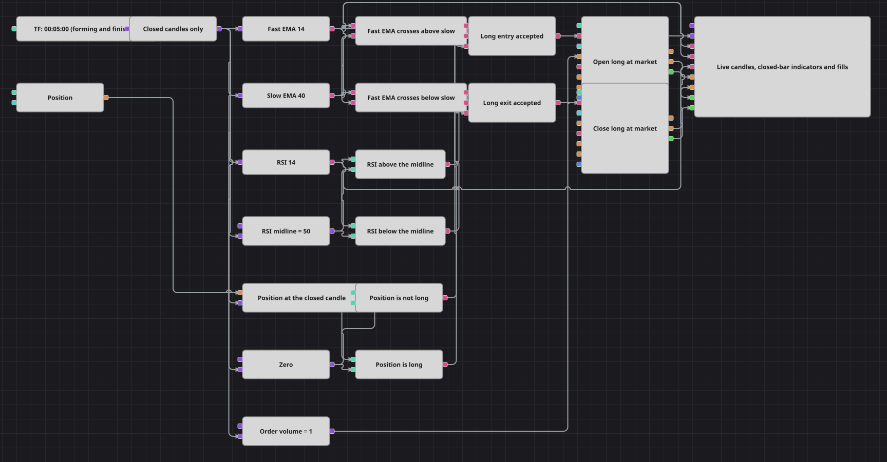

# 非重绘砖形图（Renko）模拟策略图
[English](README.md) | [Русский](README_ru.md) | [Español](README_es.md) | [Deutsch](README_de.md) | [Português](README_pt.md) | [日本語](README_ja.md)

交易者之所以偏爱砖形图，是因为一块砖一旦画出就不再改变：依据它发出的信号不会在一分钟后被收回。本图用普通的时间周期 K 线取得同样的性质。K 线数据源特意订阅了中间更新，而在数据源与每一个参与判断的模块之间都隔着一个最终值（Final value）模块，因此均线、交叉与入场都是在一根已经收盘的 K 线上决定的。实时数据流并未被丢弃，只是仅送往图表面板——那里才是未完成 K 线该待的地方。

## 策略概览

- 五分钟 K 线在订阅时启用了中间更新，因此数据源在 K 线形成过程中会多次发出该 K 线，收盘时再发出一次。
- 一个 K 线类型的最终值（Final value）模块是数据源通向逻辑的唯一入口：只有当数值为最终值时它才向下传递，因此下游任何模块都不会看到仍可能变动的价格。
- 这个模块是承重结构，而不是装饰。指标模块会把送入其中的每个数值都视为最终值，因此用未完成 K 线喂养的均线会在每次更新时改写同一根 K 线的读数，而由两条这样的均线构成的交叉会在 K 线内部时现时隐。
- 快速与慢速指数移动平均线以及相对强弱指标都建立在收盘数据流之上，三者都设置为形成之后才输出数值，因此最初的判断要等待一个完整的慢速窗口。
- 两个交叉（Crossing）模块承载同一事件的两个方向：一个把快线接在向上输入、慢线接在向下输入，另一个则将两者互换，因此各自在其命名所对应的交叉上输出真。
- 相对强弱指标与中线变量在两个方向上进行比较，由此得到一个动量过滤条件，它必须与交叉一致，才会发出任何委托。
- 持仓被读入一个持仓变量，该变量由每根收盘 K 线触发，并两次与零比较，因此入场可以要求当前不是多头持仓，而离场可以要求当前正是多头持仓。
- 两个逻辑与（AND）模块汇总交叉、动量与持仓：一个以开仓（Open position）条件驱动市价入场，另一个以平仓（Close position）条件驱动市价离场；图表面板绘制实时 K 线、三个指标、委托与成交。

## 入场与出场规则

- **做多入场**: 在一根收盘 K 线上，快速均线上穿慢速均线，相对强弱指标位于其中线之上，且当前不是多头持仓。逻辑与（AND）模块汇总这三个答案，入场模块按委托数量以市价买入。它的开仓（Open position）条件意味着委托只会从空仓状态发出，因此持仓期间再次出现交叉不会带来任何变化。
- **做空入场**: 本图没有做空入场。当指标位于中线之下，或快速均线处于慢速均线之下时，本图只是袖手旁观；它在卖出方向唯一会发出的委托，就是用于平掉多头持仓的那一笔。
- **离场**: 在一根收盘 K 线上，快速均线下穿回慢速均线，相对强弱指标已跌至其中线之下，且当前持有多头。第二个逻辑与模块触发，平仓模块以市价卖出全部持仓，其数量由平仓（Close position）条件根据未平仓头寸算出。这里既没有止损模块，也没有止盈模块：开启这笔交易的那个交叉，本身就是结束它的东西，而其中每一个决定都是在一根已经走完的 K 线上做出的。

## 参数

| 参数 | 默认值 | 说明 |
|---|---|---|
| Candles | 00:05:00 | 整个图所依据运行的 K 线序列的时间周期；该序列订阅时启用了中间更新，由最终值（Final value）模块从中筛出已收盘的 K 线。 |
| Fast EMA Length | 14 | 快速指数移动平均线的周期，即两条线中较快的一条，它们的交叉就是信号。 |
| Slow EMA Length | 40 | 慢速指数移动平均线的周期，即快线用以衡量自身的参照线。 |
| RSI Length | 14 | 用作双向动量过滤条件的相对强弱指标的周期。 |
| RSI Midline | 50 | 划分动量过滤条件的水平：高于该水平时本图可以开多，低于该水平时才可以平多。 |
| Order Volume | 1 | 入场时发出的委托数量；离场的数量则改由未平仓头寸决定。 |

## 图表详情

- 判断条件恰好在发生交叉的那根 K 线上触发。交叉（Crossing）模块只在两条线交换位置的那一刻输出，而比较模块在每根收盘 K 线上都会输出；逻辑条件会保留每个输入，直到自上次触发以来所有输入都已到达，因此缺失的那一环始终是交叉，而与它组合在一起的答案正是来自同一根 K 线。
- 两个交叉模块其实是同一种模块，只是输入互换。当各自的向上输入达到或超过向下输入时输出真，在相反的事件上输出假；正因如此，一个以多头交叉命名，另一个以空头交叉命名，而不是由一个模块同时驱动两处判断。
- 持仓模块只在持仓发生变化时才输出，而在行情清淡的一周里可能一次也不输出。它后面的持仓变量从零开始，保留最后收到的数值，并在每根收盘 K 线上重新输出，因此两个比较始终有一个新鲜的左侧数值可用。
- 没有任何东西在时间上拉开信号之间的间隔。每一次符合条件的交叉都会被采用，唯一能阻止一次入场叠加在另一次之上的，就是要求当前不是多头持仓，并由委托模块自身的开仓（Open position）条件加以保证。
- 未完成的 K 线并没有被丢弃，只是被挡在决策之外：原始数据流绘制在图表上，与指标并列，而指标是按收盘数据流绘制的，因此两者可以相互对照阅读。

## 使用方法

将 `.json` 文件导入 Designer，在回测器中用历史数据运行，然后根据自己的交易品种调整参数或方块，确认无误后再用于实盘。
