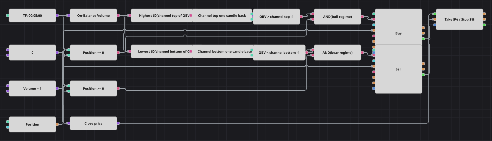

# Diagramm der OBV-Kanalausbruch-Strategie
[English](README.md) | [Русский](README_ru.md) | [中文](README_zh.md) | [Español](README_es.md) | [Português](README_pt.md) | [日本語](README_ja.md)

Das On-Balance Volume addiert das Volumen jeder steigenden Kerze und zieht das jeder fallenden ab, seine Kurve ist also die laufende Bilanz von Kauf- gegen Verkaufsdruck. Dieses Diagramm legt einen Donchian-artigen Kanal nicht über den Preis, sondern über diese Kurve: Verlässt OBV den Kanal der vorangegangenen Kerzen nach oben, hat die Akkumulation die Oberhand und das Schema kauft; verlässt er ihn nach unten, überwiegt die Distribution und das Schema verkauft.

## Strategieübersicht

- Den Kanal bilden ein Highest- und ein Lowest-Baustein über 60 Werte, gespeist vom On-Balance-Volume-Baustein und nicht von den Kerzen.
- Zwei Bausteine für den vorherigen Wert halten den Kanal der vorangegangenen Kerze fest, sodass der Ausbruch gegen eine Grenze gemessen wird, die der aktuelle OBV-Wert noch nicht verschoben hat.
- Weil die Grenze von der Vorkerze stammt, ist der Ausbruch ein Ereignis und kein Zustand: Es handelt genau die Kerze, die OBV über das alte Extrem hebt.
- Die ursprüngliche Strategie trägt ATR im Namen, verwendet diesen Indikator im eigenen Code aber nie; das Diagramm lässt ihn deshalb weg und behält nur, was wirklich über einen Trade entscheidet.

## Ein- und Ausstiegsregeln

- **Long-Einstieg**: Der aktuelle OBV-Wert liegt über der Kanaloberkante der Vorkerze und die Position ist nicht long. Die Order kauft ein Lot: aus der Neutralstellung ein Long-Einstieg, aus einem Short dessen Schließung.
- **Short-Einstieg**: Der aktuelle OBV-Wert liegt unter der Kanalunterkante der Vorkerze und die Position ist nicht short. Die Order verkauft ein Lot: aus der Neutralstellung ein Short-Einstieg, aus einem Long dessen Schließung.
- **Ausstieg**: Der Schutzbaustein schließt den Trade bei 5 Prozent Take-Profit oder 3 Prozent Stop-Loss zum Einstiegspreis; ein gegenläufiger Ausbruch stellt die Position ebenfalls glatt, da alle Orders dasselbe Volumen verwenden.

## Parameter

| Parameter | Standard | Beschreibung |
|---|---|---|
| Channel Length | 60 | Anzahl der OBV-Werte im Fenster von Highest und Lowest; beide Bausteine bekommen dieselbe Länge. |
| Take profit, % | 5 | Abstand des Take-Profits zum Einstiegspreis in Prozent. |
| Stop loss, % | 3 | Abstand des Stop-Loss zum Einstiegspreis in Prozent. |
| Volume | 1 | Ordervolumen in Lots. |
| Candles | 00:05:00 | Zeiteinheit der Kerzen, mit der das gesamte Diagramm arbeitet. |

## Diagrammdetails

- Der Kerzenbaustein speist den On-Balance-Volume-Baustein, dessen Ausgang weiter in den Highest- und den Lowest-Baustein läuft: ein Indikator, der einen anderen Indikator liest.
- Jede Kanalgrenze läuft durch einen Baustein für den vorherigen Wert, sodass der Vergleich die Grenze der Kerze vor dem Ausbruch benutzt.
- Zwei Vergleichsbausteine prüfen den aktuellen OBV gegen diese Grenzen, zwei weitere die Position gegen eine Nullkonstante; jedes logische UND verbindet einen Ausbruch mit seiner Positionsprüfung.
- Das Original hält ein haftendes Bullen- oder Bärenregime und handelt nur beim Wechsel; im Diagramm sorgt die Positionsprüfung für denselben einen Einstieg pro Bewegung, indem sie einen erneuten Ausbruch in die bereits gehaltene Richtung blockiert.
- Beide Bausteine zur Positionsänderung senden Marktorders mit dem Volumen einer gemeinsamen Konstante, und ihre Trades laufen in den Schutzbaustein mit Take-Profit und Stop-Loss.

## Verwendung

Importieren Sie die `.json`-Datei in Designer, testen Sie sie im Backtester mit historischen Daten und passen Sie danach Parameter oder Bausteine an Ihr Instrument an, bevor Sie live handeln.
