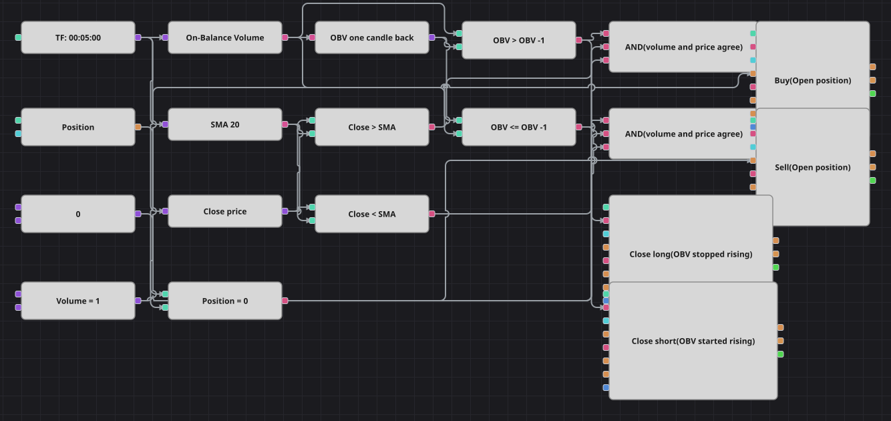

# Diagrama de la estrategia de dirección del OBV con filtro de media móvil
[English](README.md) | [Русский](README_ru.md) | [中文](README_zh.md) | [Deutsch](README_de.md) | [Português](README_pt.md) | [日本語](README_ja.md)

El On-Balance Volume suma el volumen de cada vela alcista y resta el de cada vela bajista, de modo que su pendiente indica qué lado está operando. Este diagrama lee solo esa pendiente, vela a vela, y deja que una media móvil simple del precio decida cuándo merece la pena seguirla. El nombre de la estrategia original habla de ruptura, pero su código compara el OBV únicamente con su valor anterior, y el diagrama sigue al código.

## Resumen de la estrategia

- El On-Balance Volume se calcula sobre velas cerradas y se compara con su valor una vela atrás, lo que da un veredicto simple: sube o no sube.
- Una media móvil simple de veinte velas sobre el precio de cierre divide el gráfico en una mitad superior y otra inferior y fija la dirección de la entrada.
- Solo se entra estando plano, de modo que los dos lados nunca se estorban dentro de la misma operación.
- La salida no necesita la media: la posición se abandona en cuanto el flujo de volumen se vuelve en su contra.

## Reglas de entrada y salida

- **Entrada en largo**: El On-Balance Volume está por encima de su valor en la vela anterior, la vela cerró por encima de la media móvil y la posición está plana. La orden compra un lote a mercado.
- **Entrada en corto**: El On-Balance Volume está en su valor anterior o por debajo, la vela cerró por debajo de la media móvil y la posición está plana. La orden vende un lote a mercado. Un OBV sin cambios cuenta aquí como no ascendente, igual que en el código original.
- **Salida**: Un largo se cierra en la primera vela en la que el OBV deja de subir y un corto en la primera vela en la que vuelve a subir, ambos mediante bloques de modificación de posición en modo cierre. El original tampoco tiene stop loss ni take profit.

## Parámetros

| Parámetro | Por defecto | Descripción |
|---|---|---|
| SMA Length | 20 | Periodo de la media móvil simple que decide la dirección de la entrada. |
| Volume | 1 | Volumen de la orden, en lotes. |
| Candles | 00:05:00 | Marco temporal de las velas con el que trabaja todo el diagrama. |

## Detalles del diagrama

- El bloque de velas alimenta el bloque de On-Balance Volume, el de la media móvil y el conversor que lee el precio de cierre; un bloque de valor anterior con desplazamiento de una vela entrega el OBV previo y dos bloques de comparación convierten la pareja en una bandera ascendente y otra no ascendente.
- Cada Y lógica une la bandera del OBV, la posición del precio respecto a la media y la comprobación de posición plana, y dispara un bloque de modificación de posición en modo de solo apertura.
- Esas mismas dos banderas del OBV van directamente a los bloques de cierre, que están en modo cierre y por tanto permanecen inactivos mientras el diagrama está plano.
- La estrategia original trabaja con velas de un minuto y hace una pausa de quinientas velas tras cada operación. El histórico incluido es más grueso que un minuto y el diagrama no tiene contador de barras, así que funciona con velas de cinco minutos y opera cada señal.

## Uso

Importe el archivo `.json` en Designer, ejecútelo sobre datos históricos en el probador y después ajuste los parámetros o los propios bloques a su instrumento antes de operar en real.
