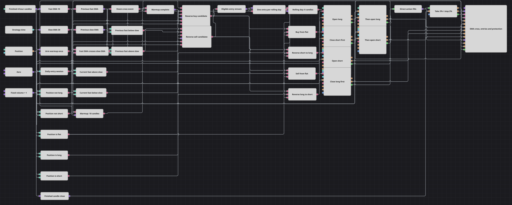

# Strategiediagramm für einen Trade je 24 Stunden
[English](README.md) | [Русский](README_ru.md) | [中文](README_zh.md) | [Español](README_es.md) | [Português](README_pt.md) | [日本語](README_ja.md)

Dieses Diagramm handelt strikte Kreuzungen von EMA(10) und EMA(30) auf abgeschlossenen Vierstundenkerzen in Gegenrichtung. Ein konfigurierbares Arbeitszeitfenster steuert die Zulässigkeit der Kandidaten; Flag und ein N-values-Zähler über sechs Kerzen lassen höchstens eine Einstiegsentscheidung je rollierendem 24-Stunden-Intervall zu.

## Strategieübersicht

- Abgeschlossene Vierstundenkerzen speisen EMA 10 und EMA 30. Der Kreuzungszustand entwickelt sich von Beginn an, Einstiegskandidaten werden jedoch erst nach zehn abgeschlossenen Kerzen freigegeben.
- Eine strikte Aufwärtskreuzung des schnellen EMA durch den langsamen erzeugt einen Verkaufskandidaten. Eine strikte Abwärtskreuzung erzeugt einen Kaufkandidaten.
- Time und Working time lassen Kandidaten nur innerhalb des eingestellten Intervalls zu. Combination führt beide Richtungsströme zusammen, und Flag gibt bis zur Rücksetzung nur den ersten akzeptierten Kandidaten aus.
- Der akzeptierte Einstieg startet N values. Nach sechs weiteren abgeschlossenen Vierstundenkerzen setzt der Zähler Flag zurück und bildet eine rollierende 24-Stunden-Sperre.
- Aus einer Nullposition sendet Position modify eine Marktorder mit festem Volume. Gegen eine entgegengesetzte Einheitsposition schließt er diese zuerst und eröffnet dann mit einer zweiten Marktorder mit festem Volume die neue Seite.
- Position protection ist der Ausstiegsmechanismus. Er verfolgt direkte Ausführungen von Einstiegen und Umkehrungen und kann die Position bei 3% Take-Profit oder 2% festem Stop-Loss schließen.

## Ein- und Ausstiegsregeln

- **Long-Einstieg**: Nach einer strikten Abwärtskreuzung der EMA, zehn abgeschlossenen Aufwärmkerzen, offenem Working-time-Fenster und freier rollierender Sperre wird Volume gekauft. Aus null wird Long eröffnet; aus einem Einheits-Short schließt ein Kauf und ein zweiter eröffnet Long.
- **Short-Einstieg**: Nach einer strikten Aufwärtskreuzung der EMA, zehn abgeschlossenen Aufwärmkerzen, offenem Working-time-Fenster und freier rollierender Sperre wird Volume verkauft. Aus null wird Short eröffnet; aus einem Einheits-Long schließt ein Verkauf und ein zweiter eröffnet Short.
- **Ausstieg**: Position protection schließt die erfasste Position bei 3% Take-Profit oder 2% festem Stop-Loss. Eine spätere zulässige Gegenkreuzung kann die Position stattdessen durch Schließen und anschließendes Neueröffnen umkehren.

## Parameter

| Parameter | Standard | Beschreibung |
|---|---|---|
| Candles | 04:00:00 | Vierstundenzeitrahmen; nur abgeschlossene Kerzen steuern EMA, Aufwärmphase, rollierenden Zähler und Preisprüfungen des Schutzes. |
| Fast EMA Length | 10 | Länge des schnellen exponentiellen gleitenden Durchschnitts. |
| Slow EMA Length | 30 | Länge des langsamen exponentiellen gleitenden Durchschnitts. |
| Warmup Bars | 10 | Anzahl abgeschlossener Kerzen, bevor Kreuzungseinstiege zulässig sind. |
| Session From | 00:00:00 | Beginn des zulässigen Fensters in Wiedergabe- oder Serverzeit der Strategie. |
| Session Until | 23:59:59 | Ende des zulässigen Fensters in Wiedergabe- oder Serverzeit der Strategie. |
| Rolling Cooldown Bars | 6 | Anzahl abgeschlossener Kerzen nach einem akzeptierten Einstieg bis zur nächsten zulässigen Entscheidung; sechs Vierstundenkerzen entsprechen 24 Stunden. |
| Volume | 1 | Feste Menge für jede Eröffnungs- oder Umkehraktion. |
| Take Profit % | 3 | Günstige prozentuale Bewegung für Position protection. |
| Stop Loss % | 2 | Ungünstige prozentuale Bewegung für den festen, nicht nachlaufenden Stop. |

## Diagrammdetails

- Der Baustein [Kerzen](https://doc.stocksharp.com/de/topics/designer/strategies/using_visual_designer/elements/data_sources/candles.html) gibt abgeschlossene Vierstundenkerzen an zwei [Indikator](https://doc.stocksharp.com/de/topics/designer/strategies/using_visual_designer/elements/common/indicator.html)-Bausteine. Crossing erkennt Änderungen zwischen EMA 10 und EMA 30; strikte Vergleiche vorheriger und aktueller Werte bestätigen jedes Ereignis, ein NOT-Zweig erzeugt den Abwärtsimpuls.
- Ein Aufwärmfilter über zehn Kerzen blockiert frühe Kandidaten. [Time](https://doc.stocksharp.com/de/topics/designer/strategies/using_visual_designer/elements/data_sources/time.html) liefert Wiedergabe- oder Serverzeit an [Working time](https://doc.stocksharp.com/de/topics/designer/strategies/using_visual_designer/elements/common/working_time.html); die mitgelieferte Historie wird in UTC wiedergegeben.
- Combination leitet ausführbare Kauf- und Verkaufskandidaten an [Flag](https://doc.stocksharp.com/de/topics/designer/strategies/using_visual_designer/elements/common/flag.html). Der erste wahre Kandidat wird ausgegeben, startet [N values](https://doc.stocksharp.com/de/topics/designer/strategies/using_visual_designer/elements/common/n_values.html) und sperrt weitere, bis sechs zusätzliche abgeschlossene Kerzen Flag zurücksetzen.
- Die aktuelle Position wählt den Pfad von [Position modify](https://doc.stocksharp.com/de/topics/designer/strategies/using_visual_designer/elements/positions/modify.html). Ein Einstieg aus null nutzt eine Marktaktion mit fester Seite; eine Umkehr nutzt zwei aufeinanderfolgende Aktionen derselben Seite, zuerst zum Glattstellen und dann zum Eröffnen. Die Sperre begrenzt daher akzeptierte Einstiegsentscheidungen, obwohl eine Entscheidung absichtlich zwei Ausführungen erzeugen kann.
- Alle direkten Ausführungen von Eröffnung und Umkehr aktualisieren [Position protection](https://doc.stocksharp.com/de/topics/designer/strategies/using_visual_designer/elements/positions/protect.html). Abgeschlossene Kerzenschlusskurse steuern seine Preisprüfungen; die eigene Schließungsausführung wird nicht auf seinen Trade-Eingang zurückgeführt.

## Verwendung

Importieren Sie die `.json`-Datei in Designer, testen Sie sie im Backtester mit historischen Daten und passen Sie danach Parameter oder Bausteine an Ihr Instrument an, bevor Sie live handeln.
