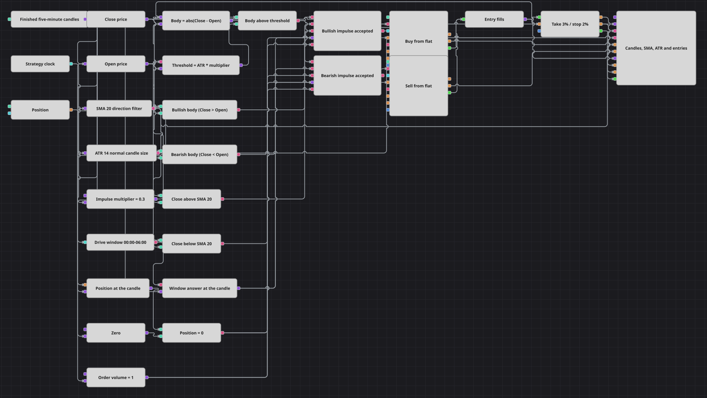

# Open Drive Strategy Diagram
[Русский](README_ru.md) | [中文](README_zh.md) | [Español](README_es.md) | [Deutsch](README_de.md) | [Português](README_pt.md) | [日本語](README_ja.md)

This diagram takes a single impulse candle: one whose body is larger than a fraction of the current Average True Range. The colour of that body decides the side, SMA 20 has to agree with it, the clock has to be inside the first six hours of the UTC day, and the position has to be flat. A take profit and a stop loss are the only way out.

## Strategy Overview

- Finished five-minute candles supply Close and Open through two Converters and drive SMA 20 and ATR 14. Both indicators are formed-only, so no comparison produces a verdict until each has collected enough candles.
- One Formula measures the body of the current candle as `abs(Close - Open)`; a second turns the current ATR into a threshold, `ATR x 0.3`. A Comparison calls the candle an impulse when the body is strictly larger than that threshold, so the bar the diagram acts on is unusually large for the volatility of the moment.
- Two Comparisons read the colour of the same candle, `Close > Open` and `Close < Open`, and two more read its side against SMA 20, `Close > SMA` and `Close < SMA`. Impulse alone never trades: colour and trend have to point the same way.
- The Current time block streams strategy time into a Working time block covering 00:00:00 to 06:00:00 UTC. Its true/false answer is stored in a Variable that republishes it when a candle arrives, so the session filter is decided on the same tick as every price comparison instead of on its own clock.
- A Variable snapshots the position on each candle and a Comparison against zero says whether the diagram is flat. Reading the position through a snapshot keeps a fill that lands between two candles from re-opening the entry logic mid-bar.
- The long Logical condition is `impulse AND bullish body AND close above SMA AND inside the window AND flat`; the short one is its mirror. Each waits for all five inputs, so it publishes exactly one verdict per finished candle.
- A verdict of true triggers a Modify position block in OpenPosition mode, which sends a market order for the configured volume and refuses it unless the position really is zero. One candle can therefore never open two trades, and a running position blocks new entries entirely.
- Entry fills from both sides pass through a Combination into Position protection, which arms a 3% take profit and a 2% stop loss against the close price of every later finished candle.

## Entry and Exit Rules

- **Long entry**: Inside 00:00:00-06:00:00 UTC, with SMA 20 and ATR 14 formed and the position flat: `abs(Close - Open) > ATR x 0.3`, `Close > Open` and `Close > SMA 20` send an OpenPosition market buy for one unit.
- **Short entry**: Inside 00:00:00-06:00:00 UTC, with SMA 20 and ATR 14 formed and the position flat: `abs(Close - Open) > ATR x 0.3`, `Close < Open` and `Close < SMA 20` send an OpenPosition market sell for one unit.
- **Exit**: There is no signal-based exit and no reversal. Position protection closes the trade at 3% profit or 2% loss from the entry fill price, evaluated on the close of each finished candle, so an intrabar spike through a level is not acted on until that candle is complete. The diagram keeps no cool-down counter between trades: once a position is closed, the very next qualifying candle inside the window may open another one.

## Parameters

| Parameter | Default | Description |
|---|---|---|
| Candles | 00:05:00 | Time frame of the finished candles; every comparison, both indicators and the protective levels are evaluated on their closes. |
| MA Period | 20 | Period of the formed-only simple moving average that decides which side of the trend a candle closed on. |
| ATR Period | 14 | Period of the formed-only Average True Range that describes the normal candle size of the moment. |
| ATR Multiplier | 0.3 | Fraction of the current ATR a candle body has to exceed to count as an impulse. Raising it demands rarer, larger candles; lowering it accepts ordinary ones. |
| Window Begin | 00:00:00 | Start of the trading window, in UTC. Before it, impulses are measured and drawn but never traded. |
| Window End | 06:00:00 | End of the trading window, in UTC. Widen the pair to 00:00:00-23:59:59 to let the diagram trade around the clock. |
| Order Volume | 1 | Quantity sent by both entries; the position is always one unit because a second entry is refused while it is open. |
| Take Profit | 3% | Take profit distance, as a percentage of the entry fill price. |
| Stop Loss | 2% | Stop loss distance, as a percentage of the entry fill price. |

## Diagram Details

- The [Candles](https://doc.stocksharp.com/en/topics/designer/strategies/using_visual_designer/elements/data_sources/candles.html) block emits finished five-minute candles, which the packaged minute history can build. Two [Converters](https://doc.stocksharp.com/en/topics/designer/strategies/using_visual_designer/elements/converters/converter.html) read Close and Open, and two formed-only [Indicator](https://doc.stocksharp.com/en/topics/designer/strategies/using_visual_designer/elements/common/indicator.html) blocks calculate SMA 20 and ATR 14.
- Two [Formula](https://doc.stocksharp.com/en/topics/designer/strategies/using_visual_designer/elements/common/formula.html) blocks build the body and the ATR threshold, and five [Comparison](https://doc.stocksharp.com/en/topics/designer/strategies/using_visual_designer/elements/common/comparison.html) blocks turn body, colour, trend side and position into signals.
- The [Current time](https://doc.stocksharp.com/en/topics/designer/strategies/using_visual_designer/elements/time/current_time.html) block feeds strategy time into [Working time](https://doc.stocksharp.com/en/topics/designer/strategies/using_visual_designer/elements/time/working_time.html), whose answer changes far more often than a candle does. A [Variable](https://doc.stocksharp.com/en/topics/designer/strategies/using_visual_designer/elements/data_sources/variable.html) with Input as trigger switched off stores that answer and releases it only when the next candle triggers it.
- [Position](https://doc.stocksharp.com/en/topics/designer/strategies/using_visual_designer/elements/positions/current.html) is snapshotted by a second Variable and compared with a constant zero. Both five-input [Logical condition](https://doc.stocksharp.com/en/topics/designer/strategies/using_visual_designer/elements/common/logical_condition.html) blocks wait for every input, so each candle yields one long verdict and one short verdict.
- Two OpenPosition [Modify position](https://doc.stocksharp.com/en/topics/designer/strategies/using_visual_designer/elements/positions/modify.html) blocks trade at market. A [Combination](https://doc.stocksharp.com/en/topics/designer/strategies/using_visual_designer/elements/common/combination.html) merges both entry fills for [Position protection](https://doc.stocksharp.com/en/topics/designer/strategies/using_visual_designer/elements/positions/protect.html), and the [Chart panel](https://doc.stocksharp.com/en/topics/designer/strategies/using_visual_designer/elements/common/chart.html) draws candles, SMA, ATR, every order including the protective pair, and every fill.

## Usage

Import the `.json` file into Designer, run it in the backtester on historical data, then adjust the parameters or the blocks themselves to fit your instrument before trading it live.
